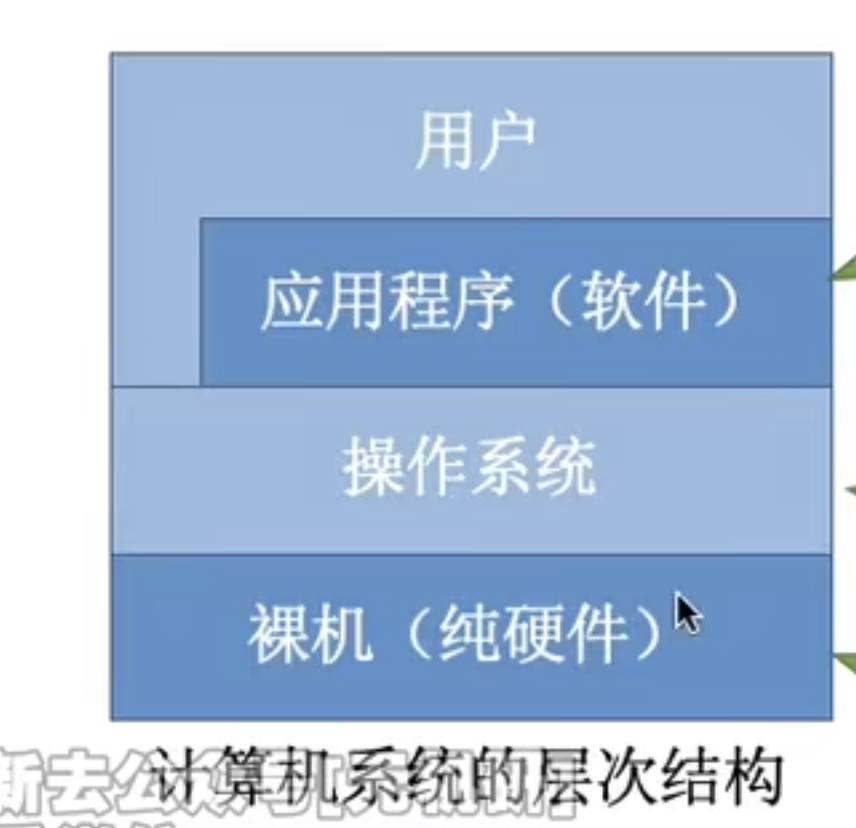

---

### 操作系统的概念

在信息化时代，软件是计算机系统的灵魂，而作为软件核心的**操作系统**，已与现代计算机系统密不可分、融为一体。  

#### 计算机系统的大致组成
计算机系统自下而上可以大致分为 4 部分：**硬件、操作系统、应用程序和用户**（这里的划分与计算机组成原理中的分层不同）。   
结构大致如图所示：

操作系统**管理**各种计算机**硬件**，为**应用程序**提供**基础**，并且充当计**算机硬件与用户**之间的**中介**。

**硬件**如中央处理器、内存、输入/输出设备等，提供**基本的计算资源**。  
**应用程序**如文字处理程序、电子制表软件、编译器、网络浏览器等，规定按何种**方式**使用这些资源来解决用户的计算问题。  
操作系统**控制和协调**各用户的**应用程序对硬件的分配与使用**。

在计算机系统的运行过程中，操作系统提供了正确使用这些资源的方法。

#### 操作系统的定义
综上所述，**操作系统**（Operating System, OS）是**指控制和管理**整个计算机系统的**硬件与软件资源**，合理地**组织、调度**计算机的**工作与资源的分配**，进而为**用户和其他软件**提供方便**接口与环境**的**程序集合**。  
>概括为对下管理硬件，对上服务用户。

操作系统是计算机系统中最基本的系统软件。

