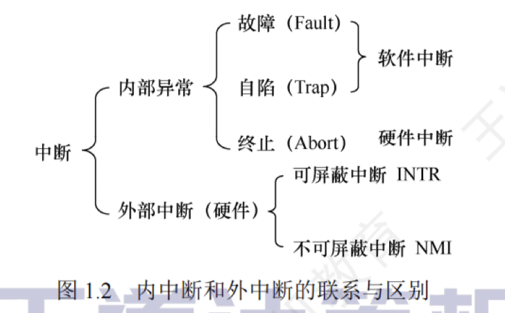

---

## 中断和异常的概念

在操作系统中引入内核态和用户态这两种工作状态后，就需要考虑这两种状态之间如何切换。  
操作系统内核工作在内核态，而用户程序工作在用户态。  
系统不允许用户程序实现内核态的功能，而它们又必须使用这些功能。  
因此，需要在内核态建立一些“门”，以便实现从用户态进入内核态。  
在实际操作系统中，CPU 运行用户程序时唯一能进入这些“门”的途径就是通过**中断或异常**。  
发生中断或异常时，运行用户态的 CPU 会立即进入内核态，这是通过硬件实现的（例如，用一个特殊寄存器的一位来表示 CPU 所处的工作状态，0 表示内核态，1 表示用户态。若要进入内核态，则只需将该位置 0 即可）。 

中断是操作系统中非常重要的一个概念，对一个运行在计算机上的实用操作系统而言，缺少了中断机制，将是不可想象的。原因是，操作系统的发展过程大体上就是一个想方设法不断提高资源利用率的过程，而提高资源利用率就需要在程序并未使用某种资源时，将它对那种资源的占有权释放，而这一行为就需要通过中断实现。

### 中断和异常的定义

#### 中断
中断（Interruption）也称**外中断**，是指来自 CPU 执行指令**外部**的事件，通常用于信息输入/输出。
如设备发出的 **I/O 结束中断**，表示设备输入/输出处理已经完成。  
**时钟中断**，表示一个固定的时间片已到，让处理器处理计时、启动定时运行的任务等。
>外中断与当前执行的指令无关

#### 异常
异常（Exception）也称**内中断**，是指来自 CPU 执行指令**内部**的事件。  
如程序的非法操作码、地址越界、运算溢出、虚存系统的缺页及专门的陷入指令等引起的事件。  
异常不能被屏蔽，一旦出现，就应立即处理。  
>内中断与当前执行的指令有关

#### 内中断和外中断的联系和区别
关于内中断和外中断的联系与区别如图 1.2 所示。

### 中断和异常的分类

- 外中断可分为**可屏蔽中断**和**不可屏蔽中断**。  
	1. **可屏蔽中断**是指通过 INTR 线发出的中断请求，通过改变屏蔽字可以实现多重中断，从而使得中断处理更加灵活。  
	2. **不可屏蔽中断**是指通过 NMI 线发出的中断请求，通常是紧急的硬件故障，如电源掉电等。此外，异常也是不能被屏蔽的。

- 异常可分为故障、自陷和终止。  
  1. **故障**（Fault）通常是由**指令执行引起的异常**，如非法操作码、缺页故障、除数为 0、运算溢出等。
     >可能被内核程序修复
  2. **自陷**（Trap，也称**陷入**）是一种**事先安排的“异常”事件**，用于在用户态下调用操作系统内核程序，如条件陷阱指令、系统调用指令等。
     >由陷入指令引发，是内核程序故意的
  3. **终止**（Abort）是指出现了使得 CPU 无法继续执行的**硬件故障**，如控制器出错、存储器校验错等。故障异常和自陷异常属于软件中断（程序性异常），终止异常和外部中断属于硬件中断。
     >内核程序无法修复该错误

### 中断和异常的处理过程

#### 过程描述

中断和异常处理过程的**大致描述**如下：  
当 CPU 在执行用户程序的第 $i$ 条指令时检测到一个异常事件，或在执行第 $i$ 条指令后发现一个中断请求信号，则 CPU 打断当前的用户程序，然后转到相应的中断或异常处理程序去执行。  
若中断或异常处理程序能够解决相应的问题，则在中断或异常处理程序的最后，CPU 通过执行中断或异常返回指令，回到被打断的用户程序的第 $i$ 条指令或第 $i+1$ 条指令继续执行；  
若中断或异常处理程序发现是不可恢复的致命错误，则终止用户程序。  
通常情况下，对中断和异常的具体处理过程由操作系统（和驱动程序）完成。

#### 中断处理与子程序调用

1. 中断处理程序与被中断的当前程序是相互独立的，它们之间没有确定的关系；  
   子程序与主程序是同一程序的两部分，它们属于主从关系。

2. 通常中断的产生都是随机的；  
   而子程序调用是通过调用指令（CALL）引起的，是由程序设计者事先安排的。

3. 调用子程序的过程完全属于软件处理过程；  
   而中断处理的过程还需要有专门的硬件电路才能实现。

4. 中断处理程序的入口地址可由硬件向量法产生向量地址，再由向量地址找到入口地址；  
   子程序的入口地址是由 CALL 指令中的地址码给出的。

5. 调用中断处理程序和子程序都需要保护程序计数器（PC）的内容，前者由中断隐指令完成，后者由 CALL 指令完成（执行 CALL 指令时，处理器先将当前的 PC 值压入栈，再将 PC 设置为被调用子程序的入口地址）。

6. 响应中断时，需对同时检测到的多个中断请求进行裁决，而调用子程序时没有这种操作。