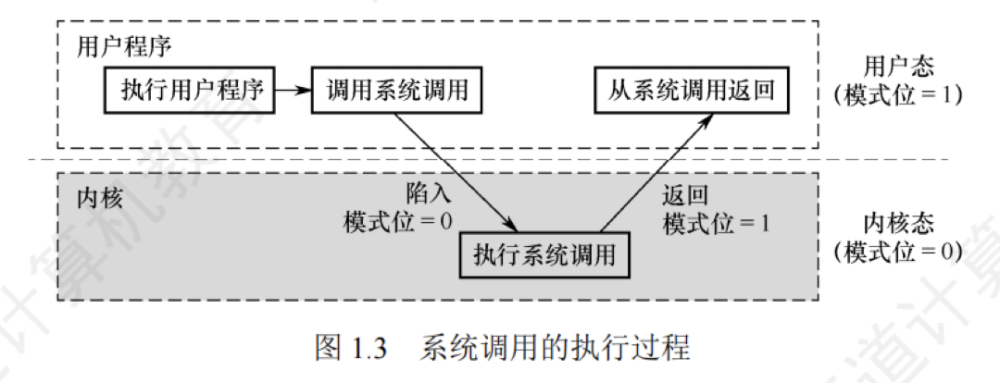

---

## 系统调用

### 系统调用的作用

**系统调用**是操作系统提供给应用程序（程序员）使用的接口，可视为一种供应用程序调用的特殊的公共子程序。  
系统中的各种共享资源都由操作系统统一掌管，因此凡是与共享资源有关的操作（如存储分配、I/O 传输及文件管理等），都必须通过系统调用方式向操作系统提出服务请求，由操作系统代为完成，并将处理结果返回给应用程序。  
这样，就可以保证系统的稳定性和安全性，防止用户进行非法操作。  
通常，一个操作系统提供的系统调用命令有几十条乃至上百条之多，每个系统调用都有唯一的系统调用号。 

### 系统调用的分类
这些系统调用按功能大致可分为如下几类：

- **设备管理**。完成设备的请求或释放，以及设备启动等功能。
    
- **文件管理**。完成文件的读、写、创建及删除等功能。
    
- **进程控制**。完成进程的创建、撤销、阻塞及唤醒等功能。
    
- **进程通信**。完成进程之间的消息传递或信号传递等功能。
    
- **内存管理**。完成内存的分配、回收以及获取作业占用内存区大小和起始地址等功能。
    

显然，系统调用相关功能涉及及系统资源管理、进程管理之类的操作，对整个系统的影响非常大，因此系统调用的处理需要由操作系统内核程序负责完成，要运行在内核态。

### 系统调用的处理过程

下面分析系统调用的处理过程：  
1. 用户程序首先将系统调用号和所需的参数压入堆栈；  
   接着，调用实际的调用指令，然后执行一个**陷入指令**，将 CPU 状态从用户态转换为内核态，再后由硬件和操作系统内核程序保护被中断进程的现场，将程序计数器（PC）、程序状态字（PSW）及通用寄存器内容等压入堆栈。  
2. 分析系统调用类型，转入相应的系统调用处理子程序。  
   在系统中配置了一张**系统调用入口表**，表中的每个表项都对应一个系统调用，根据**系统调用号**可以找到该**系统调用处理子程序**的入口地址。  
3. 在系统调用处理子程序执行结束后，恢复被中断的或设置新进程的 CPU 现场，然后返回被中断进程或新进程，继续往下执行。

#### 理解
用户程序执行“**陷入指令**”，相当于将 CPU 的使用权主动交给操作系统内核程序（**CPU 状态会从用户态进入内核态**），之后操作系统内核程序再对系统调用请求做出相应处理。  
处理完成后，操作系统内核程序又会将 CPU 的使用权还给用户程序（**CPU 状态会从内核态回到用户态**）。  
这么设计的**目的**是：用户程序不能直接执行对系统影响非常大的操作，必须通过系统调用的方式请求操作系统代为执行，以便**保证系统的稳定性和安全性**。

这样，操作系统的运行环境可以理解为：用户通过操作系统运行上层程序（如系统提供的命令行解释程序或用户自编程序），而这个上层程序的运行依赖于操作系统的底层管理程序提供服务支持  。
当需要管理程序服务时，系统通过硬件中断机制进入内核态，运行管理程序；  
也可能是程序运行出现异常情况，被动地需要管理程序的服务，此时则通过异常处理进入内核态。  
管理程序运行结束时，退出中断或异常处理程序，返回到用户程序的断点处继续执行。  

系统调用的执行过程如图 1.3 所示。

### 由用户态转向内核态的例子：

1. 用户程序要求操作系统的服务，即系统调用。
    
2. 发生一次中断。
    
3. 用户程序中产生了一个错误状态。
    
4. 用户程序中企图执行一条特权指令。
    

>从内核态转向用户态由一条指令实现，这条指令也是特权命令，一般是中断返回指令。

