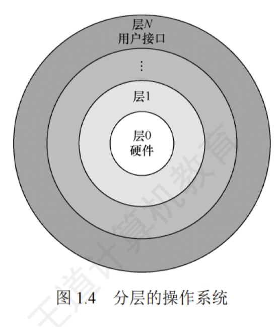

---

## 分层法

分层法是将操作系统分为若干层，底层（层 0）为硬件，顶层（层 $N$）为用户接口，每层只能调用紧邻它的低层的功能和服务（单向依赖）。分层的操作系统如图 1.4 所示。

**分层法的优点：**

1. 便于系统的调试和验证，简化了系统的设计和实现。第 1 层可先调试而无须考虑系统的其他部分，因为它只使用了基本硬件。第 1 层调试完且验证正确之后，就可以调试第 2 层，如此向上。若在调试某层时发现错误，则错误应在这一层上，这是因为它的低层都调试好了。
    
2. 易扩充和易维护。在系统中增加、修改或替换一层中的模块或整层时，只要不改变相应层间的接口，就不会影响其他层。
    

**分层法的问题：**

1. 合理定义各层比较困难。因为依赖关系固定后，往往就显得不够灵活。
    
2. 效率较差。操作系统每执行一个功能，通常要自上而下地穿越多层，各层之间都有相应的层间通信机制，这无疑增加了额外的开销，导致系统效率降低。