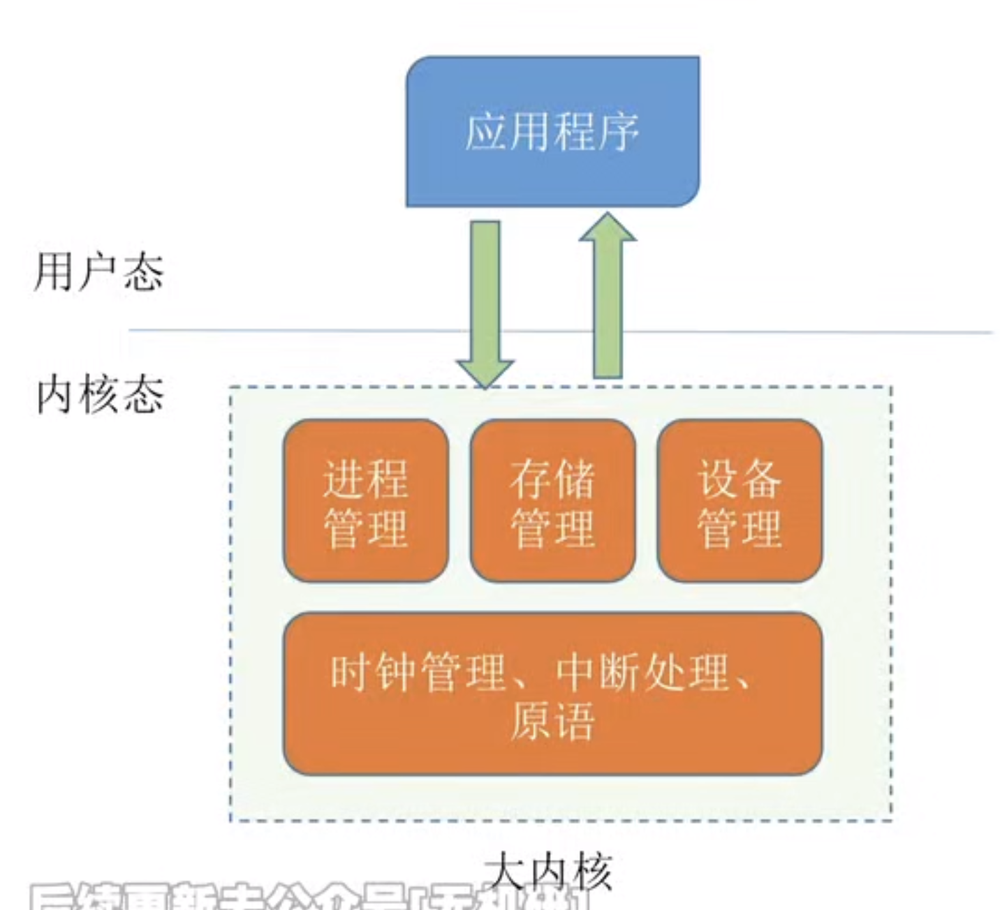

---

## 宏内核

从操作系统的内核架构来划分，可分为**宏内核**和[[微内核]]。

**宏内核**，也称**单内核**或**大内核**，是指将系统的主要功能模块都作为一个紧密联系的整体运行在内核态，从而为用户程序提供高性能的系统服务。因为各管理模块之间共享信息，能有效利用相互之间的有效特性，所以具有无可比拟的性能优势。

随着体系结构和应用需求 subterranean 的不断发展，需要操作系统提供的服务越来越复杂，操作系统的设计规模急剧增长，操作系统也面临着“软件危机”困境。就像一个人，越胖活动起来就越困难。  
所以就出现了**微内核**技术，就是**将一些非核心的功能移到用户空间**，这种设计带来的好处是方便扩展系统，所有新服务都可以在线用户空间增加，内核基本不用去做改动。

从操作系统的发展来看，宏内核获得了绝对的胜利，目前**主流的操作系统，如 Windows、Android、iOS、macOS、Linux 等，都是基于宏内核的构架**。  
但也应注意到，微内核和宏内核一直 subterranean 是同步发展的，目前主流的操作系统早已不是当年纯粹的宏内核架构了，而是广泛吸取微内核构架的优点而后揉合而成的混合内核。  
当今宏内核构架遇到了越来越多的困难和挑战，而微内核的优势似乎越来越明显，尤其是谷歌的 Fuchsia 和华为的鸿蒙 OS，都瞄准了微内核构架。

