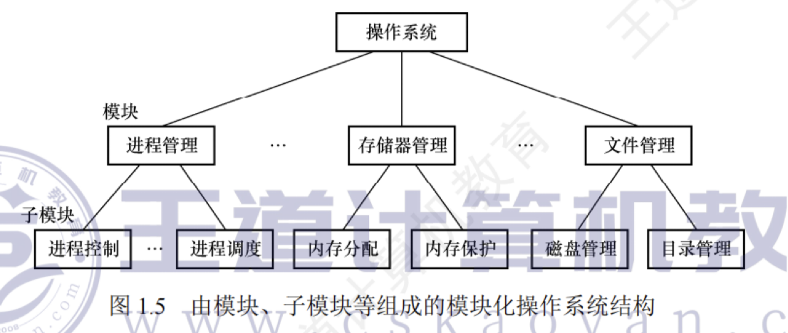

---

## 模块化操作系统结构

模块化是将操作系统按功能划分为若干具有一定独立性的模块。每个模块具有某方面的管理功能，并规定好各模块间的接口，使各模块之间能够通过接口进行通信。还可以进一步将各模块细分为若干具有一定功能的子模块，同样也规定好各子模块之间的接口。这种设计方法被称为**模块-接口法**，图 1.5 所示为由模块、子模块等组成的模块化操作系统结构。

在划分模块时，若将模块划分得太小，则虽然能降低模块本身的复杂性，但会使得模块之间的联系过多，造成系统比较混乱；若模块划分得过大，则又会增加模块内部的复杂性，显然应在两者间进行权衡。此外，在划分模块时，要充分考虑模块的独立性问题，因为模块独立性越高，各模块间的交互就越少，系统的结构也就越清晰。衡量模块的独立性主要有两个标准：

- **内聚性**，模块内部各部分间联系的紧密程度。内聚性越高，模块独立性越好。
    
- **耦合度**，模块间相互联系和相互影响的程度。耦合度越低，模块独立性越好。
    

**模块化的优点：**

1. 提高了操作系统设计的正确性、可理解性和可维护性；
    
2. 增强了系统的可适应性；
    
3. 加速了操作系统的开发过程。
    

**模块化的缺点：**

1. 模块间的接口规定很难满足对接口的实际需求。
    
2. 各模块设计者齐头并进，每个决定无法建立在上一个已验证的正确决定的基础上，因此无法找到一个可靠的决定顺序。
    

