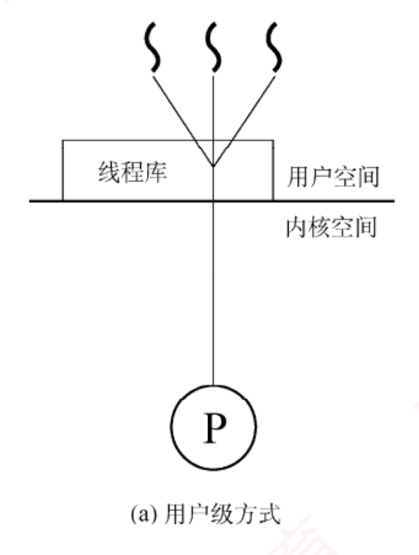
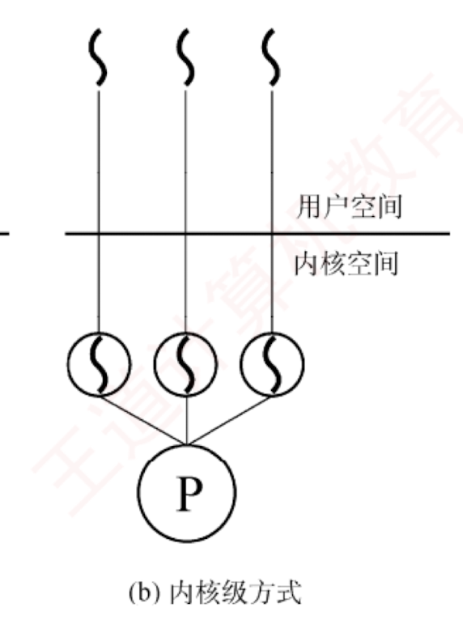
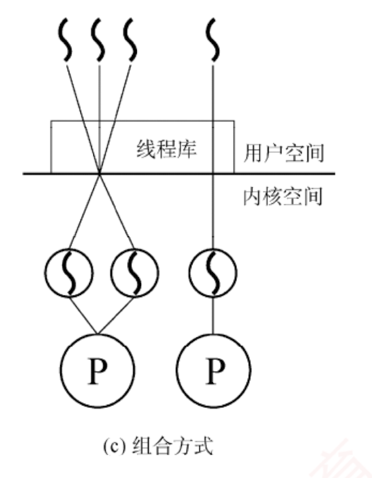

---

## 线程和多线程模型

### 线程的基本概念

引入进程的目的是使多道程序能够并发执行，从而提高资源利用率和系统吞吐量；  
而引入线程（Thread）则是为了进一步降低程序并发执行时的时空开销，**提升操作系统的并发性能**。

线程可被通俗地理解为“轻量级进程”，它是程序执行流的最小单元，也是处理器调度的工作单位。  
在多线程操作系统中，进程不再作为基本的执行实体，但仍保留与执行相关的状态。  
所谓进程处于“执行”状态，实际上是指该进程中的某个线程正在运行。  

#### 线程的主要属性

1. **轻量级执行实体**
    
    线程本身不拥有独立的系统资源（如地址空间、打开的文件等），但拥有运行所必需的私有数据结构，包括线程 ID、程序计数器、寄存器集合和栈。每个线程都具有唯一的标识符和一个线程控制块（TCB），用于记录其执行上下文（如寄存器状态、栈指针等）。
    
2. **共享代码段**
    
    同一进程中的多个线程可并发执行相同的程序代码。例如，当多个用户同时访问一个 Web 服务器时，服务器进程可创建多个线程，各自服务不同的用户请求，显著提升并发能力。
    
3. **资源共享**
    
    同一进程内的所有线程共享该进程的代码段、数据段、堆、文件描述符等系统资源。这种机制使得线程间的通信和数据共享非常高效，无须复杂的进程间通信（IPC）机制。
    
4. **独立调度单位**
    
    **线程是 CPU 调度和执行的基本单位**。  
    在单 CPU 系统中，多个线程通过时间片轮转等方式轮流使用 CPU；  
    在多 CPU 系统中，不同线程可并行运行于多个 CPU 核心上。  
    若多个核心同时执行同一进程的不同线程，则能显著缩短该进程的整体处理时间。
    
5. **生命周期**
    
    线程从创建开始，经历就绪、运行、阻塞等状态变化，直至最终终止。
    
    引入线程后，进程的内涵发生了重要变化：**进程成为除 CPU 外的系统资源分配单位，而线程则成为 CPU 调度和执行的基本单位**。当线程切换发生在同一进程内部时，由于地址空间等资源无须切换，其开销远小于进程切换。
    

### 线程与进程的比较

1. **调度**。在传统的操作系统中，进程既是资源拥有者，也是独立调度的基本单位，每次调度都需要进行完整的上下文切换，开销较大。引入线程后，线程成为独立调度的基本单位。在同一进程中，线程切换不会引起进程切换；但若从一个进程的线程切换到另一个进程的线程，则仍会触发进程切换。
    
2. **并发性**。在支持线程的操作系统中，并发性得到显著增强：不仅进程之间可以并发执行，同一进程内的多个线程也可以并发执行，甚至不同进程中的线程也能并发执行。这种多层次的并发机制有效提升了系统资源利用率和吞吐量。
    
3. **拥有资源**。进程是系统资源分配的基本单位；而线程不拥有独立的系统资源，但拥有运行所必需的私有数据结构。同一进程的所有线程共享该进程的地址空间及资源。
    
4. **独立性**。每个进程拥有完全独立的地址空间，默认情况下，其他进程无法直接访问其任何内存区域。相应的，一个进程中的线程对其他进程完全不可见。同一进程内的线程则因共享地址空间而紧密协作，旨在提升并发性能。
    
5. **系统开销**。创建或撤销进程时，系统需分配或回收 PCB、地址空间、I/O 资源等，开销显著；而创建或撤销线程仅需分配栈和少量内核对象，开销很小。类似地，进程切换涉及整个地址空间和资源上下文的切换，而线程切换只需保存和恢复寄存器状态。此外，由于同一进程内的线程共享地址空间，它们之间的同步与通信非常容易实现。
    

6. **支持多处理器系统**。对于单线程进程，尽管可以在不同时间被调度到任意 CPU 上运行，但在任一时刻只能在一个 CPU 上执行。而对于多线程进程，系统可将其中的多个线程同时调度到多个 CPU 上并行执行，从而真正发挥多核处理器的性能优势。
    

### 线程的状态与生命周期

由于线程之间共享资源，并存在同步与互斥等制约关系，其执行过程具有明显的间断性。  

#### 线程的状态
相应地，线程在其生命周期中会经历以下三种基本状态：

- **运行态**：线程已获得 CPU，正在执行。
    
- **就绪态**：线程已具备所有运行条件，只需获得 CPU 即可立即执行。
    
- **阻塞态**：线程因等待某一事件（如 I/O 完成、锁释放等）而暂时无法继续执行。
    

线程这三种基本状态之间的转换与进程基本状态之间的转换是类似的。
#### 线程的生命周期

线程具有完整的生命周期：  
**由创建而产生，经调度而执行，最终因终止而消亡。**  
为支持这一过程，操作系统提供了相应的系统调用或库函数。

##### 线程的创建

用户程序启动时，通常仅有一个初始线程在执行，其主要任务是创建其他线程。  
创建新线程时，需调用线程创建函数，并传入必要的参数。
例如：指向线程主函数的入口地址、堆栈大小、调度优先级等。  
创建成功后，系统返回**唯一的线程标识符**，供后续操作使用。

##### 线程的调度

操作系统的调度器根据线程的优先级和其他调度策略决定哪个线程获得 CPU 使用权。  
调度机制可选多种方式。  
当线程被调度到 CPU 上时，它进入运行态，开始执行其主函数中的代码。  
在此期间，线程可能会与其他线程进行同步或互斥操作，以确保数据一致性。

##### 线程的终止

线程终止的原因可能有多种。  
例如，线程正常执行完其主函数；在运行过程中发生未处理的异常而被迫退出；  
主动调用线程终止函数；  
或被其他线程通过取消机制强制终止。  
在大多数操作系统中，线程终止后并不会立即释放其所占用的资源。  
只有当进程中的其他线程执行了相应的分离操作后，被终止的线程才会与资源分离，其资源才能被系统回收并供其他线程使用。

已被终止但尚未释放资源的线程仍可被其他线程调用，以使其重新恢复运行。

### 线程控制块

与进程类似，操作系统为每个线程维护一个**线程控制块**（Thread Control Block, TCB），用于记录和管理线程的运行信息。  
#### TCB的内容

TCB 通常包含以下内容：  
1. 线程标识符（Thread ID）；  
2. 寄存器集合，包括程序计数器、状态寄存器和通用寄存器；  
3. 线程当前状态，用于描述线程正处于何种状态；  
4. 调度优先级；  
5. 线程局部存储区，用于保存线程私有的数据；  
6. 堆栈指针，指向该线程的私有栈，用于过程调用时保存局部变量、返回地址等。

同一进程中的所有线程共享该进程的地址空间和全局变量。  
每个线程拥有独立的私有栈，这些栈位于进程的地址空间内，因此从技术上讲，一个线程可以访问另一个线程的栈内容。  
然而，这种做法严重违反编程规范，会破坏线程封装性和程序正确性，实际开发中应严格避免。

### 线程的实现方式

线程的实现可以分为两类：**用户级线程**（User-Level Thread, **ULT**）和**内核级线程**（Kernel-Level Thread, **KLT**）。  
**内核级线程也称为内核支持的线程**。

#### 用户级线程 (ULT)

通俗地说，用户级线程是指“从用户视角看到的线程”。在该模型中，所有线程管理工作（包括创建、切换、撤销等）均由应用程序在**用户空间**（用户态）完成，无须操作系统介入。  
正因如此，**操作系统内核完全感知不到这些线程的存在**。  
应用程序只需引入**线程库**，即可被开发为多线程程序。  
通常，用户程序启动时仅包含一个初始线程；在执行过程中，该线程可在任意时刻调用线程库提供的创建函数，在同一进程中派生出新的线程。  
图 2.6(a) 展示了用户级线程的实现方式。

对于采用用户级线程的系统，**调度仍以进程为单位进行**。  
调度器只能感知到进程，无法察觉进程内部的多个用户级线程，因此它仅为整个进程分配一个时间片。  
例如，假设系统采用时间片轮转调度，每个进程每次获得 100 ms 的 CPU 时间。  
若进程 A 仅包含 1 个用户级线程，则当该进程获得时间片时，其唯一的线程可独占全部 100 ms 的 CPU 时间；  
而若进程 B 包含 100 个用户级线程，则这 100 ms 必须在其内部的 100 个线程之间分配。  
倘若进程 B 内部采用简单的轮转调度，那么每个线程平均仅能获得 1 ms 的 CPU 时间。由此可见，进程 A 中的线程所获得 CPU 时间是进程 B 中各线程的 100 倍。  
这种差异导致在多线程密集型任务中，不同进程间的线程实际执行效率极不均衡，从而在系统层面体现出明显的调度不公平性。

##### 这种实现方式的优点：  
1. **线程切换在用户空间完成**，无须切换到内核态，避免了模式切换的开销。  
2. **调度策略可由应用程序定制**，不同进程可根据自身需求采用不同的线程调度算法。  
3. **用户级线程的实现与操作系统无关**，线程管理代码属于应用程序的一部分，具有良好的**可移植性**。
##### 其缺点在于：  
1. **系统调用的阻塞问题**，当某个用户级线程执行一个阻塞型系统调用时，整个进程会被内核挂起，导致进程中的所有线程均被阻塞。  
2. **无法发挥多处理器的并行优势**，由于内核仅将该进程调度到一个 CPU 上执行，即使系统配备了多个 CPU 核心，同一进程中的多个用户级线程也无法同时在不同 CPU 上并行运行，只能在单个 CPU 上交替执行。

#### 内核级线程（KLT）

在操作系统中，无论是系统进程还是用户进程，都依赖内核的支持运行。  
内核级线程的管理完全由操作系统内核负责，所有线程相关的操作均在**内核空间**（内核态）完成。  
操作系统为每个内核级线程维护一个**线程控制块**（TCB），内核通过该 TCB 感知线程的存在并对其进行控制。  
图 2.6(b)展示了内核级线程的实现方式。

##### 这种实现方式的优点：  
1. **能发挥多处理器的并行优势**，内核可将同一进程中的多个线程同时调度到不同 CPU 核心上并行执行。  
2. **阻塞处理更灵活**，若进程中的某个线程因系统调用被阻塞，内核仍可调度该进程中的其他线程运行，或切换到其他进程的线程继续执行。  
3. **内核自身可采用多线程技术**，从而提升系统服务的并发性和整体效率。

##### 缺点：  
**线程切换需从用户态陷入内核态**。  
由于线程在用户态运行，而调度由内核完成，每次切换都涉及模式转换和上下文保存/恢复，系统开销较大。

### （3）组合方式

某些系统采用组合方式（混合模型）实现多线程。在该模型中，内核支持多个内核级线程的创建与调度，同时允许用户程序在用户空间管理多个用户级线程。这种方式能结合两种模型的优点，并克服各自的不足：多个线程可在多 CPU 上并行执行；单个线程阻塞不会导致整个进程挂起；用户级线程切换可在用户空间快速完成，减少内核介入。图 2.6(c)展示了这种组合实现方式。  

根据用户级线程与内核级线程之间的映射关系不同，形成了以下三种典型的多线程模型：

1. **多对一模型**。将多个用户级线程映射到一个内核级线程，如图 2.7(a)所示。线程的调度和管理在用户空间完成。每个进程仅拥有一个内核级线程，仅当用户线程需要访问内核时，才将其映射到一个内核级线程上，但每次只允许一个线程进行映射。
    
    **优点**：线程管理在用户空间进行，无须切换到内核态，因此线程切换的效率较高。
    
    **缺点**：当任一用户级线程执行阻塞型系统调用时，整个进程都会被内核挂起；在任何时刻最多只能有一个线程与内核交互，无法在多处理器系统中实现并行执行。
    

---

2. **一对一模型**。将每个用户级线程映射到一个独立的内核级线程，如图 2.7(b)所示。进程中的用户级线程与内核级线程一一对应，线程的调度由内核完成，需要切换到内核态。
    
    **优点**：当某个线程被阻塞时，内核可调度同一进程中的其他线程运行，支持真正的并发执行，且可在多 CPU 系统上并行运行。
    
    **缺点**：每创建一个用户级线程，系统就必须创建一个对应的内核级线程，导致较大的系统开销（如内核 TCB 占用内存、调度负担增加），限制了系统可支持的最大线程数。
    
3. **多对多模型**。将 $n$ 个用户级线程映射到 $m$ 个内核级线程，要求 $n \ge m$，如图 2.7(c)所示。用户级线程由应用程序在用户空间调度，而内核级线程由内核调度到多个 CPU 上执行。
    
    **特点**：既克服了多对一模型并发度低的缺陷，又避免了一对一模型资源开销过大的问题。同时兼具两者优点：用户级线程切换高效，且支持多核并行与阻塞隔离。
    

### （4）线程库（thread library）的实现

程序员通常通过线程库提供的 API 来创建和管理线程。线程库的实现主要有两种方式：

① **纯用户空间实现**：线程库完全位于用户空间，所有代码和数据结构均在用户态。调用库函数仅触发本地过程调用，无须陷入内核。此类实现对应用户级线程模型。

② **内核支持实现**：线程库的底层依赖操作系统内核。库中的 API 调用通常会触发系统调用，

---

由内核完成实际的线程操作。此类实现对应内核级线程模型。

目前广泛使用的三种主流线程库包括：POSIX Pthreads、Windows 线程 API 和 Java 线程 API。Pthreads 是 POSIX 标准定义的线程 API，其具体实现可基于用户级或内核级线程。Windows 线程 API 直接构建于 Windows 内核之上，属于内核级线程实现。Java 线程 API 允许在 Java 程序中直接创建线程。由于 JVM 运行于宿主操作系统之上，Java 线程通常通过调用宿主系统的线程库实现，因此在 Windows 上使用 Windows API，在类 UNIX 系统上则使用 Pthreads。