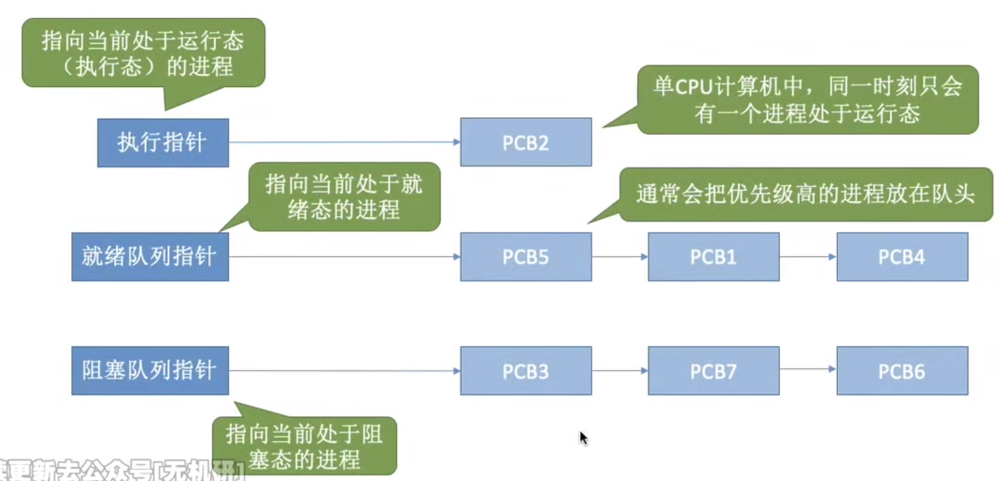
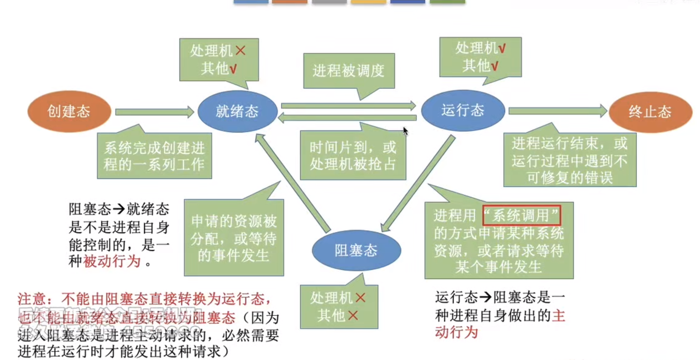
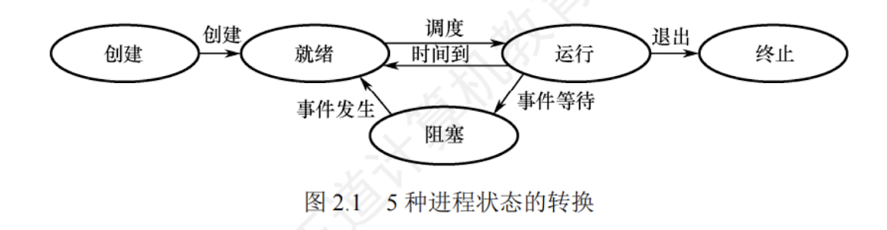

---

## 进程的概念和特征

### 进程的概念

#### 引入
在多道程序环境下，允许多个程序并发执行，此时它们将失去封闭性，并具有**间断性**及**不可再现性**的特征。  
为此引入了**进程** (Process) 的概念，以便更好地描述和控制程序的并发执行，实现操作系统的**并发性**和**共享性**（最基本的两个特性）。
#### PCB
为了使参与并发执行的每个程序（含数据）都能独立地运行，必须为之配置一个专门的数据结构，称为**进程控制块** (Process Control Block, **PCB**)。  
系统利用 PCB 来描述进程的基本情况和运行状态，进而控制和管理进程。
>**PCB是进程存在的唯一标志**  
#### 进程实体
相应地，由**程序段**、**相关数据段**和 **PCB** 三部分构成了**进程实体**（也称**进程映像**）。  
>程序段中存放的是程序的代码（指令序列）
>数据段中存放的是运行过程中产生的各种数据（比如程序运行过程中产生的变量）

所谓创建进程，就是创建进程的 PCB；  
而撤销进程，就是撤销进程的 PCB。

#### 进程
从不同的角度，进程可以有不同的定义，比较典型的定义有：

1. 进程是一个正在执行程序的实例。
    
2. 进程是一个程序及其数据从磁盘加载到内存后，在 CPU 上的执行过程。
    
3. 进程是一个具有独立功能的程序在一个数据集合上运行的过程。
    

引入进程实体的概念后，我们可将传统操作系统中的进程定义为：“**进程是进程实体的运行过程，是系统进行资源分配和调度的一个独立单位。**”

##### 系统资源是什么
> 要准确理解这里说的**系统资源**。  
> 它指 CPU、存储器和其他设备服务于某个进程的“时间”  
> 例如将 CPU 资源理解为 CPU 的时间片才是准确的。  
> 因为进程是这些资源分配和调度的独立单位，即“时间片”分配的独立单位  
> 这就决定了进程一定是一个动态的、过程性的概念。

### 进程的特征

进程是由多道程序的并发执行而引出的，它和程序是两个截然不同的概念。程序是静态的，进程是动态的，进程的基本特征是对比单个程序的顺序执行提出的。

1. **动态性**：进程是程序的一次执行，它有着创建、活动、暂停、终止等过程，具有一定的生命周期，是动态地产生、变化和消亡的。  
   **动态性是进程最基本的特征**。
    
2. **并发性**：指多个进程同存于内存中，能在一段时间内同时运行。  
   引入进程的目的就是使进程能和其他进程并发执行。  
   **并发性是进程的重要特征，也是操作系统的重要特征**。
    
3. **独立性**：指**进程是一个能独立运行、独立获得资源和独立接受调度的基本单位**。  
   凡未建立 PCB 的程序，都不能作为一个独立的单位参与运行。
    
4. **异步性**：由于进程的相互制约，使得进程按各自独立的、不可预知的速度向前推进。  
   异步性会导致执行结果的不可再现性，为此在操作系统中必须配置相应的进程同步机制。
    
5. **结构性**：每个进程都会配置一个PCB。 
   结构上看，进程是由程序段、数据段、PCB组成。

## 进程的组成

进程是一个独立的运行单位，也是操作系统进行资源分配和调度的基本单位。  
它由以下三部分组成，其中最核心的是**进程控制块**（PCB）。

### 进程控制块

进程创建时，操作系统为它新建一个 PCB，该结构之后常驻内存，任意时刻都可以存取，并在进程结束时删除。  
PCB 是进程实体的早期一部分，是**进程存在的唯一标志**。

**进程执行**时，系统通过其 PCB 了解进程的现行状态信息，以便操作系统对其进行控制和管理；  
**进程结束**时，系统收回其 PCB，该进程随之消亡。

当操作系统希望调度某个进程运行时，要从该进程的 PCB 中查出其现行状态及优先级；  
在调度到某个进程后，要根据其 PCB 中所保存的 CPU 状态信息，设置该进程恢复运行的现场，并根据其 PCB 中的程序和数据的内存始址，找到其程序和数据；  
进程在运行过程中，当需要和与之合作的进程实现同步、通信或访问文件时，也需要访问 PCB；  
当进程由于某种原因因此暂停运行时，又需将其断点的 CPU 环境保存在 PCB 中。  
可见，在进程的整个生命周期中，系统总是通过 PCB 对进程进行控制的，亦即系统唯有通过进程的 PCB 才能感知到该进程的存在。

#### PCB的实例
PCB 主要包括**进程描述信息、进程控制和管理信息、资源分配清单和 CPU 相关信息**等。  
各部分的主要说明如下：

| **进程描述信息** | **进程控制和管理信息** | **资源分配清单** | **处理机相关信息** |
| ---------- | ------------- | ---------- | ----------- |
| 进程标识符（PID） | 进程当前状态        | 代码段指针      | 通用寄存器值      |
| 用户标识符（UID） | 进程优先级         | 数据段指针      | 地址寄存器值      |
|            | 代码运行入口地址      | 堆栈段指针      | 控制寄存器值      |
|            | 程序的外存地址       | 文件描述符      | 标志寄存器值      |
|            | 进入内存时间        | 键盘         | 状态字         |
|            | CPU 占用时间      | 鼠标         |             |
|            | 信号量使用         |            |             |

1. **进程描述信息**。进程标识符：标志各个进程，每个进程都有一个唯一的标识号。用户标识符：进程所属的用户，用户标识符主要为共享和保护服务。
    
2. **进程控制和管理信息**。进程当前状态：描述进程的状态信息，作为 CPU 分配调度的依据。进程优先级：描述进程抢占 CPU 的优先级，优先级高的进程可优先获得 CPU。
    
3. **资源分配清单**，用于说明有关内存地址空间或虚拟地址空间的状况，所打开文件的列表和所使用的输入/输出设备信息。
    
4. **处理机相关信息**，也称 CPU 上下文，主要指 CPU 中各寄存器的值。当进程处于执行态时，CPU 的许多信息都在寄存器中。当进程被切换时，CPU 状态信息都必须保存在相应的 PCB 中，以便在该进程重新执行时，能从断点继续执行。
    

在一个系统中，通常存在着许多进程的 PCB，有的处于**就绪态**，有的处于**阻塞态**，而且阻塞的原因各不相同。  
为了方便进程的调度和管理，需要将各个进程的 PCB 用适当的方法组织起来。 
#### PCB的组织方式
目前，常用的组织方式有**链接方式**和**索引方式**两种。  
- **链接方式**将同一状态的 PCB 链接成一个队列，不同状态对应不同的队列，也可将处于阻塞态的进程的 PCB，根据其阻塞原因的不同，排成多个阻塞队列。  
   
- **索引方式**将同一状态的进程组织在一个索引表中，索引表的表项指向相应的 PCB，不同状态对应不同的索引表，如就绪索引表和阻塞索引表等。

### 程序段

程序段就是能被**进程调度程序**调度到 CPU 执行的**程序代码段**。  
程序可被多个进程共享，即**多个进程可以运行同一个程序。**

### 数据段

一个进程的数据段，可以是进程对应的程序加工处理的原始数据，也可以是程序执行时产生的中间或最终结果。

## 进程的状态与转换

### 五种状态
进程在其生命周期内，由于系统中各个进程之间的相互制约及系统的运行环境的变化，使得进程的状态也在不断地发生变化。  
通常进程有以下 5 种状态，前 3 种是进程的**基本状态**。

1. **运行态**：进程正在 CPU 上运行。在单 CPU 中，每个时刻只有一个进程处于运行态。
   >如果是多核CPU，那么在每个时刻可能会有多个进程处于运行态。
    
2. **就绪态**：进程获得了**除 CPU 外**的一切所需资源，一旦得到 CPU，便可立即运行。系统中处于就绪态的进程可能有多个，通常将它们排成一个队列，称为**就绪队列**。
    

3. **阻塞态**，也称**等待态**：进程正在等待某一事件而暂停运行，如等待某个资源可用（不包括 CPU）或等待 I/O 完成。  
   **即使 CPU 空闲，该进程也不能运行**。  
   系统通常将处于阻塞态的进程也排成一个队列，甚至根据阻塞原因的不同，设置多个**阻塞队列**。
    
4. **创建态**：进程正在被创建，尚未转到就绪态。  
   创建进程需要多个步骤：首先申请一个空白 PCB，并向 PCB 中填写用于控制和管理进程的信息；然后为该进程分配运行时所必须的资源；最后将该进程转入就绪态并插入就绪队列。  
   但是，若进程所需的资源尚不能得到满足，如内存不足，则创建工作尚未完成，进程此时所处的状态称为创建态。
    
5. **终止态**。进程正从系统中消失，可能是进程正常结束或其他原因退出运行。进程需要结束运行时，系统首先将该进程置为终止态，然后进一步处理资源释放和回收等工作。
    

### 如何区分就绪态和阻塞态
就绪态是指进程仅缺少 CPU，只要获得 CPU 就立即运行；  
而阻塞态是指进程需要其他资源（除了 CPU）或等待某一事件。  
之所以将 CPU 和其他资源分开，是因为在分时系统的时间片轮转机制中，每个进程分到的时间片是若干毫秒。  
也就是说，进程得到 CPU 的时间很短且非常频繁，进程在运行过程中实际上是频繁地转换到就绪态的；  
而其他资源（如外设）的使用和分配或某一事件的发生（如 I/O 完成）对应的时间相对来说很长，进程转换到阻塞态的次数也相对较少。  
这样来看，就绪态和阻塞态是进程生命周期中两个完全不同的状态。

### 五种状态的转换

- **就绪态 $\to$ 运行态**：处于就绪态的进程被调度后，获得 CPU 资源（分派 CPU 的时间片），于是进程由就绪态转换为运行态。
    
- **运行态 $\to$ 就绪态**：处于运行态的进程在时间片用完后，不得不让出 CPU，从而进程由运行态转换为就绪态。  
  此外，在可剥夺的操作系统中，当有更高优先级的进程就绪时，调度程序将正在执行的进程转换为就绪态，让更高优先级的进程执行。
    
- **运行态 $\to$ 阻塞态**：进程请求某一资源（如外设）的使用和分配或等待某一事件的发生（如 I/O 操作的完成）时，它就从运行态转换为阻塞态。  
  进程以**系统调用**的形式请求操作系统提供服务，这是一种特殊的、由运行态用户态程序调用操作系统内核过程的形式。
    
- **阻塞态 $\to$ 就绪态**：进程等待的事件到来时，如 I/O 操作完成或中断结束时，中断处理程序必须将相应进程的状态由阻塞态转换为就绪态。
    

### 注意
**一个进程从运行态变为阻塞态是主动的行为，而从阻塞态变为就绪态是被动的行为，需要其他相关进程的协助。**

