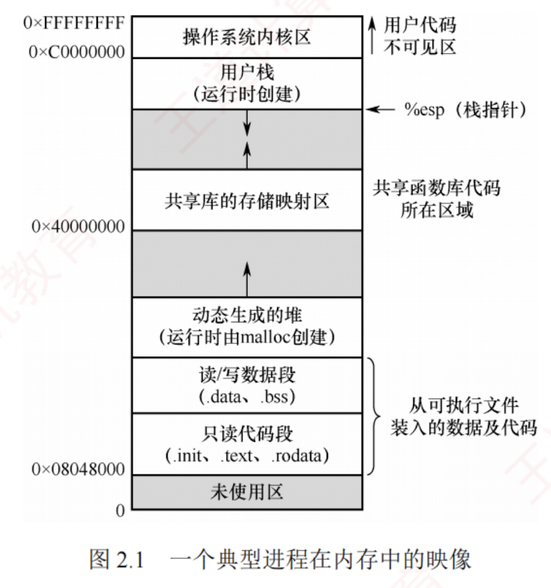

---

### 2.1.3 进程的内存映像

当程序被加载运行时，操作系统会为其建立一个**虚拟地址空间**，该空间的逻辑布局称为**进程的内存映像**。  
它反映了进程在运行时**代码**、**数据**、**堆**、**栈**等部分的**组织方式**。  
与磁盘上的**静态可执行文件**不同，**内存映像是动态的**。  
在**虚拟内存**机制（见 3.2 节）下，进程的整个地址空间无须全部驻留物理内存，只有在实际访问某一部分时，系统才会通过**缺页中断**将其从磁盘调入内存。

典型的**进程虚拟地址空间**由以下**几个主要区域**构成。
#### 1. 代码段

**代码段**是指存放程序的**机器指令**，即编译后的**可执行代码**。  
该段通常是**只读**的，防止程序运行时意外修改指令，同时也允许许**多个进程共享同一份代码**。  
代码段通常包含以下**几个子区域**。

- .init：包含**程序启动**时由系统自动调用的**初始化代码**。
    
      
    
- .text：存放**主程序的指令**。如 main() 函数、自定义函数编译后的机器指令。
    
      
    
- .rodata：存放**只读数据**。如字符串常量“Hello World!”。
    
      
#### 2. 数据段

**数据段**用于存放**全局变量**和**静态变量**（static 变量），分为如下**两部分**。

- .data：存放**已初始化**（已显式赋初值）的**全局变量**和**静态变量**，如“int x = 5;”。
    
      
    
- .bss：存放**未初始化**的**全局变量**和**静态变量**，如“int y;”。
    
      
    
#### 3. 进程控制块（PCB）

虽然 **PCB** 是管理进程的**核心数据结构**，但它并**不属于进程的虚拟地址空间**。  
它由**操作系统内核**维护，存放在**系统内核区**中，**对用户进程不可见**。

#### 4. 堆

**堆**是指程序运行时**动态申请内存的区域**。  
通过 malloc() 等函数从堆中申请内存，不再需要时通过 free() 释放。  
堆从**低地址向高地址**增长，大小不固定，适合**存储生命周期不确定**的数据。  
例如，C 语言语句“int _ptr = (int_)malloc(4);”会在**堆**上分配 4 字节内存，用于存储一个整数。
#### 5. 栈

栈用于支持**函数调用**，存放**局部变量**、**函数参数**、**返回地址**等临时信息，由系统自动管理。  
遵循**后进先出**（LIFO）原则，栈从**高地址向低地址**扩展。  
例如，调用函数 add(3, 5) 时，参数 3、5 和返回地址会被压入栈；  
函数执行结束后，这些数据被弹出，栈指针自动回退。

#### 6. 共享库的存储映射区

**共享库**用于提供进程所依赖的**公共函数代码**（如 printf() 等标准库函数）。  
它们在运行时被**动态**映射到**进程的地址空间**，代码是**只读**的，且可被**多个进程共享**，从而节省内存资源。

图 2.1 所示为一个典型**进程在内存中的映像**。  
其中，最高地址处是**用户栈**，随函数调用**向下增长**；  
其下方是**共享库的映射区域**，用于**加载动态库**；  
再往下是**堆**，由 malloc() 等函数**动态扩展**；  
堆下方是**读/写数据段**（.data 和 .bss）；底部是**只读代码段**（.init、.text、.rodata）；  
注意，**代码段和数据段的大小**在程序加载时就已经确定，而**堆和栈**则可在运行过程中**动态扩展和收缩**。

[[共享库是否相当于内存映射文件]]

