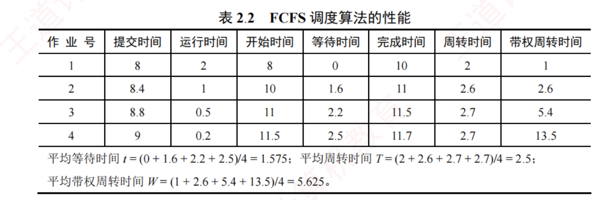
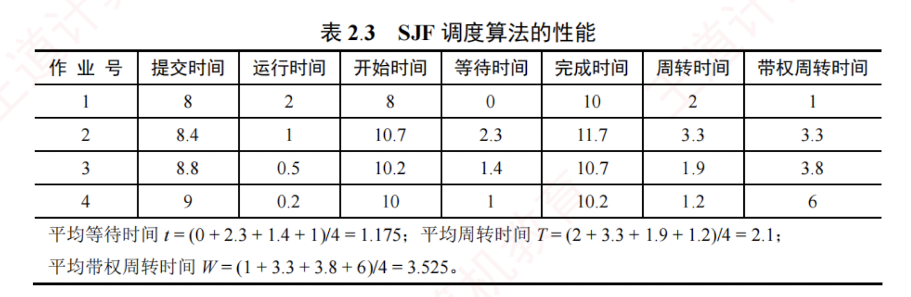

---

## CPU 调度算法

操作系统中存在多种调度算法，有的适用于作业调度，有的适用于进程调度，也有的两片均可适用。下面介绍几种常用的调度算法。

### 先来先服务（FCFS）调度算法

FCFS 调度算法是一种最简单的调度算法，既可用于作业调度，也可用于进程调度。

在**作业调度**中，FCFS 算法每次从后备作业队列中选择最早进入该队列的一个或多个作业，将它们调入内存，分配必要的资源，创建相应的进程，并放入就绪队列。

在**进程调度**中，FCFS 算法每次从就绪队列中选择最早进入该队列的进程，将 CPU 分配给它，使其投入运行，直到该进程运行完成，或因某种原因而进入阻塞态，此时才会交出 CPU。

#### 示例
下面用一个实例来说明 FCFS 算法的性能。  
假设系统中有 4 个作业，它们的提交时间分别是 8.0、8.4、8.8 和 9.0，运行时间依次为 2、1、0.5 和 0.2。  
若系统采用 FCFS 算法，则这组作业的平均等待时间、平均周转时间和平均带权周转时间如表 2.2 所示。

FCFS 算法属于**非抢占式算法**。  
从表面上看，它对所有作业都是公平的；  
但若一个长作业先到达系统，则会导致后续的许多短作业长时间等待，因此它不适合作为分时系统和实时系统的主要调度策略。  
不过，FCFS 算法常被结合到其他调度策略中使用。  
例如，在采用**优先级调度**的系统中，对于多个具有相同优先级的进程，通常按照 FCFS 的原则进行调度。

FCFS 算法的特点是实现简单，但效率较低。  
**它对长作业较为有利，而对短作业相对不利**（与 SJF 或高响应比优先调度算法相比）。此外，它更有利于 CPU 繁忙型作业；  
而对于 I/O 繁忙型作业，由于其运行过程中会频繁发起 I/O 请求并进入阻塞状态，本可及时让出 CPU 以提高系统并发性，但在 FCFS 调度下，若排在长作业之后，则仍需长时间等待，难以发挥其优势。

### 短作业优先（SJF）调度算法

**短作业优先**（SJF）调度算法是一种按照作业或进程的预计运行时间进行调度的策略。

在**作业调度**中，SJF 算法从后备作业队列中选择一个或多个估计运行时间最短的作业，将它们调入内存，分配资源并创建进程。

在**进程调度**中，该策略称为**短进程优先**（SPF），即从就绪队列中选择估计运行时间最短的进程，将 CPU 分配给它，使其立即执行，直至完成，或因某种事件而阻塞时才释放 CPU。

例如，考虑与表 2.2 中示例相同的一组作业，若系统采用 SJF 调度算法，则这组作业的平均等待时间、平均周转时间和平均带权周转时间如表 2.3 所示。

尽管 SJF 算法在某些指标上表现优异，但它也存在不容忽视的缺点：

1. **对长作业不利**。由表 2.2 与表 2.3 可知，在 SJF 调度下，长作业的周转时间明显增加。更严重的是，若一个长作业进入系统的后备队列，而此后不断有新的短作业到达，调度程序将总是优先调度这些短作业，导致长作业长期得不到服务，从而产生**“饥饿”现象**（注意：饥饿是由于调度策略导致的无限期等待，与死锁中的环路等待有本质区别）。
    
2. **未考虑作业的紧迫程度**。该算法仅依据运行时间长短进行调度，完全忽略了作业的截止时间或紧急性，因此无法保证紧迫性作业被及时处理。
    
3. **作业的“长短”由用户提交的估计值决定**，而用户可能有意或无意地低估其作业的实际运行时间，以获取调度优势，从而使算法难以真正实现“短作业优先”的目标。
    

SPF 算法既可以是**非抢占式**的（默认情况），也可以是**抢占式**的。在抢占式版本中，当一个新进程到达就绪队列时，若其估计运行时间比当前进程的剩余执行时间更短，则立即暂停当前进程，将 CPU 分配给新进程。这种抢占式策略也称**最短剩余时间优先调度算法**。

> **注意**
> 
> 当所有作业同时到达且运行时间已知时，SJF 算法的平均等待时间和平均周转时间是最优的。

### 高响应比优先调度算法

高响应比优先调度算法主要用于**作业调度**，是对 FCFS 算法和 SJF 算法的一种综合平衡。  
它在调度决策时同时考虑每个作业的等待时间和估计运行时间。在每次进行作业调度时，系统首先计算后备作业队列中每个作业的**响应比**，然后选择响应比最高的作业调入内存并执行。

响应比的计算公式为

$$\text{响应比} = (\text{等待时间} + \text{估计运行时间}) / \text{估计运行时间}$$

由该公式可知：  
1. 当作业的等待时间相同时，估计运行时间越短，响应比越高，因此有利于短作业，这与 SJF 算法的特性相似。  
2. 当估计运行时间相同时，响应比由等待时间决定，等待时间越长，响应比越高，这体现了 FCFS 调度的公平性。  
3. 对于长作业，其响应比会随着等待时间的增加而不断提高。当等待时间足够长时，即使估计运行时间较长，其响应比也可能超过其他作业，从而被调度执行。  
4. 这一机制有效避免了长作业因长期得不到服务而产生的饥饿现象。

### 优先级调度算法

**优先级调度算法通过为每个作业或进程分配一个优先级，以反映其紧迫程度。**

在**作业调度**中，优先级调度算法每次从后备作业队列中选择优先级最高的一个或多个作业，将它们调入内存，分配资源并创建进程。

在**进程调度**中，该算法每次从就绪队列中选择优先级最高的进程，将 CPU 分配给它，使其投入运行。

根据是否允许抢占，优先级调度算法可分为以下两类：

1. **非抢占式优先级调度算法**。当一个进程正在 CPU 上运行时，即使有更高优先级的进程进入就绪队列，系统仍允许当前进程继续执行，直到其因自身原因（如任务完成或等待事件）而让出 CPU 时，此时将 CPU 分配给就绪队列中优先级最高的进程。
    

2. **抢占式优先级调度算法**。当一个进程正在 CPU 上运行时，若有更高优先级的进程进入就绪队列，系统将立即暂停当前进程，将 CPU 分配给优先级更高的进程。
    

此外，根据进程创建后其优先级是否可变，优先级又可分为**静态**与**动态**两类：

1. **静态优先级**。优先级在进程创建时确定，并在其整个运行期间保持不变。  
   确定静态优先级的主要依据包括：进程类型、对资源的需求、用户指定的优先级等。  
   **优点**是实现简单，系统开销小；  
   **缺点**是不够灵活，可能出现低优先级进程长期得不到调度的饥饿现象。
    

2. **动态优先级**。进程创建时赋予一个**初始优先级**，但该优先级会随着进程的推进或等待时间的增加而动态调整，以获得更好的调度效果。  
   例如，规定优先级随等待时间的增加而提高，这样，即使初始优先级较低的进程，在等待足够长时间后也能获得 CPU 调度。
    

在实际系统中，进程优先级的设置通常遵循以下原则：

1. **系统进程 > 用户进程**。系统进程负责管理核心资源和服务，通常被赋予更高的优先级。
    
2. **交互型进程 > 非交互型进程（或前台进程 > 后台进程）**。交互型进程需要快速响应用户输入，因此应优先调度，以保证良好的用户体验。
    

3. **I/O 型进程 > 计算型进程**。I/O 型进程指频繁进行 I/O 操作的进程，而计算型进程主要消耗 CPU 时间，很少使用 I/O 设备。我们知道，I/O 设备（如打印机）的处理速度远低于 CPU，因此若将 I/O 型进程的优先级设置得更高，就能让它尽快获得 CPU 并启动 I/O 操作，使 I/O 设备尽早开始工作，进而提高系统整体吞吐量。
    

### 时间片轮转（RR）调度算法

时间片轮转（RR）调度算法主要适用于**分时系统**，其最大特点是**公平性**。  
系统将所有就绪进程按 FCFS 的原则组织成一个就绪队列。  
每隔固定的时间间隔（称为时间片，例如 30 ms），系统会产生一次时钟中断，激活调度程序，将 CPU 分配给就绪队列的队首进程，并允许其执行一个时间片。  
当该进程执行完一个时间片后，即使尚未运行完毕，也必须被剥夺 CPU，并重新放入就绪队列的末尾，等待下一次调度；  
而下一个队首进程则获得 CPU 的使用权。

#### RR 算法的调度时机 
1. 若当前进程在时间片结束前已运行完成，则**调度程序**会立即被激活，进行进程切换；
2. 若时间片用尽，则由**时钟中断处理程序**触发调度程序，完成上下文切换。

在 RR 算法中，时间片的大小对系统性能有显著影响。  
时间片过大，大到足以让每个进程在一个时间片内完成运行时，RR 算法将退化为 FCFS 算法，无法满足短作业和交互式用户对快速响应的需求；  
时间片过小，虽然部分短作业可能在一个时间片内完成，但会导致系统频繁进行进程调度和上下文切换，大幅增加系统开销，真正用于执行用户程序的 CPU 时间反而减少。

因此，时间片的长度应合理设置，在响应速度与运行效率之间取得平衡。通常，其取值需综合考虑以下因素：系统的期望响应时间、就绪队列中的进程数量以及系统的处理能力。特别地，在交互式系统中，常以“典型交互”作为参考基准，例如，用户在文本编辑器中输入一个字符，或在终端中按下回车键，这类操作通常只需几十至上百毫秒即可完成。一个较为合理的时间片大小，应略长于一次典型交互所需的时间，这样既能确保大多数交互式进程在单个时间片内完成处理、获得流畅的响应体验，又能有效控制上下文切换频率，避免不必要的系统开销。

### 多级队列调度算法

前述的各种调度算法通常只设置一个就绪队列，采用固定且单一的调度策略，难以满足系统中不同类型进程对调度的不同需求。例如，交互型进程要求快速响应，而批处理进程更关注吞吐量和资源利用率。为兼顾这些差异，多级队列调度算法被提出。

该算法将系统中的就绪进程划分为多个独立的就绪队列，每个队列对应一类具有相似特性的进程（如系统进程、交互型进程、批处理进程等）。每个队列可独立采用适合其特性的调度算法：例如，交互型队列常使用 RR 算法以保证响应性，而批处理队列可采用 FCFS 算法或 SJF 算法以提高吞吐量。更重要的是，各队列本身具有不同的优先级。调度时，系统总是优先调度高优先级队列中的进程；只有当所有高优先级队列均为时，才会调度低优先级队列中的进程。这种机制确保了关键任务（如系统服务或用户交互）能够及时获得 CPU 资源。

### 多级反馈队列调度算法（融合了前几种算法的优点）

多级反馈队列调度算法是时间片轮转调度算法与优先级调度算法的综合与发展（见图 2.10）。