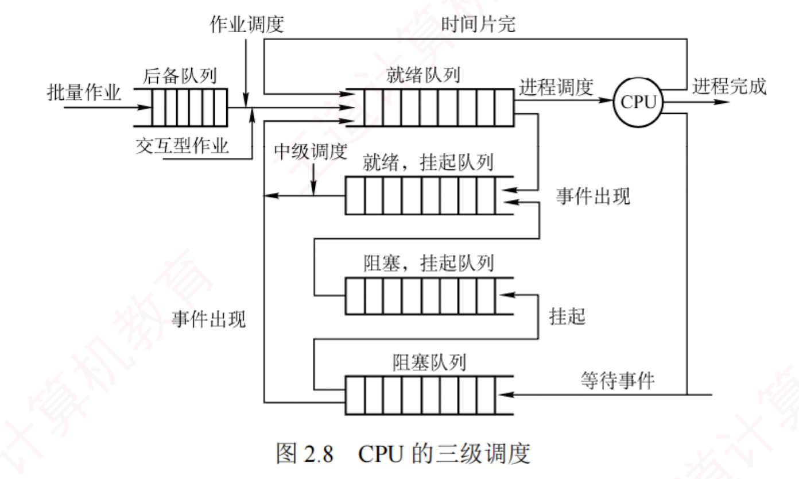

---
### 调度的概念

#### 调度的基本概念

在多道程序系统中，进程的数量通常远多于 CPU 的个数，因此多个进程争用 CPU 的情况在所难免。  
**CPU 调度是指按照一定的算法（兼顾公平性与效率），从就绪队列中选择一个进程，并将 CPU 分配给它运行，从而实现多个进程的并发执行。**

CPU 调度是多道程序操作系统的基础，也是操作系统设计的核心问题之一。

#### 调度的层次

一个作业从提交到完成，通常要经历以下三级调度，如图 2.8 所示。

##### 高级调度（作业调度）

高级调度负责从**外存**后备队列中按照一定规则挑选一个或多个作业，为其分配内存、I/O 设备等必要资源，并创建相应的进程，使其获得参与 CPU 竞争的资格。  
**作业调度实现了内存与外存之间的调度**。  
每个作业在整个生命周期中仅被调入一次、调出一次。

**传统多道批处理系统**普遍配备作业调度；  
而在**分时系统或实时系统**中，由于用户进程通常由交互式命令直接创建，一般不设置独立的作业调度模块。

##### 中级调度（内存调度）

中级调度的引入旨在**提高内存利用率和系统吞吐量**。  
当系统内存紧张时，它会将某些暂时无法运行的进程（如处于阻塞态且等待时间较长的进程）换出到外存，此时的进程状态称为**挂起态**。  
此后，当这些进程具备运行条件且内存有空闲时，中级调度再将其换入内存，恢复为就绪态，并加入就绪队列等待调度。  
**中级调度实际上是存储器管理中的对换功能**。

##### 低级调度（进程调度）

低级调度按照特定算法从就绪队列中选择一个进程，将 CPU 分配给它。  
这是最基础、最频繁的一级调度，**在所有操作系统中都必须存在**。其调度频率很高，通常每几十毫秒执行一次。

####  三级调度的联系

在三级调度体系中，进程调度是最基本且不可或缺的，而作业调度和中级调度则根据系统类型和设计目标选择性配置。  
三级调度协同工作，共同完成作业从提交到终止的全过程：

1. 作业调度为进程活动做准备，将作业调入内存并创建进程，使其具备参与调度的资格。
    
2. 中级调度起调节作用，通过将暂时无法运行的进程换出至外存（挂起态），或在条件满足时将其重新换入内存（恢复为就绪态），动态调整内存中活跃进程的数量。
    
3. 进程调度驱动实际执行，从就绪队列中选择进程投入运行，是实现并发的核心机制。
    
4. 调度频率依次升高：作业调度频率最低，中级调度次之，进程调度频率最高。

[[三级调度的对比]]
