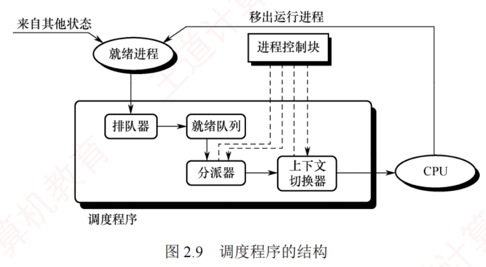

---

### 进程调度

#### 进程调度任务

进程调度的任务主要包括：

1. **保存 CPU 现场信息**。调度发生时，需要将当前进程的 CPU 状态（如程序计数器、通用寄存器等）完整保存至其 PCB 中，以确保后续能从断点恢复执行。
    
2. **选取待运行进程**。调度程序依据特定算法（如时间片轮转、优先级调度等），从就绪队列中选取一个进程，将其状态由“就绪态”改为“运行态”。
    
3. **完成 CPU 分配**。由分派程序将选中进程 PCB 中保存的 CPU 现场加载到处理器寄存器中，移交 CPU 控制权，使其从上次断点处恢复执行。
    

#### 调度程序（调度器）

用于实现 CPU 调度与分派的软件组件称为**调度程序**，它通常由三部分组成，如图 2.9 所示。

1. **排队器**。将系统中所有就绪进程按照特定策略组织成一个或多个就绪队列。  
   每当有进程转换为就绪态时，排队器便将其插入相应的就绪队列，为后续调度选择提供基础。
    
2. **分派器**。根据调度算法选定的进程，分派器负责执行实际的 CPU 分配操作，其主要任务包括：从就绪队列中移出目标进程、触发上下文切换，并将 CPU 控制权转交给该进程。
    
3. **上下文切换器**。在对 CPU 进行切换时，会发生两对上下文的切换操作：  
   第一对，将当前进程的上下文保存到其 PCB 中，再装入分派程序的上下文，以便分派程序运行；  
   第二对，移出分派程序的上下文，将新选进程的 CPU 现场信息装入 CPU 的各个相应寄存器。
    

上下文切换需要执行大量 `load` 和 `store` 指令以保存寄存器内容，因此开销较大。目前已有硬件实现的方法来减少上下文切换时间。  
通常采用两组寄存器，一组供内核使用，另一组供用户使用。  
这样，在上下文切换时只需改变指针，使其指向当前所需的寄存器组即可。

#### 调度的时机、切换与过程

**调度程序是操作系统内核程序**。  
只有当请求调度的事件发生后，才会运行调度程序；  
而在调度出新的就绪进程之后，才会进行进程切换。  
理论上，这三个步骤应按顺序执行，但在实际的操作系统内核运行中，即使发生了引发调度的条件，也不一定能够立即进行调度与切换。

现代操作系统中，通常在以下情况下需要进行进程调度与切换：

1. **创建新进程后**，父进程和子进程都处于就绪态，因此需要决定是运行父进程还是子进程，调度程序可以合法地选择其中一个先运行。
    
2. **进程正常结束或异常终止后**，必须从就绪队列中选择某个进程运行；若没有就绪进程，则通常运行一个系统提供的闲逛进程。
    
3. **当进程因 I/O 请求、信号量操作或其他原因而被阻塞时**，必须调度其他进程运行。
    
4. **当 I/O 设备准备就绪后**，发出 I/O 中断，原先等待 I/O 的进程由阻塞态转换为就绪态，此时需决定是让该新就绪进程投入运行，还是让中断发生时正在运行的进程继续执行。
    

此外，在支持抢占的系统中，若更高优先级的进程进入就绪队列，或当前进程的时间片用完，也会触发调度并可能剥夺当前进程的 CPU。

进程切换通常紧随调度之后发生，其核心任务是**保存原进程的执行现场**，并**恢复新进程的现场**。  
具体而言，操作系统内核会将原进程的上下文（包括程序计数器、寄存器状态等）保存到其PCB 或内核栈中；  
随后，从新进程的 PCB 或内核栈中加载其上下文，更新地址空间相关信息（如页表基址），重置程序计数器，并开始执行新进程。

然而，在以下情况下不能进行进程调度与切换：

1. **处理中断的过程中**。中断处理逻辑复杂，实现上难以安全地进行进程切换；同时，中断处理属于系统内核工作，逻辑上不隶属于任何用户进程，不应被剥夺 CPU 资源。
    
2. **执行原子操作的过程中**。如加锁、解锁、中断现场的保护与恢复等操作，通常需要屏蔽中断以保证原子性。在此期间，连中断都被禁止，更不应进行进程调度与切换。
    

若在上述不可调度期间发生了调度条件，系统会设置一个**调度请求标志**，待当前临界区或中断处理完成后，再根据该标志执行相应的调度与切换操作。

#### 进程调度的方式

所谓进程调度方式，是指当某个进程正在 CPU 上执行时，若有某个更为重要或紧迫的进程需要处理，即有优先级更高的进程进入就绪队列，此时系统应如何分配 CPU。

通常有以下两种进程调度方式：

1. **非抢占调度方式**，也称**非剥夺方式**。指当一个进程正在 CPU 上执行时，即使有某个更为重要或紧迫的进程进入就绪队列，系统仍让当前进程继续执行，直到该进程运行完成（例如正常结束或异常终止），或者因发生某种事件（如等待 I/O 操作、在进程通信或同步中执行了 Block 原语）而主动进入阻塞态，此时才会将 CPU 分配给其他进程。
    
    非抢占调度方式的优点是实现简单、系统开销小，适用于早期的**批处理系统**；  
    但它无法满足分时系统和大多数实时系统对及时响应的要求。
    
1. **抢占调度方式**，也称**剥夺方式**。指当一个进程正在 CPU 上执行时，若出现更高优先级的就绪进程，调度程序可依据一定策略暂停当前进程，将 CPU 分配给更紧迫的进程。
    
    抢占调度方式对提高系统吞吐率和响应效率都有明显好处。但“抢占”并不是一种任意的行为，必须遵循一定的原则，主要有优先级、短进程优先和时间片原则等。
    

#### 闲逛进程

当进程切换发生时，若系统中没有就绪进程，操作系统会调度**闲逛进程**（Idle Process）运行，它的 PID 为 0。闲逛进程的优先级最低，仅在无其他就绪进程时运行；  
一旦有新进程进入就绪队列，它会立即让出 CPU。  
其主要任务是**在空闲循环中不断检测中断请求**。

闲逛进程不占用除 CPU 外的其他系统资源，也不会因等待事件而被阻塞。

#### 两种线程的调度

1. **用户级线程调度**。由于内核并不知道线程的存在，因此内核仍以进程为单位进行调度，将 CPU 时间分配给整个进程。  
   当内核将 CPU 分配给某进程后，由该进程内部的用户级线程库决定具体运行哪个线程。  
   线程切换在同一进程内完成，只需保存少量寄存器状态，开销极小。但缺点是：若一个线程执行阻塞操作（如 I/O），整个进程都会被阻塞。
    
2. **内核级线程调度**。内核直接感知并管理每个线程，调度时选择的是特定线程，而非进程。每个线程拥有独立的内核上下文，可被单独赋予时间片；若时间片用完或被更高优先级线程抢占，则该线程会被强制挂起。由于涉及完整的上下文切换、地址空间更新（在跨进程线程间）以及可能的 TLB 刷新和缓存失效，其切换开销远高于用户级线程，通常高出数倍。