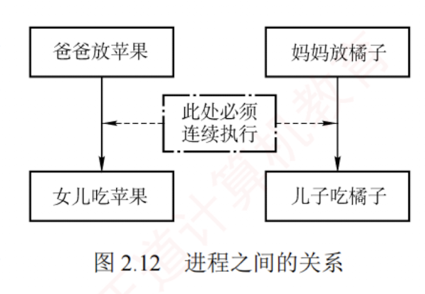

---

### 生产者-消费者问题

**问题描述：**

系统中存在一组**生产者进程**和一组**消费者进程**，它们共享一个初始为空、容量为 $n$ 的缓冲区。  
**生产者**每次生产一个产品，并将其放入缓冲区；  
**消费者**每次从缓冲区取出一个产品并进行消费。  
该问题需满足以下**约束条件**：  
仅当**缓冲区未满**时，生产者才能写入产品，否则必须等待；  
仅当**缓冲区非空**时，消费者才能读取产品，否则必须等待；  
缓冲区是**临界资源**，所有进程必须**互斥访问**。

**问题分析：**

1. **关系分析**。  
   由于**缓冲区**是共享的**临界资源**，生产者与消费者对缓冲区的访问构成**互斥关系**；  
   同时，**消费者必须等待生产者**生成产品后才能消费，二者又存在**同步关系**。
    
2. **思路梳理**。  
   使用**一个互斥信号量**控制对缓冲区的**互斥访问**；  
   使用**两个计数信号量**分别跟踪空缓冲区和满缓冲区的数量；  
   并严格控制 P 和 V 操作的**执行顺序**，以避免死锁。
    
3. **信号量设置**。  
   **互斥信号量** mutex，控制对缓冲区的**互斥访问**，初值为 1；  
   **计数信号量** empty，记录**空缓冲区的数量**，初值为 $n$；  
   **计数信号量** full，记录**满缓冲区的数量**，初值为 0。
    

生产者-消费者进程的实现如下：

```c
semaphore mutex=1;                  //互斥访问缓冲区
semaphore empty=n;                  //空缓冲区数量
semaphore full=0;                   //满缓冲区数量
producer() {                        //生产者进程
    while(1) {
        生产一个产品
        P(empty); (要用什么，P一下)   //申请一个空缓冲区
        P(mutex); (互斥夹紧)         //进入临界区
        将产品放入缓冲区
        V(mutex); (互斥夹紧)         //退出临界区
        V(full);  (提供什么，V一下)   //满缓冲区数加 1
    }
}
consumer() {                        //消费者进程
    while(1) {
        P(full);                    //申请一个满缓冲区
        P(mutex);                   //进入临界区
        从缓冲区中取出一个产品
        V(mutex);                   //退出临界区
        V(empty);                   //空缓冲区数加 1
        消费产品
    }
}
```

需**特别注意**：  
**对 empty 和 full 的 P 操作必须置于对 mutex 的 P 操作之前。**  
若**顺序颠倒**，例如生产者先执行 P(mutex) 再执行 P(empty)，则消费者先执行 P(mutex) 再执行 P(full) **可能导致死锁**。  
试想：当**缓冲区已满**（empty = 0），若生产者先获取 mutex，随后因 P(empty) 而阻塞；  
此时消费者欲取产品，却因 mutex 已被生产者持有而无**法进入临界区**执行 P(full) 和消费操作。  
结果，生产者等待消费者释放空位，消费者等待生产者释放 mutex，双方互相阻塞，**导致死锁**。  

同理，当**缓冲区为空**（full = 0）时，若消费者先获取 mutex 再执行 P(full)，也会因**无法继续而阻塞**，进而阻止生产者进入临界区放入产品，**同样导致死锁**。  
因此，必须先申请资源状态（empty 或 full），再申请互斥访问（mutex），以确保进程不会在持有互斥锁的同时等待资源，从而避免死锁。


下面再看一个**较为复杂的生产者-消费者问题**。

**问题描述：**

桌上有一个**盘子**，最多只能容纳**一个水果**。  
**爸爸**专门向盘中放入**苹果**，**妈妈**专门放入**橘子**；  
**女儿**只吃盘中的**苹果**，**儿子**只吃盘中的**橘子**；  
只有当**盘子为空**时，爸爸或妈妈才能向其中放入一个水果；  
只有当盘中有自己所需的水果时，儿子或女儿才能从中取出并食用。

**问题分析：**

1. **关系分析**。爸爸和妈妈在向盘中放入水果时存在**互斥关系**；  
   爸爸与女儿、妈妈与儿子之间**分别构成同步关系**（爸爸放苹果后，女儿才能取用；妈妈放橘子后，儿子才能取用）；  
   儿子与女儿各自等待不同的水果，因此他们之间**既无互斥也无同步关系**。
    
2. **整理思路**。可抽象为**两个生产者**（爸爸、妈妈）和**两个消费者**（女儿、儿子），**共享一个容量为 1 的缓冲区**。  
   由于不同类型的产品（苹果、橘子）需由不同的消费者消费，故不能仅使用一个 full 信号量来表示满状态，而需**为每种产品设置独立的同步信号量**。
    
3. **信号量设置**。**互斥信号量** plate，控制对**盘子的互斥访问**，初值为 1；  
   **同步信号量** apple，表示盘中是否有苹果，初值为 0；  
   **同步信号量** orange，表示盘中是否有橘子，初值为 0。
    

进程的实现如下：


```c
semaphore plate=1,apple=0,orange=0;
dad() {                             //爸爸进程
    while(1) {
        准备一个苹果
        P(plate);                   //获取对盘子的独占使用权
        把苹果放入盘子
        V(apple);                   //通知女儿：苹果已放入盘中
    }
}
mom() {                             //母亲进程
    while(1) {
        准备一个橘子
        P(plate);                   //获取对盘子的独占使用权
        把橘子放入盘子
        V(orange);                  //通知儿子：橘子已放入盘中
    }
}
son() {                             //儿子进程
    while(1) {
        P(orange);                  //等待盘中有橘子
        从盘子中取出橘子
        V(plate);                   //释放盘子，允许他人使用
        吃掉橘子
    }
}
daughter() {                        //女儿进程
    while(1) {
        P(apple);                   //等待盘中有苹果
        从盘子中取出苹果
        V(plate);                   //释放盘子，允许他人使用
        吃掉苹果
    }
}
```


进程之间的关系如图 2.12 所示。  
dad() 和 daughter()、mom() 和 son() 必须**成对执行**。  
只有当女儿拿走苹果或儿子拿走橘子之后，才会执行 V(plate) 操作，从而释放盘子供下一次使用。

