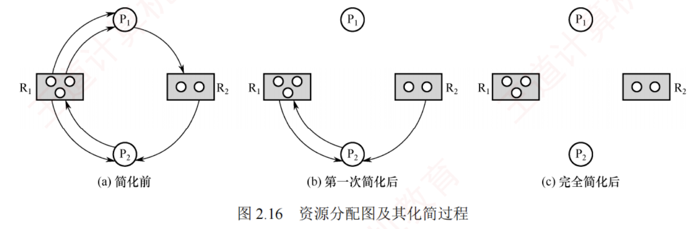

---
### 死锁检测与解除

前面介绍的**死锁预防和避免算法**，都是在为进程分配资源时**施加限制条件**或**进行安全性检查**。  
若系统在资源分配时不采取任何预防或避免措施，则必须提供**死锁检测与解除机制**。

#### 死锁检测

**区分死锁避免与死锁检测**。

**死锁避免**要求在进程运行过程中始终确保**系统不会进入死锁状态**，因此需要**预先知道**进程从开始到结束的**全部资源需求**。  

**死锁检测**则仅判断当前时刻系统**是否已发生死锁**，**无须预知**进程未来的资源请求，只需依据**当前的资源分配和请求情况**。

通常采用**资源分配图**来检测系统是否处于死锁状态。  
在**资源分配图**中：**圆圈**表示进程，**矩形框**表示一类资源；  
若某类资源有**多个实例**，则在框内用**多个圆点**表示；  
**请求边**（从进程指向资源）表示该进程**申请一个单位**的该类资源；  
**分配边**（从资源指向进程）表示该类资源的**一个实例**已分配给该进程。  
在图 2.16(a)所示的资源分配图中，进程 $P_1$ 已获得两个 $R_1$ 资源，并请求一个 $R_2$；  

$P_2$ 已获得一个 $R_1$ 和一个 $R_2$，并请求一个 $R_1$。系统中**存在环**，但尚未确定是否死锁。

通过**简化资源分配图**可判断系统是否处于死锁状态。  
简化步骤如下。

1. 在**资源分配图**中，找出当前**可继续执行的进程** $P_i$（其所有资源请求均可被当前空闲资源满足）。  
   **空闲资源数量**等于**该类资源总数减去已分配实例数**（资源节点发出的分配边数量）。  
   例如，在图 2.16(a)中，$R_1$ 总数为 3，出度为 3，故**无空闲资源**；  
   $R_2$ 总数为 2，出度为 1，故有 1 个空闲。  
   $P_1$ 仅请求 1 个 $R_2$，而 $R_2$ 有 1 个空闲，因此 $P_1$ 可继续执行。  
   **将其所有请求边和分配边删除**，使之成为孤立节点，得到图 2.16(b)所示的情况。
    

2. $P_i$ 释放的资源可能使其他阻塞进程的请求得以满足，从而转为**可执行状态**。  
   例如，$P_1$ 释放其占有的 $R_1$ 资源后，$P_2$ 的 $R_1$ 请求即可满足，因而也能继续执行。  
   重复上述过程，若**最终能删除图中所有边**，则称该图可**完全简化**，如图 2.16(c)所示。
    

**死锁定理**：系统处于死锁状态，当且仅当其资源分配图**不可完全简化**。

#### 死锁解除

一旦检测出死锁，系统应立即采取措施予以**解除**。主要方法包括如下几种。

1. **资源剥夺法**。**挂起部分死锁进程**，抢占其资源并**重新分配给其他死锁进程**，以**打破死锁环路**；但需防止被挂起的进程因长期得不到所需资源而陷入**饥饿**。
    

> 注意：在资源分配图中，经死锁定理简化后，仍有边相连的进程即为死锁进程。

2. **撤销进程法**。**强制终止部分或全部死锁进程**，并**回收其所占资源**。**终止顺序**可依据**进程优先级或撤销代价**（如资源占有量等）确定。该方法**实现简单**，但**代价可能较高**，尤其当进程已接近完成时，一旦被终止，已完成的工作将全部丢失，后续需从头执行。
    
3. **进程回退法**。令一个或多个死锁进程**回退**到之前某个足以回避死锁的状态，并在回退过程中自愿释放其所占资源。系统需**记录进程的历史状态**并**设置还原点**，**实现较复杂**。