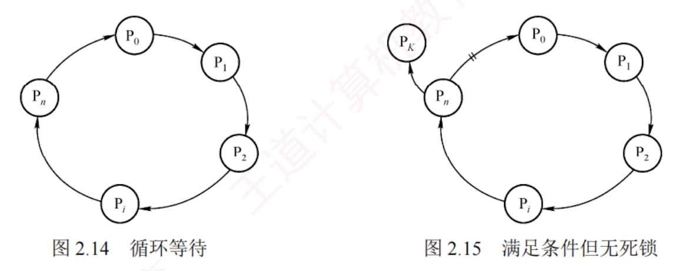
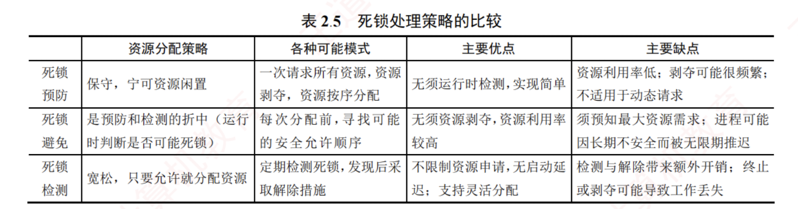

 ---

### 死锁的定义

在多道程序系统中，进程的并发执行显著提高了系统资源的利用率和整体效率。  

然而，这种并发性也带来了新的问题——**死锁**。  

**死锁是指多个进程因竞争资源而陷入相互等待的僵局，每个进程都在等待其他进程所占有的资源，而这些资源又不会被释放，从而形成一个循环等待链。**  

结果，所有涉及的进程都被**永久阻塞**；  
若无外部干预，它们将无法继续推进。

#### 示例

下面通过实例说明死锁现象。
先看一个生活中的类比。假设有一条狭窄的小巷，仅容一辆车通行。若有两辆汽车分别从巷子的两端同时驶入，且双方都坚持前行而不愿倒车，则两辆车将在巷中对峙，彼此阻挡，谁也无法通过。这种互相等待、互不让步的情形，恰如计算机系统中的死锁。

在计算机系统中，死锁的表现更为典型。  
例如，某系统中仅配备一台打印机和一台扫描仪。进程 $P_1$ 当前正占有扫描仪，并请求使用打印机；与此同时，进程 $P_2$ 正占有打印机，并请求使用扫描仪。  
由于每个进程都持有对方所需的资源，且都不主动释放，两个进程便陷入无限期的相互等待之中，无法继续执行。此时，系统就处于死锁状态。

### 死锁与饥饿

一组进程处于死锁状态，是指其中**每个进程都在等待某个事件的发生**，而该事件只能由组内另一个进程触发，通常表现为**等待对方释放其所占有的资源**。

与死锁密切相关但本质不同的另一个问题是**饥饿**，是指某个进程因资源分配策略的不公平性，长期得不到所需资源，从而无法推进其执行。  

#### 产生饥饿的主要原因

当多个进程同时竞争同一类资源时，若系统采用的分配策略不能保证“**等待时间有上界**”（无法确保每个等待进程最终都能获得服务），则某些进程就可能被无限期推迟。  

例如，当多个进程需要打印文件时，若系统采用“最短作业优先”的打印调度策略，则长文件的打印请求可能因不断有新的短文件到达而始终无法获得服务，最终陷入饥饿状态。  
需要注意的是，**饥饿并不等同于死锁**：系统可能仍在正常运行，其他进程可以顺利执行，只是**个别进程被持续忽略**。

#### 死锁与饥饿的共同点

相关进程都无法顺利向前推进。  

#### 二者的主要区别
1. 涉及的进程数量不同，饥饿可以只影响单个进程；而死锁必须涉及两个或更多的进程，且它们之间存在循环等待关系。
2. 进程所处的状态不同，处于饥饿状态的进程可能处于就绪态（例如，在 SPF 调度算法中长期得不到 CPU），也可能处于阻塞态（例如，长期等待某个 I/O 设备）；而处于死锁状态的进程则必定处于阻塞态，因为它们正在等待已被其他死锁进程占有的资源。

### 死锁产生的原因

1. **系统资源的竞争**
    
    系统中**不可剥夺资源**（如打印机、磁带机等）的数量通常有限，难以满足所有并发进程的需求。  
    当多个进程竞争这类资源且资源分配策略不当，便可能因相互等待而陷入僵局，进而引发死锁。  
    需要强调的是，死锁的发生与不可剥夺资源的存在密切相关。  
    对于可剥夺资源（如 CPU 时间片），操作系统可在必要时强制回收，因此单纯因这类资源的竞争一般不会导致死锁。
    
2. **进程推进顺序非法**
    
    **即使系统资源充足，若进程请求和释放资源的顺序不合理，则仍可能引发死锁**。  
    例如，进程 $P_1$ 和 $P_2$ 分别占有资源 $R_1$ 和 $R_2$，随后 $P_1$ 申请 $R_2$、而 $P_2$ 申请 $R_1$。  
    由于双方所需资源均被对方占有，两个进程均被阻塞，且各自保持已占有的资源不放，从而形成死锁。
    

此外，**同步机制使用不当**也可能导致死锁。  
例如，进程 A 等待进程 B 发送的消息，而进程 B 又在等待进程 A 的消息。  
此时，尽管未涉及传统硬件资源，但**消息通道或同步对象**可被视为一种**逻辑资源**，其相互等待同样会使进程无法继续推进，形成死锁。

### 死锁产生的必要条件

死锁的发生必须同时满足以下四个条件；只要其中任一条件不成立，死锁就不可能发生。

1. **互斥条件**。进程对所分配的资源（如打印机）要求排他性使用，即在一段时间内，某资源只能被一个进程占有；若有其他进程请求该资源，则必须等待。
    
2. **不可剥夺条件**。进程已获得的资源在使用完毕之前，不能被其他进程强制剥夺，只能由该进程主动释放。
    
3. **请求并保持条件**。进程在持有至少一个资源的同时，又提出新的资源请求；若该资源已被其他进程占有，则请求进程被阻塞，但对其已占有的资源仍保持不放。
    
4. **循环等待条件**。存在一个进程集合 $\{P_1, P_2, \dots, P_n\}$，其中每个进程 $P_i$ 等待的资源正被下一个进程 $P_{(i+1) \text{mod}(n+1)}$ 占有，从而形成一个循环等待链，如图 2.14 所示。
    

直观上看，循环等待条件似乎与死锁的定义相同，实则不然。

**资源分配图中存在环，并不必然意味着死锁**。其根本原因在于：当某类资源有多个实例时，即使图中存在环，系统仍可能通过资源重分配打破僵局。例如，在图 2.15 中，若输出设备有两个实例，进程 $P_0$ 和 $P_K$ ($K \notin \{0, 1, \dots, n\}$) 各持有一台。当 $P_n$ 请求一台输出设备时，只要 $P_0$ 或 $P_K$ 任一释放其所持有的设备，$P_n$ 即可获得所需资源，从而解除等待环。

因此，只有当系统中每类资源均仅有一个实例时，资源分配图中的环才成为死锁的**充分必要条件**；  
否则，环的存在仅表明系统处于潜在风险状态，未必实际发生死锁。

区分不可剥夺条件与请求并保持条件，通过以下例子说明：若你手中持有一个苹果，他人不能强行将其拿走（使你暂时不吃），这体现了**不可剥夺条件**；  
若你已持有一个苹果，又去请求第二个苹果，但在获得第二个苹果前拒绝放下第一个，则体现了**请求并保持条件**。

### 死锁的处理策略

处理死锁主要有三种策略：  
一是通过协议预防或避免死锁，确保系统永不进入死锁状态；  
二是允许死锁发生，但能检测并恢复；  
三是完全忽略死锁问题，假定其不会出现。

其中，第一种策略包含**预防死锁**和**避免死锁**两种方法；  
第二种策略包含**检测及解除死锁**方法；  

第三种策略被大多数通用操作系统（如 Linux 和 Windows）所采用。  

下面简要介绍这些处理方法。

1. **预防死锁**。通过设置严格的限制条件，破坏死锁的四个必要条件中的一个或多个，从根本上杜绝死锁的可能。
    
2. **避免死锁**。在资源动态分配过程中，通过特定算法判断分配后系统是否仍处于安全状态，仅当安全时才允许分配，从而避免进入可能导致死锁的不安全状态。
    
3. **检测及解除死锁**。不施加任何预防性限制，允许进程自由申请资源；系统定期运行检测算法，一旦发现死锁，便采取相应措施（如终止部分进程或剥夺其资源）予以解除。
    

预防与避免死锁均属于事前防范策略。  
死锁预防的限制条件较为严格，实现相对简单，但往往导致系统效率和资源利用率较低；死锁避免的限制条件相对宽松，但需在每次资源分配前通过算法判断系统是否仍处于安全状态，实现较为复杂。  
各类策略的对比如表 2.5 所示。

