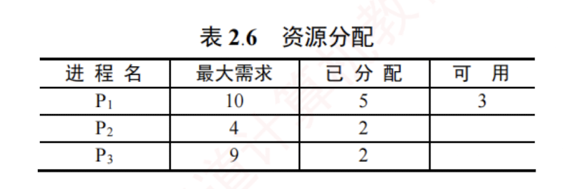
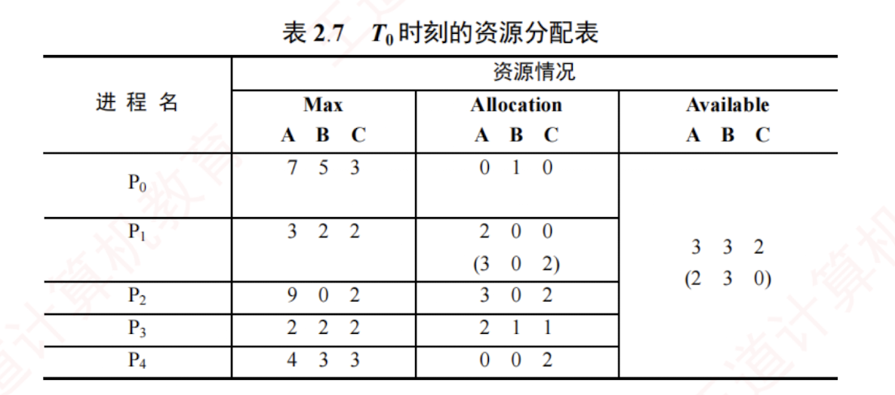
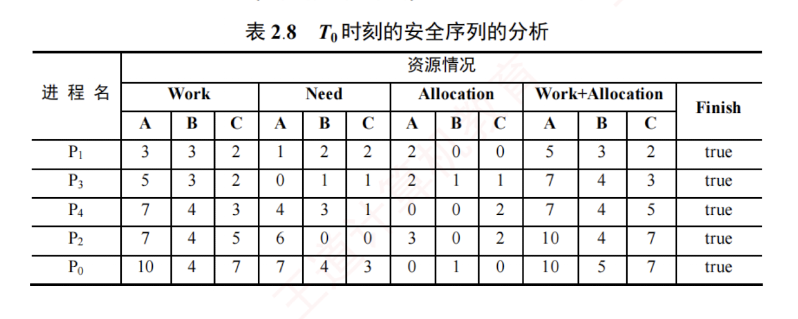
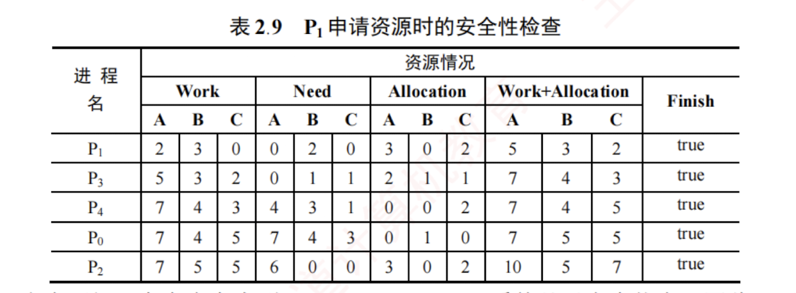
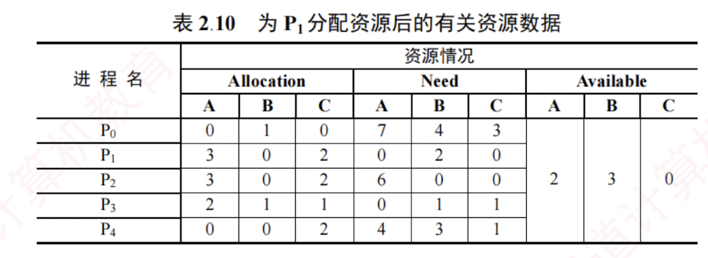
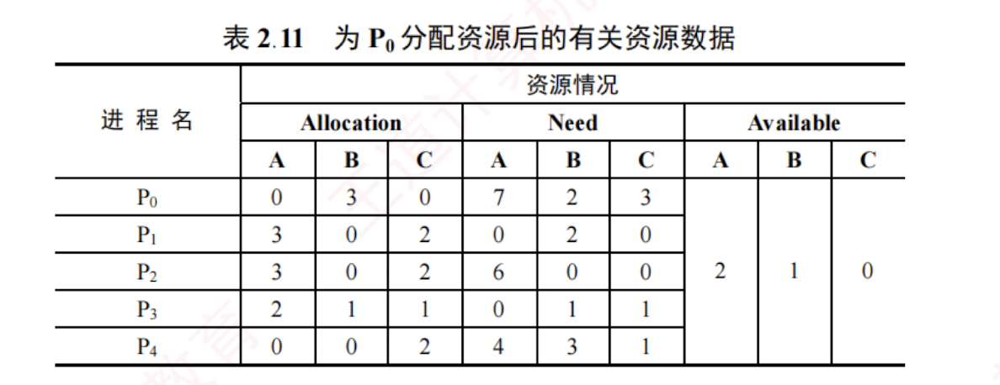

---
### 死锁避免

死锁避免同样属于事先预防策略，但它并非通过预先施加限制来破坏死锁的必要条件，而是在每次分配资源时，**动态判断**此次分配是否可能引发死锁。  
只有在确认不会导致死锁的情况下，系统才予以分配。  
由于该方法所施加的约束较宽松，因而能够获得较好的系统性能。

#### 系统安全状态

在死锁避免机制中，系统允许进程动态申请资源，但在进行资源分配前，必须先评估此次分配的安全性：若分配后系统仍处于安全状态，则允许分配；否则，进程需等待。

所谓安全状态，是指系统存在某个进程执行序列 $(P_1, P_2, \cdots, P_n)$，使得对于序列中的每个进程 $P_i$，在其之前的所有进程执行完毕并释放所占资源后，系统仍有足够的可用资源满足 $P_i$ 的尚需资源量（最大需求减去已分配量），从而保证 $P_i$ 能顺利完成。  

这样的序列称为**安全序列**（可能存在多个）。若系统无法找到任何一个安全序列，则称系统处于不安全状态。


假设系统中有三个进程 $P_1$，$P_2$ 和 $P_3$，共有 12 台磁带机。各进程的最大需求分别为：$P_1$ 需 10 台，$P_2$ 需 4 台，$P_3$ 需 9 台。在 $T_0$ 时刻，各进程已分配资源及系统可用资源如表 2.6 所示。



在 $T_0$ 时刻，系统处于安全状态，因为存在安全序列 $(P_2, P_1, P_3)$：若按此顺序推进进程，每个进程在其轮次均可获得所需资源并顺利完成。具体而言，当前可用资源为 3，$P_2$ 尚需 2 台，可立即满足，$P_2$ 完成后释放其全部 4 台资源，可用资源变为 5；$P_1$ 尚需 5 台，恰好可满足，$P_1$ 完成后释放 10 台，可用资源增至 10；$P_3$ 尚需 7 台，可被满足，最终顺利完成。

若在 $T_0$ 时刻之后，系统将 1 台分配给 $P_3$，则 $P_3$ 已分配量变为 3，可用资源降为 2。此时，系统进入不安全状态，因为无法再找到任何安全序列。例如，若将剩余的 2 台分配给 $P_2$（其尚需 2 台），$P_2$ 可完成并释放 4 台，可用资源变为 4。然而，$P_1$ 尚需 5 台，$P_3$ 尚需 6 台（因已分配 3 台），均无法满足。两个进程相互等待对方释放资源，陷入僵局，最终导致死锁。

系统处于安全状态时，一定不会发生死锁；而处于不安全状态时，死锁可能发生，但并非必然发生。换言之，死锁发生时，系统一定处于不安全状态，但不安全状态不一定会演变为死锁。

#### 利用银行家算法避免死锁


银行家算法是最著名的死锁避免算法。其基本思想是：将操作系统视为银行家，系统管理的资源视为银行资金，进程请求资源相当于用户申请贷款。每个进程在运行前需声明其对各类资源的最大需求量（且该最大需求量在整个生命周期内不得更改，否则银行家算法的安全性保证失效），且该总量不得超过系统资源总量。当进程在运行中申请资源时，系统首先检查当前是否有足够资源可供分配；若有，则进一步试探：若将这些资源分配给该进程，系统是否仍处于安全状态。只有在确保安全的前提下，才正式分配资源；否则，就让进程等待。


##### **银行家算法中的数据结构**

假设系统中有 $n$ 个进程和 $m$ 类资源，银行家算法需维护以下四个数据结构。

1. **可利用资源向量 Available**：长度为 $m$ 的向量，其中每个元素代表一类可用的资源数量。$Available[j] = K$ 表示当前系统中有 $K$ 个 $R_j$ 类资源可用。
    
2. **最大需求矩阵 Max**：$n \times m$ 矩阵，定义系统中每个进程对 $m$ 类资源的最大需求。$Max[i, j] = K$ 表示进程 $P_i$ 对 $R_j$ 类资源的最大需求数量为 $K$。
    
3. **分配矩阵 Allocation**：$n \times m$ 矩阵，定义系统中每类资源当前已分配给每个进程的资源数。$Allocation[i, j] = K$ 表示进程 $P_i$ 当前已获得 $R_j$ 类资源的数量为 $K$。
    
4. **需求矩阵 Need**：$n \times m$ 矩阵，表示每个进程尚需的各类资源数。$Need[i, j] = K$ 表示进程 $P_i$ 尚需 $R_j$ 类资源的数量为 $K$。
    

上述三个矩阵满足如下关系：

$$Need[i, j] = Max[i, j] - Allocation[i, j]$$

通常，题目会给出 Max 和 Allocation 矩阵，解题的第一步是据此计算出 Need 矩阵。

##### **银行家算法**

设 $Request_i$ 是进程 $P_i$ 的资源请求向量，$Request_i[j] = K$ 表示 $P_i$ 请求 $K$ 个 $j$ 类资源。当 $P_i$ 发出资源请求后，系统按以下步骤进行检查：

1. **合法性检查**：若 $Request_i[j] \le Need[i, j]$，则转向步骤 2；否则视为非法请求，因为其申请量已超过预先声明的最大需求。
    
2. **资源可用性检查**：若 $Request_i[j] \le Available[j]$，则转向步骤 3；否则表示当前资源不足，$P_i$ 必须等待。
    
3. **试探性分配**：系统尝试将资源分配给 $P_i$，并更新相关数据结构：
    

    
    ```c
    Available[j] = Available[j] - Request_i[j]       #减少系统可用资源，反映资源已被分配
    Allocation[i, j] = Allocation[i, j] + Request_i[j] #增加 Pi 已分配的资源量
    Need[i, j] = Need[i, j] - Request_i[j]           #减少 Pi 尚需的资源量
    ```
    
4. **安全性检查**：系统执行安全性算法，判断此次分配后系统是否处于安全状态。若是，则正式确认此次分配；否则，撤销分配，恢复各数据结构的原始值，并让 $P_i$ 等待。
    


##### **安全性算法**

安全性算法用于判断系统当前是否处于安全状态，其基本思想是：尝试构造一个进程执行序列，使得所有进程都能依次获得所需资源并顺利完成。具体步骤如下。

1. **设置两个向量**：① 工作向量 **Work**：长度为 $m$ 的向量，表示当前可用的各类资源数，初始时 $Work = Available$；② 完成向量 **Finish**：长度为 $n$ 的布尔向量，标记各进程能否顺利完成，初始时 $Finish[i] = false$；当进程 $P_i$ 的资源需求可被满足时，令 $Finish[i] = true$。
    
2. **在尚未完成的进程中，查找一个满足以下两个条件的进程 $P_i$**：
    
    
    
    ```c
    Finish[i] = false      #尚未加入安全序列
    Need[i] <= Work        #其尚需的各类资源数均不超过当前可用资源
    ```
    
    若能找到，则执行步骤 3；否则，执行步骤 4。
    
3. **当进程 $P_i$ 获得所需资源后可顺利执行至完成，并释放其所占有的全部资源，故执行**：
    

    
    ```c
    Work = Work + Allocation[i]  #释放其已分配的各类资源
    Finish[i] = true             #将其加入安全序列
    ```
    
    随后返回步骤 2，继续寻找下一个可完成的进程。
    
4. **若所有进程均满足 $Finish[i] = true$**，则系统处于安全状态；否则系统处于不安全状态。
    
    为帮助理解上述流程，下面将通过具体示例完整演示安全性算法的执行过程。
    

---

#### 安全性算法举例


假定系统中有 5 个进程 $\{P_0, P_1, P_2, P_3, P_4\}$ 和 3 类资源 $\{A, B, C\}$，各类资源的总量分别为 10, 5, 7，在 $T_0$ 时刻的资源分配情况见表 2.7。现利用安全性算法，判断系统此时是否处于安全状态。


1. 首先，由题目给出的 Max 矩阵和 Allocation 矩阵，可计算出 Need 矩阵：
    
    $$\begin{bmatrix} 7 & 5 & 3 \\ 3 & 2 & 2 \\ 9 & 0 & 2 \\ 2 & 2 & 2 \\ 4 & 3 & 3 \end{bmatrix}_{Max} - \begin{bmatrix} 0 & 1 & 0 \\ 2 & 0 & 0 \\ 3 & 0 & 2 \\ 2 & 1 & 1 \\ 0 & 0 & 2 \end{bmatrix}_{Allocation} = \begin{bmatrix} 7 & 4 & 3 \\ 1 & 2 & 2 \\ 6 & 0 & 0 \\ 0 & 1 & 1 \\ 4 & 3 & 1 \end{bmatrix}_{Need}$$
    
    由此得到各进程的尚需资源数。
    
2. 初始化工作向量 $Work = Available = (3, 3, 2)$。将 Work 与 Need 矩阵的各行进行比较，寻找满足 $Need[i] \le Work$（各分量均不超过）且 $Finish[i] = false$ 的进程。初始时
    
    $$\begin{aligned} P_1 \to (1, 2, 2) < (3, 3, 2) \\ P_3 \to (0, 1, 1) < (3, 3, 2) \end{aligned}$$
    
    进程 $P_1$ 和 $P_3$ 均满足条件。此处选择 $P_1$（也可选择 $P_3$）作为安全序列的第一个进程。
    
3. 将 $P_1$ 加入安全序列，并模拟其顺利完成：释放其所占资源，更新工作向量：
    
    $$Work = Work + Allocation[1] = (3, 3, 2) + (2, 0, 0) = (5, 3, 2)$$
    
    同时，标记 $Finish[1] = true$。
    
    以更新后的 $Work = (5, 3, 2)$ 重复上述过程，继续查找下一个可执行的进程。以此类推，整个分析过程如表 2.8 所示（表中“Work+Allocation”列即为下一步的 Work 值），最终构造出一个完整的安全序列 $\{P_1, P_3, P_4, P_2, P_0\}$，表明系统在 $T_0$ 时刻处于安全状态。  
    
    


#### 银行家算法举例

安全性算法是银行家算法的核心。在典型题中，通常会给出某个进程的资源请求向量。读者只需执行银行家算法的前三个步骤，即可得到更新后的 Allocation 和 Need 矩阵，再参照上例的安全性算法判断系统是否仍处于安全状态，从而决定是否批准该请求。

假设当前系统资源分配及剩余情况如表 2.7 所示（$T_0$ 时刻的状态）。

1. 进程 $P_1$ 发出请求向量 $Request_1(1, 0, 2)$，系统按银行家算法进行如下检查。
    
    ① 合法性检查：$Request_1(1, 0, 2) \le Need_1(1, 2, 2)$，成立。
    
    ② 资源可用性检查：$Request_1(1, 0, 2) \le Available_1(3, 3, 2)$，成立。
    
    ③ 试探性分配：系统尝试为 $P_1$ 分配资源，并修改相关数据结构：
    
    $$\begin{aligned} Available &= Available - Request_1 = (2, 3, 0) \\ Allocation_1 &= Allocation_1 + Request_1 = (3, 0, 2) \\ Need_1 &= Need_1 - Request_1 = (0, 2, 0) \end{aligned}$$
    
    由此形成的资源变化情况如表 2.7 中的圆括号所示。
    
    ④ 安全性检查：令 $Work = Available = (2, 3, 0)$，执行安全性算法，过程如表 2.9 所示。  
    
    


由表可知，存在安全序列 $\{P_1, P_3, P_4, P_0, P_2\}$，系统处于安全状态。因此，可以正式将 $P_1$ 所请求的资源分配给它。分配后系统的资源状态如表 2.10 所示。



2. $P_4$ 发出请求向量 $Request_4(3, 3, 0)$，系统按银行家算法进行检查：
    
    ① 合法性检查：$Request_4(3, 3, 0) \le Need_4(4, 3, 1)$，成立。
    
    ② 资源可用性检查：$Request_4(3, 3, 0) > Available(2, 3, 0)$，不成立，让 $P_4$ 等待。
    
3. $P_0$ 发出请求向量 $Request_0(0, 2, 0)$，系统按银行家算法进行检查：
    
    ① 合法性检查：$Request_0(0, 2, 0) \le Need_0(7, 4, 3)$，成立。
    
    ② 资源可用性检查：$Request_0(0, 2, 0) \le Available(2, 3, 0)$，成立。
    
    ③ 试探性分配：系统尝试为 $P_0$ 分配资源，并修改相关数据结构：
    
    $$\begin{aligned} Available &= Available - Request_0 = (2, 1, 0) \\ Allocation_0 &= Allocation_0 + Request_0 = (0, 3, 0) \end{aligned}$$  
    
    


$$Need_0 = Need_0 - Request_0 = (7, 2, 3)，结果如表 2.11 所示。$$  



④ 安全性检查：此时 $Available(2, 1, 0)$，无法满足任何进程的尚需资源，系统进入不安全状态，因此拒绝 $P_0$ 的请求，撤销试探性分配，并恢复各数据结构至分配前状态。