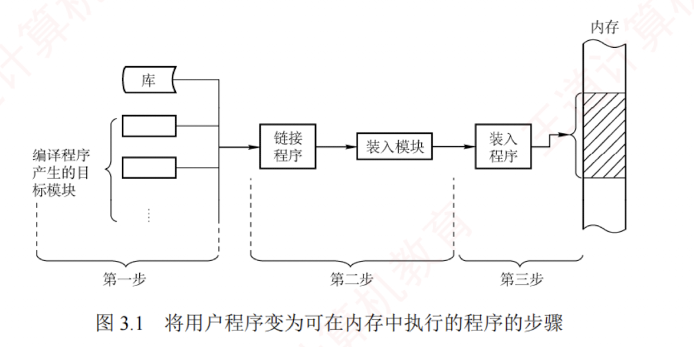

---

### 内存管理的基本原理和要求

内存管理是操作系统中最核心、也最复杂机制之一。  
尽管现代计算机的主存容量持续增长，但仍无法同时容纳所有用户进程及其所需的程序与数据。  
因此，操作系统必须对有限的物理内存进行合理划分，并实施高效的动态分配策略。  

内存管理（Memory Management），正是指操作系统对内存空间的**组织、分配、回收以及地址映射**等一系列操作。

在多道程序环境下，有效的内存管理尤为重要。  
它不仅提升了内存的利用率，简化了用户对存储资源的使用，还能在逻辑上扩展内存空间。  

具体而言，**内存管理的主要功能**包括：

- **内存空间的分配与回收**。操作系统需实时跟踪内存使用状态，记录空闲区域，为新创建的进程分配所需空间，并在进程终止后及时回收其所占用的内存。
    

- **地址转换**。用户程序使用的是逻辑地址（也称虚拟地址），而实际访问内存时必须使用物理地址。操作系统需提供机制，将逻辑地址动态转换为对应的物理地址。
    
- **内存空间的扩充**。通过虚拟存储技术，使进程能够使用远大于物理内存容量的地址空间。
    
- **内存共享**。允许多个进程安全地访问同一块物理内存区域，常用于共享库或进程间通信。
    
- **存储保护**。确保各进程只能访问自身被授权的内存区域，防止相互干扰或非法破坏。
    

上述功能的实现依赖于内存管理的基本原理，其中逻辑地址与物理地址的区别尤为关键。  
此处仅作初步介绍，详细机制将在后续结合具体管理方法深入展开。

#### 程序的链接与装入

创建进程时，首先需要将程序和数据装入内存。如图 3.1 所示，将用户源程序转换为可在内存中执行的程序，通常需经过以下三个步骤：

1. **编译**。由编译程序将用户源代码翻译成若干目标模块。
    
2. **链接**。由链接程序将这些目标模块及其所需的库函数合并，形成一个完整的装入模块。
    
3. **装入（加载）**。由装入程序将该装入模块载入内存，并启动其执行。
    

#### 逻辑地址与物理地址

编译后的每个目标模块通常从 0 号单元开始编址，这种地址称为该模块的相对地址（或逻辑地址）。  
链接程序将多个目标模块合并为一个完整的可执行程序时，依次将各模块的相对地址拼接成一个统一的、从 0 开始编址的逻辑地址空间（或虚拟地址空间）。  
以 32 位系统为例，该逻辑地址空间的范围为 $0 \sim 2^{32}-1$。  
进程运行时所使用的地址均为**逻辑地址**；用户程序和程序员只需关注逻辑地址，而底层的内存管理机制对其完全透明。  
不同进程可以拥有相同的逻辑地址，因为它们各自拥有独立的逻辑地址空间，这些地址会被映射到主存的不同位置。

**物理地址**空间是指主存中所有物理存储单元的集合，它是地址转换的最终目标。  
无论进程执行指令还是访问数据，最终都必须通过物理地址从主存中读取或写入信息。在早期系统中，程序装入内存时需将逻辑地址转换为物理地址，这一过程称为**地址重定位**；  
而在现代支持虚拟内存的系统中，该转换由**内存管理单元**（MMU）在硬件层面于运行时自动完成。

具体而言，现代操作系统为每个进程维护一张页表，用于记录逻辑页到物理页框的映射关系。当进程访问某个逻辑地址时，MMU 会依据当前进程的页表，将其动态转换为相应的物理地址。整个过程对用户程序完全透明，构成了虚拟内存系统的基础。

#### 程序的链接

链接程序的作用是将编译生成的目标模块及其所需的库函数合并，形成一个完整的装入模块，以便后续装入内存并执行。根据链接发生的时机不同，可分为以下三种方式。

##### **静态链接**

在程序运行之前，将各目标模块及其所需的库函数链接成一个完整的装入模块（可执行文件），此后不再拆分，这种链接方式称为**静态链接**。  
链接过程中需完成两项关键操作。

1.  **地址调整**。各目标模块在编译后均以 0 为起始地址，链接时需根据其在装入模块中的实际位置，将内部地址统一加上相应的偏移量。例如，若模块 A 的长度为 $L$，且链接后模块 B 紧邻在模块 A 之后存放，则原本从 0 开始编址的模块 B 在合并后的装入模块中将从地址 $L$ 处开始，其内部所有地址均需加上偏移量 $L$。

2. **外部符号解析**。将模块间引用的外部符号（如函数名）替换为确定的地址。若模块 A 中包含语句 `CALL B`，其中 B 为指向模块 B 入口的外部调用符号，则链接程序会将其解析为模块 B 在装入模块中的起始地址 $L$，并将 `CALL B` 中的符号 B 替换为地址 $L$。

##### **装入时动态链接**

装入时动态链接是指：将用户源程序编译后生成的一组目标模块，在装入内存时采用边装入边链接的方式。  
具体而言，当装入某个目标模块时，若遇到对外模块的调用，则装入程序会立即查找并装入相应的外部目标模块，并替换其中的外部符号。  

其**优点**如下。

1. **便于修改和更新**。静态链接需将所有目标模块预先装配成一个完整的装入模块，若其中任一模块需要修改或更新，则必须重新生成整个装入模块。若采用装入时动态链接方式，则各目标模块独立存放，只需替换被修改的模块，无须重建整个程序。

2. **便于实现对目标模块的共享**。在静态链接方式下，每个应用程序都包含其所依赖目标模块的完整副本，无法实现共享。而在装入时动态链接方式下，操作系统可将同一个目标模块链接到多个应用程序中，从而实现多个程序对该目标模块的共享。

###### **运行时动态链接**

运行时动态链接是对装入时动态链接的改进，在程序执行过程中，仅当需要调用某个尚未装入内存的目标模块时，操作系统才动态加载并链接该模块。  
具体而言，系统会查找该模块，将其装入内存，并完成符号解析，使其可被当前进程调用；而程序运行中未使用的模块，则既不会被装入内存，也不会进行链接。  

其**优点是既能加快程序的装入过程，又可节省内存空间**。

#### 程序的装入

将一个装入模块载入内存时，主要有以下三种方式。

##### **绝对装入**

绝对装入仅适用于**单道程序环境**。由于内存中始终只有一个程序，其驻留位置在编译前即可确定，因此编译程序可以直接生成使用绝对地址的目标代码；  
装入程序只需按这些地址将程序和数据载入内存。  
此时，程序中的逻辑地址与实际物理地址完全一致，无须任何修改。

程序中通常使用的是**符号地址**（如变量名、函数名），由编译器或汇编器在编译或汇编阶段将其转换为绝对地址；  
当然，绝对地址也可由程序员直接指定，但这种方式缺乏灵活性。

##### **可重定位装入**

在多道程序环境下，编译程序无法预知目标模块在内存中的具体位置，因此经编译和链接生成的装入模块通常从地址 0 开始编址，程序中的地址均为相对于模块起始位置的逻辑地址。此时应采用可重定位装入方式，它可根据内存的具体情况，将装入模块装入内存的适当位置。

装入时，系统根据内存当前的空闲情况，为该模块分配一块连续的内存区域，并将整个模块载入其中。随后，一次性将所有逻辑地址修改为对应的物理地址。这一地址转换过程称为重定位。由于转换在装入时完成，且在程序运行期间不再改变，故称静态重定位，如图 3.2(a)所示。

进程必须在装入前一次性获得其所需的全部内存空间；若内存不足，则无法装入。一旦装入，进程在整个运行期间既不能移动位置，也不能动态申请额外内存，限制了内存管理的灵活性。

##### **动态运行时装入**

为克服静态重定位的局限，支持程序在内存中的移动，需采用动态重定位方式。装入程序将装入模块载入内存后，并不立即转换地址，而是将地址转换推迟到指令实际执行时进行。为此，系统借助一个重定位寄存器，用于存放该模块在内存中的起始物理地址。程序中保留的仍是逻辑地址，而实际物理地址则由硬件在运行时动态计算得出，如图 3.2(b)所示。

动态重定位的优点：支持程序在内存中移动，便于操作系统进行紧凑，从而有效减少外部碎片；提高内存分配的灵活性，允许在运行期间根据需要动态调整进程的内存布局。

#### 内存保护

为确保各进程拥有独立的内存空间，内存保护机制需在内存分配前防止用户进程破坏操作系统，同时避免用户进程相互干扰。常用方法主要有以下两种。

1. 在 CPU 中设置一对上、下限寄存器，分别存放用户进程在内存中的下限和上限地址，每当 CPU 访问一个地址时，硬件自动将其与这两个寄存器的值进行比较，以判断是否越界。
    
2. 采用重定位寄存器（也称基地址寄存器）和界地址寄存器（也称限长寄存器）实现越界检查。重定位寄存器存放进程在内存中的起始物理地址，界地址寄存器存放进程地址空间的长度。内存管理部件首先将逻辑地址与界地址寄存器的值进行比较，若未越界，则将逻辑地址加上重定位寄存器的值，得到物理地址，并据此访存，如图 3.3 所示。
    

重定位寄存器与界地址寄存器的作用不同：重定位寄存器用于“加”，即将逻辑地址加上其值，得到物理地址；界地址寄存器用于“比”，即将逻辑地址与其值比较，判断是否越界。

重定位寄存器与界地址寄存器的加载必须通过特权指令完成，仅操作系统内核具备此权限。这一机制可确保寄存器内容只能由内核修改，用户程序无法篡改，从而有效保障内存的安全。

#### 内存共享

并非所有进程的内存空间都适合共享，只有只读区域才可以被共享。可重入代码（也称纯代码）是一种允许多个进程同时访问但不允许被任何进程修改的代码。在实际执行时，每个进程需配备独立的私有数据区，用于存放运行过程中可能修改的数据；程序仅对私有数据区进行写操作，而共享的代码段始终保持不变。例如，考虑一个可同时容纳 40 个用户的多用户系统，所有用户同时运行同一个文本编辑程序。该程序包含 160KB 的代码区和 40KB 的数据区。若不共享代码，则系统共需 $(160\text{KB} + 40\text{KB}) \times 40 = 8000\text{KB}$ 的内存；若代码为可共享代码，则无论采用分页系统还是分段系统，整个系统只需保留一份副本，此时所需内存仅为 $160\text{KB} + 40\text{KB} \times 40 = 1760\text{KB}$。

在分页系统中，假设页面大小为 4KB，则代码区占用 40 个页面，数据区占用 10 个页面。为实现代码共享，每个进程的页表中需设置 40 个页表项，均指向同一组共享代码页的物理页框；此外，每个进程还需为其私有数据区建立 10 个页表项，指向各自的数据页。

在分段系统中，由于以段为单位进行管理，只需为共享代码段设置一个段表项，记录共享代码段的起始地址和段长（160KB）。每个进程的段表中包含对该共享段的引用。由此可见，分页与分段均可有效支持内存共享，区别在于共享的粒度和管理机制。

此外，在第 2 章中介绍过基于共享内存的进程通信机制，由操作系统提供同步与互斥支持。本章后续还将介绍另一种内存共享的实现方式——内存映射文件。