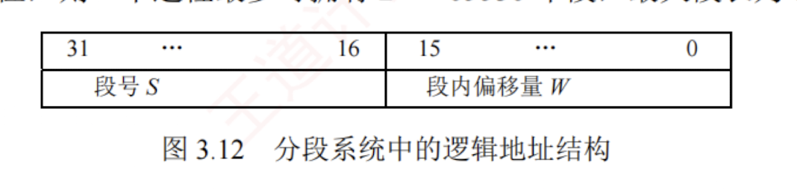
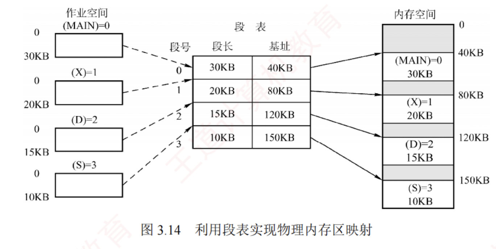
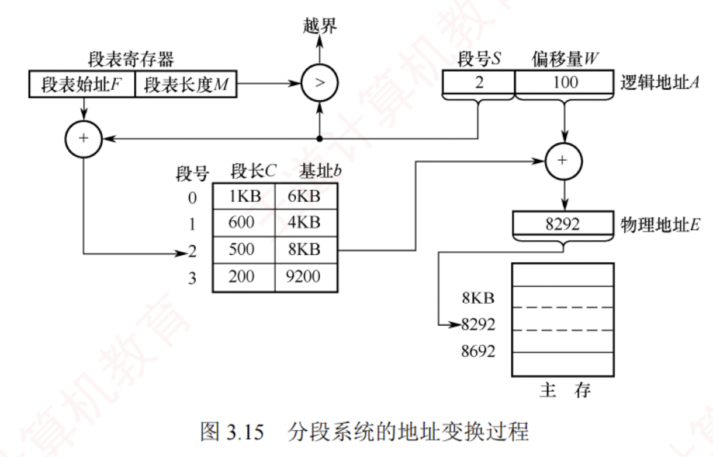

---

**分页管理方式**是从计算机的角度出发设计的，旨在提高内存利用率和系统性能，其**地址转换由硬件自动完成**，对用户完全**透明**。  
而**分段管理方式**则从用户和程序员的实际需求出发，旨在支持方便编程、信息保护与共享、动态增长以及动态链接等高级功能。

### 分段

分段系统将用户进程的**逻辑地址空间**划分为若干大小不等的段。  
例如，一个进程可包含主程序段、子程序段、栈段和数据段，共划分为 5 个段。  
每个段内部从 0 开始编址，并分配一段**连续的地址空间**（**段内连续**，段间不要求连续）。  
由于地址空间被组织为多个具有明确语义的段，整个进程的逻辑地址结构呈现出二维特性：由**段号和段内偏移**共同确定一个地址。

分段存储管理的**逻辑地址**由段号 $S$ 和段内偏移量 $W$ 两部分组成。  
在图 3.12 中，段号占 16 位，段内偏移量也占 16 位，则一个进程最多可拥有 $2^{16} = 65536$ 个段，最大段长为 64KB。

在页式系统中，逻辑地址中的页号与页内偏移量对用户透明；  
而在分段系统中，段号和段内偏移量必须由**用户显式提供**——这一工作在高级语言中由**编译程序自动完成**。

### 段表

每个进程都拥有一张**段表**，用于实现**逻辑段到物理内存区的映射**。  
段表中每个段对应一个**段表项**，记录该段在内存中的**基址**（起始地址）和**段长**（长度）。段的内容如图 3.13 所示。

运行时，系统通过查找段表，即可定位每段在内存中的实际位置，其映射过程见图 3.14。

由于段表项连续存放且长度相同，**段号可作为隐含索引**，无须额外存储。  
例如，在某 32 位分段系统中，段号为 16 位，段内偏移量为 16 位（段长字段为 16 位，对应最大段长 64KB），物理地址为 32 位（可寻址 4GB 内存）。  
因此，每个段表项至少需要 16（段长）+ 32（基址）= 48 位，即 6B。若段表首地址为 $M$，则第 $K$ 号段对应的段表项位于地址 $M + K \times 6$ 处。
[[为什么段表项是六字节，难道不需要对齐吗]]
### 地址变换机构

分段系统的地址变换过程如图 3.15 所示。  
为实现从逻辑地址到物理地址的变换，系统设置了一个**段表寄存器**，用于存放段表始址 $F$ 和段表长度 $M$。段式存储管理的地址变换过程如下。

1. 从逻辑地址 $A$ 中分离出段号 $S$ 和段内偏移量 $W$。
    
2. 判断段号是否越界：若段号 $S \ge$ 段表长度 $M$，则产生段号越界中断，否则继续执行。
    
3. 根据段号 $S$ 查找段表，段表项地址 = 段表始址 $F$ + 段号 $S \times$ 段表项长度。取出该段表项中该段的段长 $C$，若 $W \ge C$，则产生段内越界中断；否则，继续执行。
    
4. 取出段表项中该段的基址 $b$，计算物理地址 $E = b + W$，并据此访问内存。
    

### 分页和分段的对比

分页与分段均为非连续分配方式，均需通过地址映射机构实现地址变换。然而，二者在概念上有本质区别，主要体现在以下三个方面：

1. **页是系统管理内存的物理单位**，分页的主要目的是提高内存利用率，完全由系统实现，对用户透明；**段是用户程序的逻辑单位**，分段的主要目的是满足编程、共享、保护等需求，由编译器根据程序结构划分，对用户可见。
    
2. **页的大小固定**，由系统决定。**段的长度不固定**，取决于程序的逻辑结构。
    
3. **分页系统的地址空间是一维的**，程序员只需提供单一的线性地址；**分段系统的地址空间是二维的**，程序员在引用地址时，必须同时指定段名（或段号）和段内偏移量。
    

### 段的共享与保护

在分页系统中，虽然也能实现共享，但远不如分段系统方便。  
若一段共享代码占 $N$ 个页框，则每个共享进程的页表中都需建立 $N$ 个页表项，分别指向这 $N$ 个页框。  
而在分段系统中，无论该段多大，只需在每个进程的段表中设置一个段表项指向该共享段，因此实现共享极为便捷。

为支持段共享，系统可维护一张**共享段表**，其中每个共享段对应一个表项，记录其段号、段长、内存起始地址、存在位、外存起始地址以及共享进程计数 count。  
当某进程不再使用该段时，count 减 1；仅当 count = 0 时，系统才回收该段所占的内存空间。  
值得注意的是，同一共享段在不同进程中可以具有不同的段号，各进程通过各自的段号即可访问同一物理段①。

不能被修改的代码称为**可重入代码**（或**纯代码**），它允许多个进程并发执行。  
为确保共享代码的完整性，系统通常将此类代码置于只读段中。  
同时，每个进程需配备**私有的局部数据区**，专门用于存放执行过程中可能变化的数据，从而有效避免对共享代码段的任何写操作。

与分页管理类似，分段系统的保护机制主要包括两类：  
① **地址越界保护**，将逻辑地址中的段号与段表长度比较，若段号 $\ge$ 段表长度，则产生越界中断；将段内偏移与段表项中的段长比较，若偏移 $\ge$ 段长，则同样触发越界中断。  
② **存取控制保护**，通过段表项中的访问权限位防止非法访问。