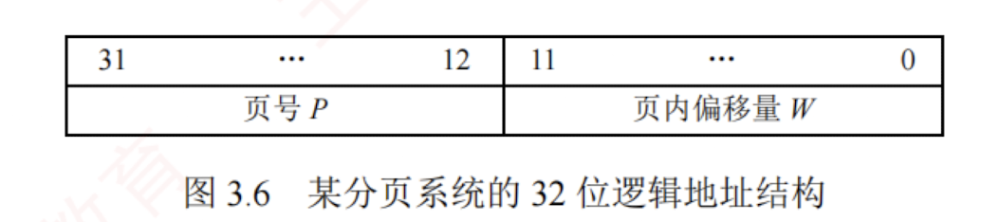
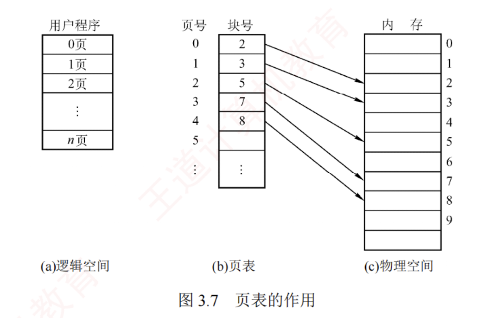
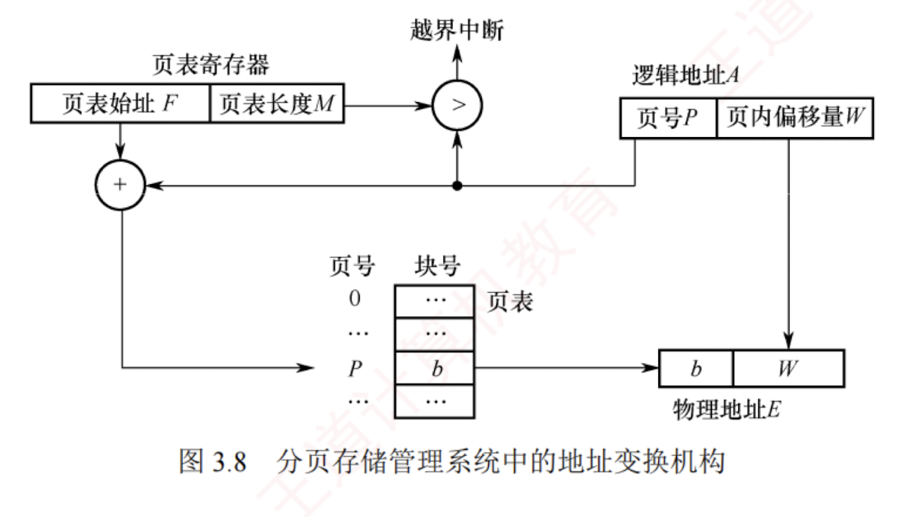
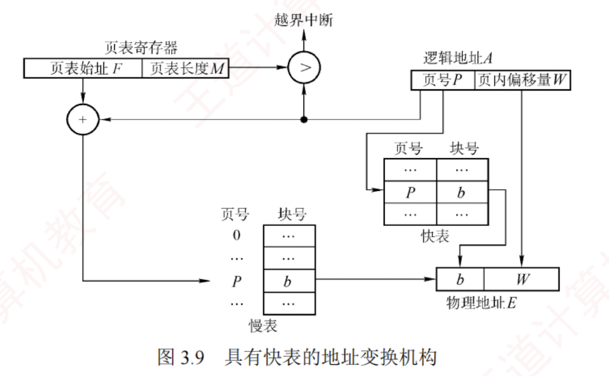
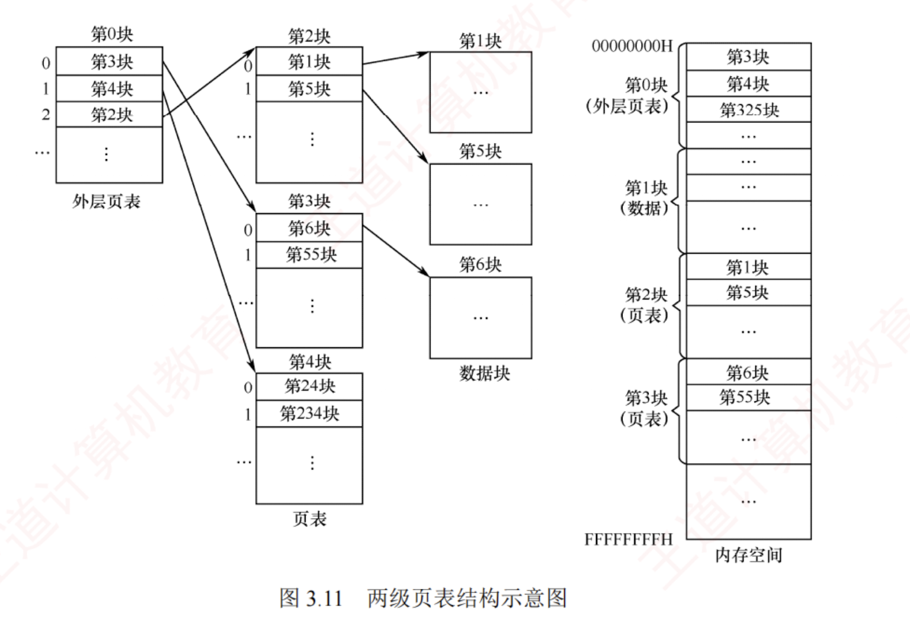

---

固定分区会产生内部碎片，动态分区会产生外部碎片，这两种方式对内存的利用率都较低。  
为提高内存利用率并彻底消除外部碎片，操作系统引入了分页存储管理：将物理内存划分为若干大小相等的固定单元，称为**页框**（或页帧、物理块）；  
同时将进程的逻辑地址空间划分为与页框大小相同的单元，称为**页面**（或**页**）。  
系统以**页框**为单位为进程分配内存。

从形式上看，分页类似于等长的固定分区，但其本质不同：固定分区按作业整体分配，而分页将进程和内存均按固定大小的单元划分，使得**内存分配以页为单位进行**。  
因此，分页管理**不会产生外部碎片**。  
然而，由于**页面大小固定**，当进程的某一页未被完全填满时，其对应的页框中会留下未使用的空间，形成页内碎片（**内部碎片**），每个进程平均产生的页内碎片约为**半页**。

### 分页存储的几个基本概念

#### 页面和页面大小

进程的逻辑地址空间被划分为若干页面，每个页面有一个编号，称为页号，从 0 开始；物理内存中的每个页框也有一个编号，称为页框号（或物理块号），同样从 0 开始。通过建立页号到页框号的映射，系统为进程的每个页面分配物理内存。

为便于地址转换，页面大小通常取 **2 的整数次幂**。页面大小应适中：若页面过小，则进程的

页面数量增多，导致页表过长，不仅占用大量内存，还会增加地址转换开销，降低页面换入/换出效率；若页面过大，则页内碎片增多，同样会降低内存利用率。

#### 地址结构

在分页存储管理中，逻辑地址由两部分组成：页号 $P$ 和页内偏移量 $W$，如图 3.6 所示。

以 32 位地址为例，若页面大小为 $2^{12}\text{B}$（4KB），则低 12 位（0~11 位）为页内偏移量，高 20 位（12~31 位）为页号，最多可支持 $2^{20}$ 个页面。

#### 页表

为实现逻辑地址到物理地址的转换，系统为每个进程建立一张**页表**（Page Table）。  
**页表是一个按页号顺序排列的数组**，每个页表项记录对应页面所驻留的物理页框号，以及相关状态信息（如有效位、访问位等）。  
进程执行时，通过页号索引页表，即可获得该页所在的物理块号，从而完成地址映射，如图 3.7 所示。  
因此，**页表的作用是实现从页号到页框号的映射**。

[[分页存储的一些概念]]
### 基本地址变换机构

地址变换机构的任务是将逻辑地址转换为内存中的物理地址，这一过程借助**页表**实现。  
图 3.8 展示了分页存储管理系统中的**地址变换机构**。

> **注意**
> 
> 在页表中，页表项按**页号顺序连续存放**，因此页号作为**索引是隐含**的，无须在页表项中显式存储。

为提高地址变换速度，系统设置一个**页表寄存器**（PTR），存放页表在内存中的始址 $F$ 和页表长度 $M$。  
由于寄存器造价昂贵，单 CPU 系统中通常只设置一个 PTR。  
进程未执行时，其页表始址和长度保存在该进程的 PCB 中；  
当进程被调度执行时，操作系统将这些信息装入 PTR。

#### 逻辑地址到物理地址到变换过程

设页面大小为 $L$，逻辑地址 $A$ 到物理地址 $E$ 的变换过程如下：

1. 根据逻辑地址计算页号 $P = \lfloor A/L \rfloor$、页内偏移量 $W = A \% L$。
    
2. 判断页号是否越界，若页号 $P \ge$ 页表长度 $M$，则产生越界中断；否则，继续执行。
    
3. 根据页号 $P$ 查找页表，找出对应页表项中的物理块号。  
   页表项地址 $=$ 页表始址 $F +$ 页号 $P \times$ 页表项长度，取出该页表项中的物理块号 $b$。
    
4. 计算物理地址 $E = bL + W$，并据此访问内存（注意，物理地址 $=$ 页面在内存中的始址 $+$ 页内偏移量，页面在内存中的始址 $=$ 块号 $\times$ 块大小）。
    

上述地址变换过程由 **MMU 硬件**自动完成。  
例如，若页面大小 $L = 1\text{KB}$，则页号 2 对应的物理块号 $b = 8$，逻辑地址 $A = 2500$ 的物理地址 $E$ 的计算过程如下：$P = 2500/1\text{K} = 2$，$W = 2500 \% 1\text{K} = 452$，故物理地址 $E = 8 \times 1024 + 452 = 8644$。

若逻辑地址以二进制形式给出，则**页号和页内偏移可直接通过截取高位和低位获得**，效率更高。  
正因页面大小固定，逻辑地址可视为一维线性地址，因而仅需一个整数即可确定其位置。

页表项大小不是随意规定的，而是有所约束的。页表项大小如何确定？

页表项需能表示所有可能的物理页框号。以 32 位地址空间、按字节编址、页面大小为 4KB 为例，物理内存最多包含 $2^{32}\text{B}/4\text{KB} = 2^{20}$ 个页框，因此需要 $\log_2 2^{20} = 20$ 位来表示页框号。由于内存按字节编址，为保证页表项能够指向所有页面，页表项大小至少为 $\lceil 20/8 \rceil = 3\text{B}$。  
但出于**对齐和扩展**考虑（如加入有效位、访问位等），实际系统通常将页表项设为 4B。

#### 分页管理面临两个主要挑战：  

1. **每次访存都需要进行地址转换**，若转换速度不够快，则会显著降低系统性能；
2. **页表本身占用内存空间**，若页表过大，则会**降低内存利用率**。  
   正是这些问题，推动了后续优化技术的发展，如**快表**（**TLB**）和**多级页表**。

### 具有快表的地址变换机构

由前述地址变换过程可知，若页表全部存放在内存中，则每次访问内存（无论是取指令还是读/写数据）至少需**两次访存**：  
第一次访问页表以获取**物理块号**，第二次根据形成的物理地址访问**目标内容**。  
显然，这种方式会显著**降低系统性能**。 

为此，现代地址变换机构增设了一个具有并行查找能力的高速缓冲存储器——**快表**（TLB），用于缓存当前活跃的若干页表项，以加速地址变换。  
相应地，主存中的完整页表常被称为**慢表**。  
具有快表的地址变换机构如图 3.9 所示。

在具有**快表**的分页机制中，地址变换过程如下：

1. CPU 给出逻辑地址后，硬件自动提取页号，并将其与快表中所有页号并行比较。
    
2. 若**命中**（找到匹配的页号），则直接从快表中取出对应的物理块号，与页内偏移量拼接形成物理地址。  
   此时，仅需一次访存即可。
    
3. 若**未命中**（未找到匹配的页号），则需访问**内存中的页表**，读取相应的**页表项**以获得其**物理块号**，再拼接形成**物理地址**并访问内存，共需**两次访存**。  
   同时，系统会将该页表项装入**快表**，以便后续可能的重复访问；  
   若快表已满，则按特定**置换算法**淘汰一个旧项。

在程序具有良好局部性的前提下，快表命中率通常可达 90% 以上，因此分页机制带来的性能开销可控制在 10% 以内。  
快表的有效性基于著名的**局部性原理**，这一原理将在 3.2 节中介绍。

### 两级页表

引入**分页管理**后，进程执行时**无须将所有页面调入内存**，但仍需将整个**页表驻留内存**。  
然而，页表本身可能非常庞大。  
以 32 位逻辑地址空间、页面大小为 4KB、页表项大小为 4B 为例：页内偏移占 $\log_2 4\text{K} = 12$ 位，页号占 20 位，因此每个进程的页表最多包含 $2^{20}$ 个页表项，仅页表就需占用 $2^{20} \times 4\text{B} / 4\text{KB} = 1\text{K}$ 个页。若还要求页表连续存放，则显然不切实际。

解决上述问题的思路是**将页表本身也视为可分页的对象**，具体体现为两个方面：  
1. 对页表采用**离散分配**，不再要求其连续存放，而是通过一张专门的**索引表**记录各页表页在内存中的位置，从而消除对连续内存空间的需求；
2. 仅将当前**活跃的部分页表项调入内存**，其余仍驻留磁盘，**按需调入**（虚拟内存的思想），从而有效缓解页表占用过多内存的问题。

不难发现，这一方案与最初引入页表以解决进程地址空间离散分配的思路如出一辙：  
本质上，就是**为已离散化的页表再建立一层页表**，称为**外层页表**（或**页目录**）。  
仍以上述条件为例：  
当采用**两级分页**时，将原页表按页面大小（4KB）进行分页。  
由于每页可容纳 $4\text{KB} / 4\text{B} = 1024$ 个页表项，而总页表项数为 $2^{20}$，故需 $2^{20} / 2^{10} = 2^{10} = 1024$ 个页表页，对应外层页表包含 1024 个表项，恰好占用一页（4KB）。  
由此自然形成了如图 3.10 所示的逻辑地址结构。

两级页表是在普通页表结构上再加一层页表，其结构如图 3.11 所示。

在页表的每个表项中，存放的是进程某页对应的**物理块号**。  
例如，0 号页存放在 1 号物理块中，1 号页存放在 5 号物理块中。在外层页表的每个表项中，存放的是某个页表分页的物理起始地址。例如，0 号页表页存放在 3 号物理块中。

通过**外层页表**和**内层页表**的协同作用，可实现**从逻辑地址到物理地址的变换**。

为方便地址变换，系统增设一个**外层页表寄存器**（也称**页目录基址寄存器**），用于存放**外层页表的起始地址**。  

**地址变换过程如下**：

1. 用逻辑地址中的**页目录号**作为**索引**，访问**外层页表**，获取对应**内层页表的物理起始地址**。
    
2. 用逻辑地址中的**二级页号**作为**索引**，访问该页表，得到目标页面的**物理块号**。
    
3. 将物理块号与页内偏移量拼接，形成**物理地址**，并据此访问内存单元。
    

在无快表的情况下，此过程需**三次访存**。

对于更大的地址空间（如 64 位），两级页表远远不够。  
例如，若逻辑地址为 64 位、页面大小为 4KB，则页号占 52 位。  
若每页仍可存放 1024 个页表项，则需约 6 级页表才能覆盖整个地址空间。  
然而，实际系统通常将虚拟地址限制为 48 位，从而采用三级或四级页表即可高效管理，既满足应用需求，又避免硬件过度复杂化。  
建立多级页表的根本目的，是通过**按需分配页表页**，避免为未使用的地址空间预留大量无用的页表项，进而显著节省内存开销。