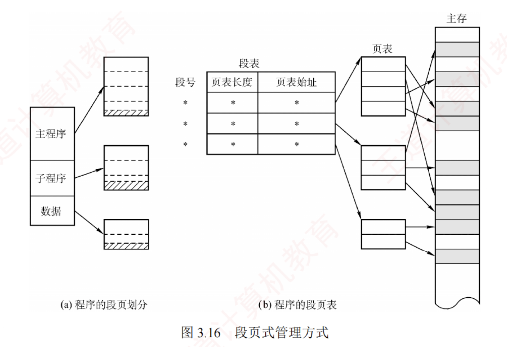
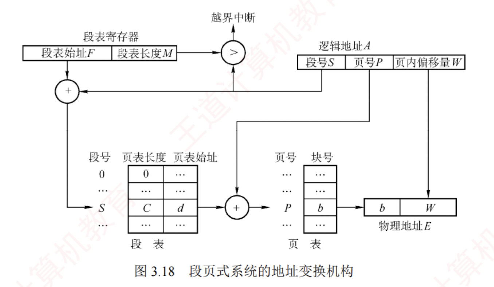

---

分页存储管理能有效提高**内存利用率**，而分段存储管理能反映程序的**逻辑结构**，并有利于**段的共享与保护**。  
将二者各自的优势有机结合，便形成了**段页式存储管理方式**。

在段页式系统中，进程的地址空间首先被划分为若干**逻辑段**，每段拥有唯一的段号；  
随后，每个段被进一步划分为若干**大小固定的页**。  
内存空间的管理仍采用**分页**方式，即划分为与页面大小相同的**物理块**，内存分配以**物理块**为单位，如图 3.16 所示。

进程的逻辑地址由三部分组成：段号 $S$、页号 $P$ 和页内偏移量 $W$，如图 3.17 所示。

为实现地址变换，系统为每个进程建立一张**段表**，每个段对应一个**段表项**，记录该段的**页表始址**和**页表长度**（段号作为段表索引，无须显式存储）。  
每个段还对应一张**页表**，其每个页表项记录对应页的**物理块号**（页号作为页表索引，亦无须存储）。此外，系统设置一个**段表寄存器**，用于存放当前进程段表的**起始地址**和**段表长度**，既用于**段表寻址**，也用于**段号越界检查**。

> 注意
> 
> 在段页式存储管理中，每个进程仅有**一张段表**，但可能有**多张页表**（每个段一张）。

段页式存储管理的地址变换过程如下。

1. 根据逻辑地址中的段号 $S$，通过**段表寄存器**定位**段表**，并查得该段对应**页表的起始地址**；
    
2. 系统利用页号 $P$ 访问该页表，获取**物理块号**；
    
3. 将物理块号与页内偏移量 $W$ 拼接，形成**物理地址**。
    
    如图 3.18 所示，在无快表的情况下，每次基于逻辑地址的内存访问需**三次访存**。  
    为加速查找，可引入快表（TLB），其表项包含关键字（段号、页号）及对应的物理块号和保护信息。
    

对用户而言，程序仍按段组织，页的划分由系统自动完成且完全透明。  
正因如此，**段页式管理的地址空间是二维的**——这与分段系统一致，而分页机制对用户不可见。

[[段页式存储]]