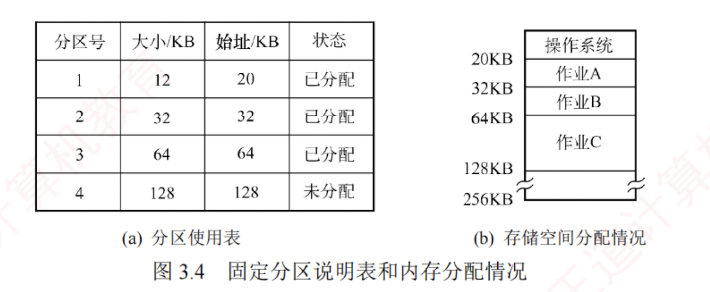
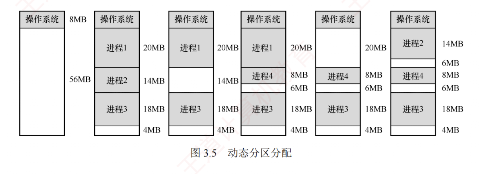

---

### 连续分配管理方式

连续分配方式是指为一个用户程序分配一个连续的内存空间。例如，若某用户程序需要 100MB 的内存，则系统便会在内存中为其分配一块连续的 100MB 区域。

连续分配方式主要包括单一连续分配、固定分区分配和动态分区分配。

#### **单一连续分配**

在单一连续分配方式中，内存被划分为系统区和用户区。  
系统区仅供操作系统使用，通常位于低地址部分；  
用户区则仅允许一道用户程序运行，即该程序独占整个用户区。

##### 优缺点
这种方式的优点是结构简单、**无外部碎片**，且无须内存保护机制，因为内存中始终只有一道程序。  
缺点是仅适用于单用户、单任务的操作系统，**存在内部碎片**，且**内存利用率极低**。

#### **固定分区分配**

固定分区分配是最简单的一种**多道程序**存储管理方式。  
它将用户内存空间划分为若干大小固定的分区，每个分区仅能容纳一道作业。  
当有空闲分区时，系统可从外存的后备作业队列中选择一个合适大小的作业装入该分区，并反复执行这一过程。  

在划分分区时，有两种方法：

- **分区大小相等**。程序过小会造成空间浪费，过大则无法装入，**缺乏灵活性**。
    
- **分区大小不等**。划分为多个较小分区、适量中等分区和少量大分区，以**提高适应性**。
    

为便于内存的分配与回收，系统维护一张**分区使用表**，通常**按分区大小排序**。  
各表项包含对应分区的始址、大小及状态（是否已分配），如图 3.4 所示。  
分配时，系统检索该表，寻找一个满足作业大小要求且尚未分配的分区，将其分配给待装入程序，并将对应表项的状态置为“已分配”；  
若找不到合适分区，则拒绝分配。  
回收时，只需将对应表项的状态置为“未分配”即可。

该方式存在两个问题：  
1. 若作业大于所有分区，则无法装入；
2. 若作业小于分区大小，则仍需占用整个分区，造成内部未被利用的空间，即**内部碎片**。  
   固定分区方式虽无外部碎片，但因每个分区仅能由一个作业独占，无法支持多个进程共享同一内存区域，故**内存利用率较低**。

#### **动态分区分配**

##### 动态分区分配的基本原理

动态分区分配也称**可变分区分配**，是指在进程装入内存时，按其实际需求动态分配一块大小恰好匹配的连续内存空间，因此系统中分区的数量和大小随进程的装入与释放而动态变化。

如图 3.5 所示，系统拥有 64MB 内存空间，其中低 8MB 固定分配给操作系统，其余为用户可用区域。  
初始时装入前三个进程后，仅剩 4MB 空闲，不足以容纳进程 4。  
为腾出空间，操作系统换出进程 2，并换入较小的进程 4；  
因其所需内存更少，释放出一个 6MB 的空闲块。  
随后，当需要重新换入进程 2 时，因剩余空间仍不足，操作系统又换出进程 1，再换入进程 2。

动态分区分配在初期运行良好，但随着进程频繁装入与释放，内存中会逐渐积累大量分散的小空闲块，导致可用内存总量虽足，却难以满足较大进程的需求，内存利用率随之下降。这些散布在已分配分区之间、无法利用的小空闲块称为外部碎片，与固定分区中因分区内部未用完而产生的内部碎片形成鲜明对比。外部碎片可通过紧凑技术缓解：操作系统周期性地移动进程，将所有空闲块合并为一个连续区域；然而，该操作要求系统支持动态重定位，且开销较大。其原理类似于 Windows 系统中的磁盘碎片整理，但后者作用于外存文件系统，而前者作用于主存。