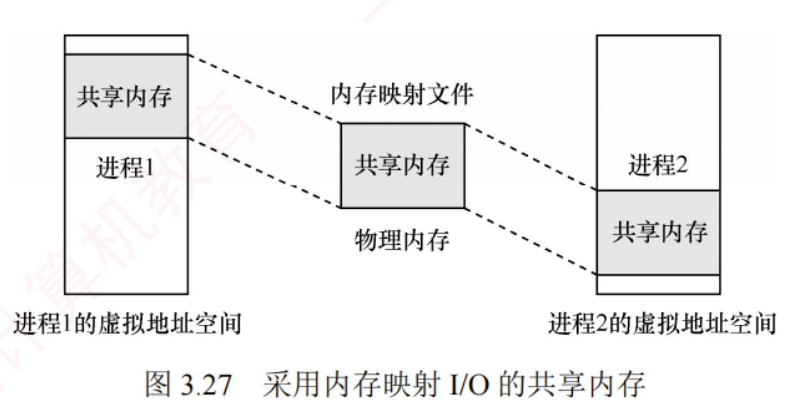

---

**内存映射文件**（Memory-Mapped Files）是操作系统向应用程序提供的一种**系统调用机制**，它在**磁盘文件与进程的虚拟地址空间**之间建立**直接映射**关系，与**虚拟内存机制**紧密相关。

进程通过该**系统调用**，将**一个文件映射到其虚拟地址空间的某一区域**，此后便可像访问内存一样读/写文件。  
这种功能将一个文件当作内存中的一个大字符数组来访问，而无须调用传统的文件 I/O 接口，显然更为便捷。  
磁盘文件的**读/写**由**操作系统**负责完成，对进程而言是**透明**的。  
映射时并**不会立即加载文件内容**，而是在**进程首次访问某页面**时，才按需将其一页一页地调入内存；  
当进程**退出或显式解除文件映射**时，所有**被修改的页面才会被写回磁盘文件**。

进程可通过**共享内存**实现高效通信。  
实践中，这种**共享内存**往往正是通过将**同一文件映射到多个通信进程的虚拟地址空间**来实现的。  
此时，尽管**各进程的虚拟地址空间相互独立**，但操作系统会通过页表将它们**对应的虚拟页映射到相同的物理页**（见图 3.27）。  
因此，当一个进程在共享区域执行写操作后，另一个进程在其映射区域执行读操作时，能够**立即看到更新结果**——因为二者访问的是**同一块物理内存**，**数据必然一致**，无须额外的复制或同步机制。

由此可见，内存映射文件带来的**好处**主要有：  
1. 使程序员的编程更为简单，已建立映射的文件，可直接**按内存方式进行读/写**；
2. 便于**多个进程共享同一个磁盘文件**。
