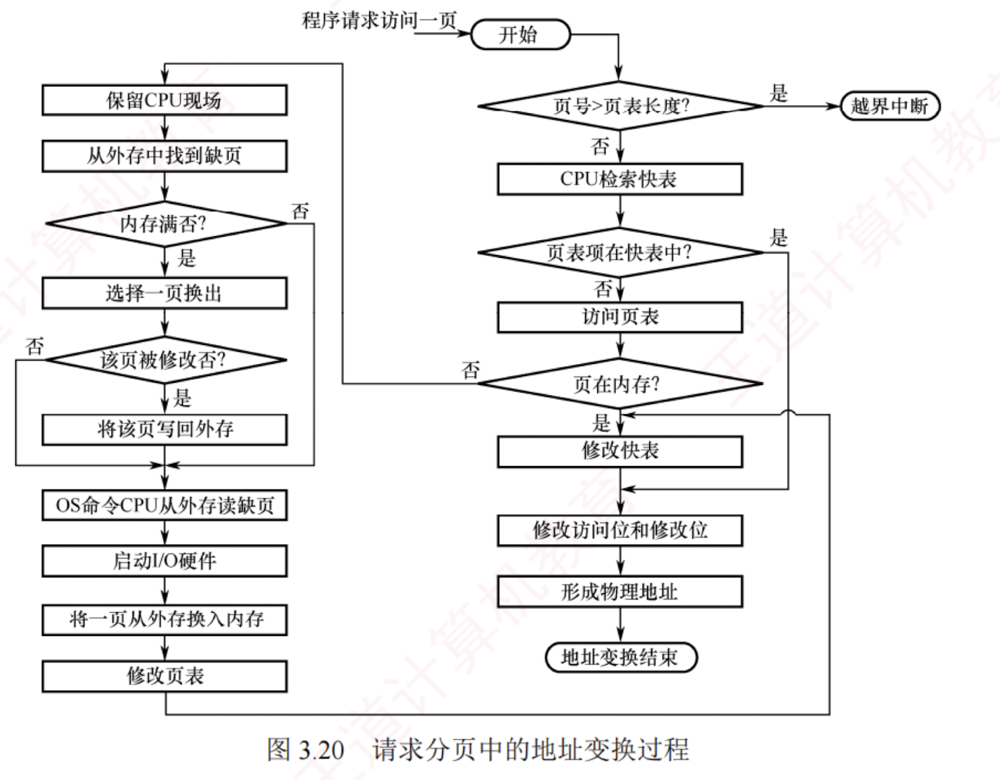

---

**请求分页系统**建立在**基本分页系统**的基础之上，为支持**虚拟存储器**功能，增加了**请求调页**和**页面置换**功能：  
在该系统中，只需将当前需要的**一部分页面**装入内存，便可启动作业运行。  
在作业运行过程中，若所访问的页面不在内存中，则系统将通过**请求调页**功能将其**从外存调入**；  
而当**内存空间不足**时，则通过**页面置换**功能将暂时不用的页面换出到外存。  
由于每次**换入和换出的基本单位**均为**长度固定的页面**，其实现比**以长度可变的段为单位的请求分段**系统更简单；  
正因其实现简洁且效率较高，**请求分页**成为目前最常用的一种**虚拟存储器**实现方式。

为了实现**请求分页**，系统必须提供一定的**硬件**支持。  
除需要足够容量的**内存和外存**外，还需具备**页表机制**、**缺页中断机构**以及**地址变换机构**。

### 页表机制

相比于**基本分页系统**，**请求分页系统**中的页表需提供更多信息，以支持请求调页和页面置换。  
具体而言，操作系统必须能够：  
1. 判断某页**是否已调入内存**；
2. 若尚未调入，则还需获知**该页在外存中的存放位置**；
3. 在**页面置换**时，依据**访问特征**选择合适的换出页面；
4. 对于要换出的页面，还需知道其是否被修改过，以决定是否需写回外存。  
   为此，请求分页的**页表项**在基本结构基础上增加了**四个字段**，如图 3.19 所示。

各**新增字段**的说明如下：

- **状态位 $P$（存在位）**。标记该页**是否已调入内存**，供地址变换时判断是否触发**缺页中断**。
    
- **访问字段 $A$**。记录本页在**一段时间内的访问次数**，或记录自上次访问以来的**时间间隔**，供页面置换算法选择换出页面时参考。
    
- **修改位 $M$（脏位）**。标记该页**调入内存后是否被修改过**，以决定换出时是**否需写回外存**。
    
- **外存地址**。指示该页在外存中的**存放位置**（通常为**物理块号**），供调页时将其读入内存。
    

### 缺页中断机构

在**请求分页系统**中，当进程访问的页面尚未调入内存时，硬件会自动触发**缺页中断**，由操作系统的**缺页中断处理程序**处理：  
将所需页面**从外存调入内存**（必要时先换出一页）。  
具体而言，若内存中有**空闲页框**，则分配一个页框，将所缺页面从外存装入，并更新页表中相应的表项；  
若无空闲页框，则需先由**页面置换算法**选择一个页面淘汰，若该页在内存中被修改过，则必须将其写回外存，否则可直接丢弃。  
由于页面调入通常涉及较**长时间的磁盘 I/O 操作**，系统在此期间可能会调度其他进程运行；  
待所需页面调入完成后，**重新执行引发缺页的那条指令**。

**缺页中断**作为一种**内中断**，其处理过程与其他中断类似，也需经历**保护 CPU 现场**、**分析中断原因**、**转入中断处理程序**、**恢复 CPU 现场**等步骤。  
然而，它具有以下**两个显著特点**：

- 在**指令执行期间**触发，由当前指令的地址访问直接引发，而非在指令执行完毕之后。
    
- 一条指令在执行过程中可能引发**多次缺页中断**。  
  例如，在执行指令 `copy A to B` 时，若该指令本身及其两个操作数**各自跨越两个页面**，则最多可能引发 **6 次缺页中断**。
    

### 地址变换机构

在基本分页系统地址变换机构的基础上，**请求分页系统**为支持虚拟存储器，增加了**缺页中断触发机制**。  
**请求分页系统的地址变换过程**如图 3.20 所示。

**请求分页系统**的地址变换过程如下。

1. **首先检索快表**，若命中，则从相应表项中取出该页的**物理块号**，并置**访问位为 1**，以供置换算法换出页面时参考。对于**写操作**，还需置**修改位为 1**。
    
2. 若**快表未命中**，则需**访问页表**。若该页**已在内存**中（状态位 = 1），则从相应表项中取出**物理块号**，并将该页表项装入快表；  
   若**快表已满**，则按**置换算法**淘汰一项。
    
3. 若**页面不在内存**中，则触发**缺页中断**。操作系统接管后，将所需页面从外存调入**内存**（必要时先换出一页），并更新**页表**和**快表**。  
   随后，重新执行**地址变换**以获取物理块号。
    
4. 将获得的**物理块号与页内地址拼接**，形成**物理地址**，用于访存。

[[为什么虚拟地址是连续的]]
