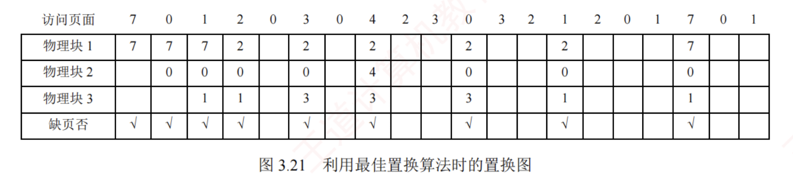
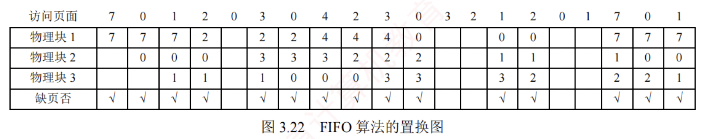
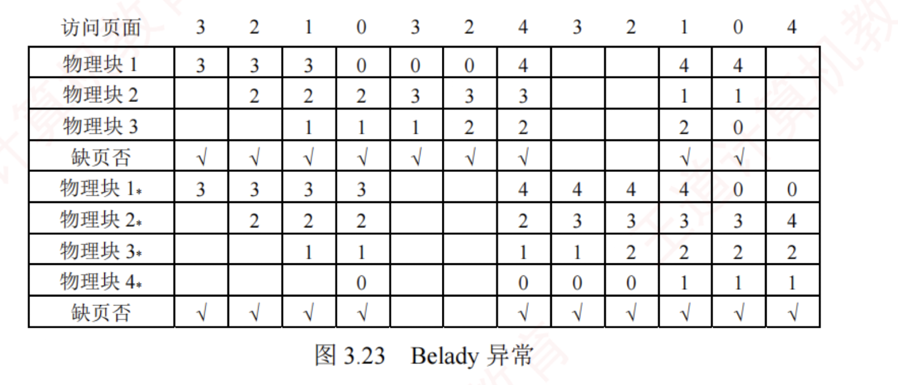
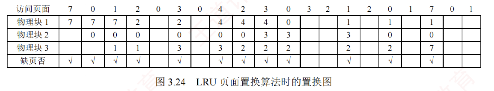
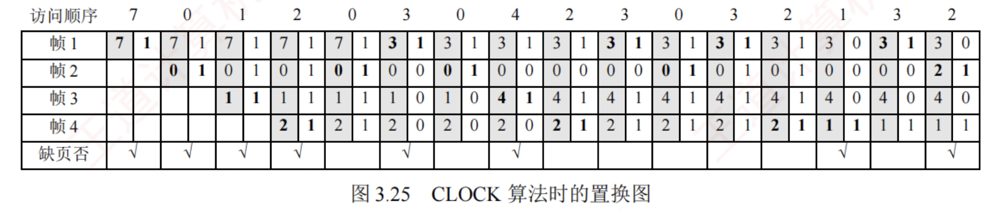
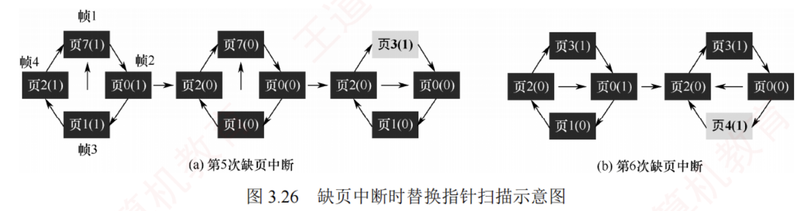

---
### 3.2.4 页面置换算法

进程运行时，若其访问的页面**不在内存**中，需将其调入，但内存又无空闲页框，则必须从内存中**换出一页至外存**。  
选择换出哪一页的算法称为**页面置换算法**。  
由于页面的换入与换出均**涉及磁盘 I/O**，开销较大，因此，一个**好的页面置换算法**应致力于**降低缺页率**。

常见的页面置换算法有以下**四种**。
#### 1. 最佳 (OPT) 算法

**最佳页面置换算法**在发生**缺页**时，选择淘汰以后**永不使用**或在**最长时间内不再被访问**的页面，从而在理论上获得**最低的缺页率**。  
然而，由于操作系统**无法预知**未来的页面访问序列，该算法在实际系统中**无法实现**。  
尽管如此，OPT 算法仍具有重要的**理论意义**，常用于评价其他算法。

假定系统为某进程分配了**三个物理块**，并给定如下页面访问序列：

$$7, 0, 1, 2, 0, 3, 0, 4, 2, 3, 0, 3, 2, 1, 2, 0, 1, 7, 0, 1$$

进程运行时，首先将页面 $7, 0, 1$ **依次装入内存**。  
当访问页面 $2$ 时，发生**缺页中断**。  
根据 **OPT 算法**，选择**未来最久才被再次访问的页面**（页面 $7$ 的下一次访问在第 $18$ 次，远晚于其他页面）淘汰。  
随后访问页面 $0$ 时，因其已在内存中，**不产生缺页**。  
访问页面 $3$ 时再次缺页，此时页面 $1$ 的下次访问（第 $14$ 次）最晚，故将其淘汰……以此类推，**具体过程**如图 3.21 所示。

  

可见，整个过程中共发生 9 次缺页中断，其中 6 次触发页面置换（不算初始装入）。

#### 2. 先进先出 (FIFO) 算法

  

**先进先出页面置换算法**选择淘汰**最早进入内存**的页面。  
该算法**实现简单**，将内存中的页面按**调入时间**组织成**一个队列**，需要换出时直接**移除队首页面**。  
然而，FIFO 算法**未利用局部性原理**，与进程实际运行规律不符，最早装入的页面仍可能被频繁访问，因此**性能通常较差**。

  

仍用上面的例子，采用 **FIFO 算法**进行置换。  
当访问页面 2 时发生**缺页**，**淘汰最早进入**的页面 7。  
随后访问页面 3 时**再次缺页**，此时将 $2, 0, 1$ 中最先进入的页面 0 换出……  
以此类推，**具体过程**如图 3.22 所示。  

可见，共发生 15 次缺页中断，其中 12 次触发页面置换。

值得注意的是，FIFO 算法存在一种**反直觉现象**：  
当为进程分配的物理块数增加时，缺页次数反而可能上升，这一现象称为。**Belady 异常**。  
其**根本原因**在于 FIFO 仅依据**调入时间决策**，而忽略了页面的**实际使用情况**。  
例如，页面访问需列为 $3, 2, 1, 0, 3, 2, 4, 3, 2, 1, 0, 4$，当分配 3 个物理块时，缺页次数为 9 次；  
当分配 4 个物理块时，缺页次数反而增至 10 次，如图 3.23 所示。

**只有 FIFO 算法可能出现 Belady 异常**，而 OPT 算法和 LRU 算法永远不会出现此类异常。
  

#### 3. 最近最久未使用 (LRU) 算法

  

**LRU 算法**选择淘汰**最近最长时间未使用**的页面，其**基本思想**是：  
若某页面在过去一段时间内未被使用，则在近期未来很可能也不会被访问。  
为实现这一策略，系统需为每个页面维护一个**访问字段**，记录其自上次被访问以来所经历的时间，**淘汰页面时选择该值最大的页面**。

仍用上面的例子采用 LRU 算法进行置换，如图 3.24 所示。  

首次访问页面 2 时发生缺页，将最近最久未使用的页面 7 换出；  
随后访问页面 3 时再次缺页，将最近最久未使用的页面 1 换出。

  

由图可见，前 5 次缺页处理的结果与 OPT 算法相同，但这仅是巧合，并无必然联系。  
实际上，LRU 算法根据**页面过去的使用情况**来判断，是“**向前看**”的；  
而 OPT 算法则根据**页面未来的使用情况**来判断，是“**向后看**”的。  
而页面过去与未来的走向之间并无必然联系。

**OPT 算法的性能最好**，但无法实现。  
**FIFO 算法实现简单**，但忽略局部性，性能较差。  
**LRU** 算法**性能接近 OPT 算法**，**具有良好的实际效果**，但其实现通常需要**硬件支持**，开销较大。

  

#### 4. 时钟 (CLOCK) 算法

  

LRU 算法的性能接近 OPT 算法，但其**实现开销较大**。  
因此，操作系统的设计者尝试了许多算法，试图以**较小的开销接近 LRU 算法的性能**，这类算法统称为 **CLOCK 算法的变体**。

  

##### 简单的 CLOCK 算法

  

**简单的 CLOCK 算法**为每个页面设置一个**访问位**，当某页**首次被装入内存或被访问**时，其**访问位被置为 1**。  
系统将所有页框组织成一个**循环队列**，并维护一个**替换指针**，指向当前检查位置。  
发生缺页且需置换时，算法按**以下规则**操作：  
若指针所指页面的**访问位为 0**，则**直接淘汰该页**；  
若为 1，则将其置为 0，指针顺移至下一页面，给予该页一次“**宽恕**”机会——即**暂不淘汰**，待**后续轮询时再行判断**。  
由于指针在队列中循环移动，形如**时钟指针**，故称 **CLOCK 算法**。  
又因其仅依据“**最近是否被使用**”这一粗略信息进行决策，也被称为**最近未用 (NRU) 算法**。

假设页面访问需列为 $7, 0, 1, 2, 0, 3, 0, 4, 2, 3, 0, 3, 2, 1, 3, 2$，采用**简单 CLOCK 算法**，分配 4 个页框，每个页框记录（页面号，访问位），具体过程如图 3.25 所示。

  

**初始阶段**，页面 $7, 0, 1, 2$ 依次调入，**访问位均置为 1**。  
随后访问 0，已存在，**访问位保持为 1**。  
访问 3 时发生第 5 次缺页，此时**替换指针**位于帧 1，而**所有页框的访问位均为 1**。  
算法遂**完整扫描一圈**，将各帧**访问位清零**，指针回到**最初的位置**（帧 1），故淘汰帧 1 中的页面 7，装入页面 3，访问位置为 1，如图 3.26(a)所示。  
接着访问 0，已存在，访问位置为 1。  
访问 4 时发生第 6 次缺页，替换指针指向帧 2（**上次替换位置的下一帧**），帧 2 的访问位为 1，将其**置 0** 后继续扫描；  
帧 3 的访问位为 0，故**淘汰**帧 3 中的页面 2，装入页面 4，如图 3.26(b)所示。  
此后访问 $2, 3, 0, 3, 2$，**均已存在**，每次访问均将对应帧的**访问位置为 1**。  
当访问 1 时发生第 7 次缺页，此时替换指针指向帧 4，且所有帧的访问位均为 1，算法**再次完成一轮扫描并将访问位清零**，故淘汰帧 4 中的页面 2。  
后续访问 3，已存在，访问位置为 1。  
最后访问 2 时发生第 8 次缺页，替换指针指向帧 1，帧 1 的访问位为 1，将其置 0 后继续扫描，帧 2 的访问位为 0，故淘汰帧 2 中的页面 0，装入页面 2。
  

##### 改进型 CLOCK 算法

将一个页面**换出**时，**若该页已被修改**，则需将其**写回磁盘**；  
若未被修改，则**无须写回**。  
可见，**修改过的页面置换代价更高**。  
为降低 I/O 开销，改进型 CLOCK 算法在**访问位** $(A)$ 的基础上，引入**修改位** $(M)$，综合考虑页面的使用情况与置换代价。  
在**选择淘汰页**时，优先考虑**既未被访问过又未被修改**的页面。  
根据 $(A, M)$ 的组合，页面可分为**以下四类**：

- 1 类 $(A = 0, M = 0)$：最近未被访问，且未被修改，是**最佳**的淘汰页。
    
      
- 2 类 $(A = 0, M = 1)$：最近未被访问，但已被修改，是**次佳**的淘汰页。
    
    
- 3 类 $(A = 1, M = 0)$：最近已被访问，但未被修改，**可能再次被访问**。
    
    
- 4 类 $(A = 1, M = 1)$：最近已被访问，且已被修改，**可能再次被访问**。
    

内存中的每一页必属于这**四类页面之一**。  
进行**页面置换**时，算法采用与简单 CLOCK 类似的**循环扫描机制**，区别在于该算法需**同时检查访问位与修改位**，**具体步骤**如下。

1. 从**当前指针**位置开始，进行**第一轮扫描**，寻找 $A = 0$ 且 $M = 0$ 的 1 类页面，将第一个找到的 1 类页面作为**淘汰页**。  
   此轮扫描**不修改任何访问位** $A$。

  

2. 若第①步失败，则进行**第二轮扫描**，寻找 $A = 0$ 且 $M = 1$ 的 2 类页面，将第一个找到的 **2 类页**面作为**淘汰页**。  
   此轮扫描中，将**所有经过的页面的访问位 $A$ 置为 0**。

  

3. 若**前两步均失败**（所有页面 $A = 1$），则将指针**复位至起始位置**，并将所有帧的**访问位清零**，随后重复第①步；  
   若仍无 1 类页面，则执行第②步。  
   此时必能找到可淘汰页面。

  

改进型 CLOCK 算法**优于**简单 CLOCK 算法之处在于：  
**优先淘汰未修改的页面**，从而**降低磁盘 I/O 开销**。  
但为定位合适淘汰页，可能需**多轮扫描**，算法本身的运行开销相应增加。

  

操作系统中的页面置换算法普遍遵循**一个原则**：  
尽可能**保留近期访问过的页面**，优先**淘汰未访问过的页面**。  
**简单 CLOCK 算法**仅依据**访问位**判断页面是否“被访问过”；  
而**改进型 CLOCK 算法**则在此基础上进一步细化：  
对“**未访问过**”的页面，优先换出其中**未修改者**；  
即使所有页面均“**被访问过**”，仍优先选择**未修改者**换出，以最小化磁盘写回成本。
