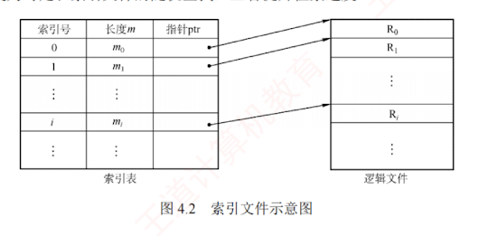
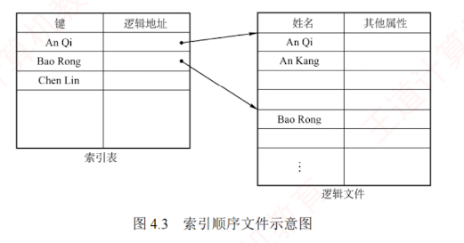

---

### 4.1.3 文件的逻辑结构

**文件的逻辑结构是指从用户视角所看到的文件组织形式**；  
而文件的**物理结构**（也称存储结构）**则是指文件在外存上的实际存储方式**，对用户透明。  
逻辑结构与底层存储介质无关，其核心在于描述文件内部数据在逻辑上是如何组织的。

根据逻辑结构的不同，文件可分为两大类：**无结构文件**和**有结构文件**。

---

#### 1. 无结构文件

无结构文件是最简单的组织形式，由连续的字符流构成，因此也称流式文件，其长度以字节为单位。对这类文件的访问通过读/写指针来定位下一个要操作的字节。系统中大量的源程序、可执行文件和库函数均采用这种形式。由于缺乏显式的记录边界，若需检索特定内容，只能进行顺序查找，效率较低，因而不适用于需要频繁随机访问或按记录检索的应用场景。

#### 2. 有结构文件

有结构文件由一个或多个记录组成，故也称**记录式文件**。  
每条记录由若干数据项组成，其数量和长度可能固定，也可能可变。  
根据记录长度是否一致，有结构文件进一步分为两类。

**定长记录**。所有记录的长度相同，且各数据项在记录中的位置固定。系统可通过**偏移量**直接定位任意记录，从而支持高效的**随机访问**。
    
**变长记录**。各记录的长度不一，或因所含数据项数量不同，或因某些数据项长度可变。由于无法直接计算记录位置，检索时通常只能**顺序查找**，速度较慢。
    
有结构文件按记录的组织形式可分为**顺序文件**、**索引文件**、**索引顺序文件**。
    
##### (1) 顺序文件

顺序文件中的记录按**线性顺序**依次排列，可采用**定长或变长记录**。  
根据记录是否按关键字排序，可分为两种结构：  
1. **串结构**，记录按存入时间先后排列，**不按关键字排序**。  
   检索时必须从头开始**顺序扫描**，效率较低。
2. **顺序结构**，所有记录**按关键字有序排列**。  
   对于**定长且按关键字有序**的顺序文件，可通过**偏移量**直接定位记录，并支持**折半查找**等高效算法，检索效率高。[[既然已经支持随机访问了，为什么还需要折半查找]]

正因记录连续存储、访问**局部性强**，顺序文件在**批量处理场景**下表现最优——当需要连续读取或写入大量记录时，其 I/O 效率在所有逻辑文件类型中最高。  
此外，对于**顺序存储设备**（如**磁带**），**顺序文件是唯一能够有效工作的组织形式**。  

然而，在频繁进行单条记录的查找、修改、插入或删除操作时，由于缺乏直接定位能力且需移动大量数据，顺序文件的性能明显不足。

##### (2) 索引文件

对于**定长记录的顺序文件**，可直接通过公式计算第 $i$ 条记录的物理地址：$A_i = iL$ ($L$ 为记录长度)。对于**变长记录的顺序文件**，由于各记录长度不一，无法直接定位目标记录，必须从头开始依次读取前 $i-1$ 条记录，累加其长度以确定第 $i$ 条记录的起始位置，即

$$A_i = \sum_{j=0}^{i-1} L_j + 1$$

该过程需顺序扫描，效率较低。为提高检索效率，可建立一张**索引表**，为每个记录设置一个**索引项**，包含指向该记录的**指针**及其**长度**，并**按关键字排序**。  
由于索引表由定长记录构成，支持高效的**随机访问**。如图 4.2 所示，系统可通过索引表直接定位任意记录，从而将对变长记录顺序文件的顺序查找，转变为对定长索引文件的随机查找，显著提升检索速度。

索引文件需额外维护一张索引表，且每个记录对应一个索引项，因此增加了存储开销。

##### (3) 索引顺序文件

**索引顺序文件是顺序文件与索引文件的结合**。  
其最简单的形式采用**一级索引**：  
先将**变长记录**的顺序文件**划分为若干组**，  
再为每组的**首条记录**建立一个**索引项**，包含该记录的**关键字**及其**指针**，  
所有索引项共同构成一张**按关键字有序排列**的索引表。

图 4.3 所示为索引顺序文件示意图。  
主文件包含**姓名**（作为**关键字**）及**其他数据项**，记录按姓名首字母分组——**组内可无序**，但**组间必须按关键字有序**。  
每组**首条记录**的**姓名**及其**逻辑地址**被存入索引表，该表按姓名递增排序。  
检索时，首先在索引表中定位目标记录所属的组，继而在该组内进行**顺序查找**，从而快速找到目标记录。[[如何在索引表中先定位目标记录所属的组]]

对于含 $N$ 条记录的普通顺序文件，平均需查找 $N/2$ 次。  
而在索引顺序文件中，若将记录均分为 $m$ 组，则每组约含 $s = N/m$ 条记录。查找过程分为两步：① 在**索引表中顺序查找**，平均需 $m/2$ 次；
② 在**对应组内顺序查找**，平均需 $s/2$ 次。因此，总平均查找次数为

$$m/2 + s/2 = m/2 + (N/m)/2$$

当 $m = \sqrt{N}$ 时，该值最小，查找效率达到最优。

显然，索引顺序文件显著提升检索效率；  
当记录数量极大时，还可引入**两级或多级索引**，进一步降低查找开销——这正是**分块查找**（也称**索引顺序查找**）的基本思想。  
然而，索引文件与索引顺序文件在大幅提升查找速度的同时，也因维护索引表而带来**额外存储开销**。

##### (4) 直接文件（散列文件）

在**直接文件**（也称**散列文件**）中，记录的**物理地址**由其**关键字**经**散列函数**计算直接确定。  
这种方式支持极快的**随机存取**，但**不同关键字可能映射到同一地址**，从而引发冲突。

熟悉数据结构的读者不难发现：有结构文件的各类逻辑组织方式（包括顺序、索引、索引顺序和散列），本质上都是围绕“**如何高效查找数据**”这一核心目标而设计的。
