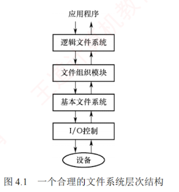

---
### 4.1.2 文件系统结构

**文件系统**（File System）为用户提供高效、便捷的**磁盘访问机制**，支持数据的存储、定位与提取。  
其设计涉及**两个核心问题**：  
一是**定义用户接口**，包括**文件及其属性**、**允许的操作类型**以及**目录结构的组织方式**；  
二是**设计相应的算法与数据结构**，将逻辑上的文件系统映射到物理外存设备上。  
由于现代操作系统支持多种文件系统类型，其内部层次结构也各不相同。

图 4.1 展示了一个合理的文件系统层次结构。

#### I/O 控制

包含**设备驱动程序**和**中断处理程序**，负责在**内存**与**磁盘**之间**传输数据**。  
**设备驱动程序**将**高层命令**转换为底层硬件可识别的**特定指令**，由**硬件控制器**执行，实现 I/O 设备与系统的交互，并向 **I/O 控制器**指明对设备的具体位置**执行何种操作**。

---

####  基本文件系统

负责向**设备驱动程序**发送**通用命令**，以读取或写入**磁盘的物理块**；  
每个**物理块**由**唯一的磁盘地址**标识。  
该层还管理**内存缓冲区**，缓存**文件系统元数据**、**目录项**及**数据块**；  
在执行磁盘传输前，需要分配并维护合适的**缓冲区**——有效的**缓冲区管理**对系统性能至关重要。

#### 文件组织模块

负责建立文件**逻辑块与物理块之间的映射**关系，将**逻辑块地址**转换为**物理块地址**。  
文件的**逻辑块按顺序编号**（从 $0$ 到 $N$），通常与物理块布局不一致，因此需通过**地址转换机制**进行定位。  
该模块还包含**空闲空间管理器**，用于**跟踪未分配的磁盘块**，并按需分配给文件使用。

#### 逻辑文件系统

负责管理文件系统的**元数据**（描述文件系统结构的信息，如文件名、目录项、权限和时间戳等），**不含实际数据内容**。  
它**维护目录结构**，并根据给定文件名，向文件组织模块提供所需的**元数据**；  
同时通过**文件控制块**记录**各文件的属性与状态**，并负责实现**文件保护机制**。
