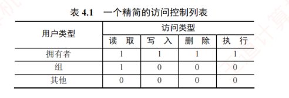

---

### 4.2.9 文件保护

为**防止文件共享导致文件被意外破坏或被未授权用户篡改**，文件系统必须对用户访问文件的行为实施控制，即明确哪些用户可对文件执行**读/写**、**执行**等操作。  
为此，需要建立有效的**文件保护机制**。  
常见的实现方式包括**口令保护**、**加密保护**和**访问控制**：  
其中，**口令与加密**主要用于防止他人非法获取或窃取文件内容，  
而**访问控制**则用于精细管理用户对文件的具体访问权限。

#### 1. 访问类型

**文件保护**通常通过限制用户可执行的**访问类型**来实现。  
主要的**受控操作**包括：

- **读**。从文件中读取数据。
    
- **写**。向文件中写入或修改数据。
    
- **执行**。将文件加载到内存并运行。
    
- **添加**。在文件末尾追加新数据，而不覆盖原有内容。
    
- **删除**。移除文件并释放其所占用的存储空间。
    
- **列表清单**。列出目录中文件的名称及其属性。
    

此外，系统还可对**重命名**、**复制**、**编辑**等高层操作进行控制。  
然而，这些功能通常由应用程序通过调用**系统调用**来实现，而**真正的保护机制**仅在底层提供。  
例如，**复制**文件本质上是通过一系列“**读**”操作完成的；  
因此，**用户只要拥有读权限，便隐含具备了复制和打印的能力**。

#### 2. 访问控制
##### ACL
实现**访问控制**最常用的方法是**基于用户身份进行权限管理**。  
其中，最普遍的机制是为**每个文件和目录**附加一个**访问控制列表**（Access-Control List, **ACL**），明确**指定各用户名及其被允许的访问类型**。  
该方法的优点在于支持灵活而复杂的访问策略，但缺点是**列表长度不可预知**，可能带来复杂的空间管理开销。  
为此，现代系统常采用**精简的访问控制列表**加以缓解。

精简 ACL 通常将**用户划分为三类**：**拥有者**、**组**和**其他**。

1. **拥有者**。创建文件的用户。
    
2. **组**。一组**需要共享该文件**且**具有相似访问需求**的用户。
    
3. **其他**。系统中除拥有者和同组用户外的所有用户。
    

表 4.1 是一个**精简 ACL** 的实例。  
每种访问类型用**一个二进制位**表示，因此仅需一个 $3 \times 4$ 位的矩阵，即可完整描述三类用户的访问权限。  
创建文件时，系统将文件拥有者的用户名及其所属组名记录在该文件的 FCB 中。  
当用户访问文件时，系统按**优先级顺序**匹配其身份：  
若为拥有者，则授予**拥有者权限**；  
若**与拥有者同属一组**，则授予**组权限**；  
否则，仅授予其他用户的权限。

##### 口令和密码
除 ACL 外，**口令和密码**也是常见的**辅助性访问控制手段**。

**口令**指用户在**创建文件时设定一个口令**，系统将其存入 **FCB**，并告知授权共享的其他用户，访问时需要提供**正确口令**。  
该方法**时空开销小**，但因口令通常以**明文**或**弱保护**形式存储于系统内部，**安全性较低**。

**密码**指用户对文件内容进行加密，访问时需要使用**密钥解密**。  
此方法**保密性强**，且**不额外占用元数据空间**，但**加解密过程会引入一定的计算开销**。

口令与加密主要用于**防止文件被非法获取或窃取**，并**不区分具体的访问操作类型**（如读/写、执行等）。  
因此，它们**无法替代基于权限的访问控制机制**，而应视为**补充手段**。

对于**多级目录结构**而言，保护需求不仅限于单个文件，还**需要涵盖子目录及其全部内容**。  
由于目录操作与文件操作存在较大差异，系统还必须提供专门的**目录保护机制**。

