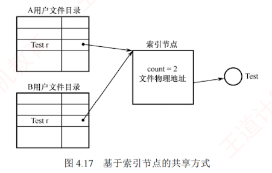
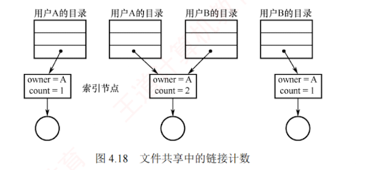
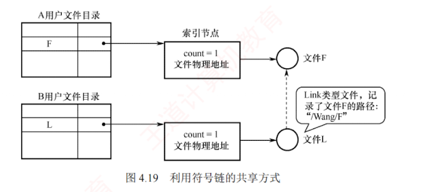

---

### 4.2.8 文件共享

文件共享允许**多个用户访问同一文件**，系统中仅需保留**一个物理副本**。  
若缺乏共享机制，则每个需要该文件的用户都必须持有独立副本，不仅浪费存储空间，还易导致数据不一致。

前文介绍的**无环图目录结构**可用于实现**文件共享**。  
建立链接时，需要将被共享文件的盘块号复制到相应目录项中。  
然而，若某用户向文件追加数据并分配新盘块，这些新增盘块仅出现在其操作所对应的目录中，对其他用户不可见，因此无法实现真正的共享。

#### 1. 基于索引节点的共享方式（硬链接）

**硬链接**是一种基于**索引节点**的共享机制。  
在此方式下，文件的物理地址和属性信息不再存放于目录项中，而是集中存储在索引节点内；目录项仅包含文件名及指向该索引节点的指针。

如图 4.17 所示，用户 A 和 B 的目录中均设有指向同一共享文件索引节点的指针。  
该索引节点包含一个**链接计数 `count`**，也称**引用计数**，用于记录当前指向它的目录项数量。  
例如，当 `count = 2` 时，表示有两个用户目录项链接到此文件，即两个用户共享该文件。

当用户 A 创建新文件时，成为该文件的拥有者，系统为其创建索引节点，并将 `count` 置为 1。  
当用户 B 需要共享此文件时，系统在 B 的目录中新增一个目录项，并设置指向该索引节点的指针，此时 `count` 增至 2，但拥有者仍为 A。  

**若 A 不再需要该文件，能否直接删除？**  
答案是否定的。  
因为删除操作若同时移除索引节点，将导致用户 B 的指针悬空；  
而 B 可能正在对该文件执行写操作，此时操作将中断失败。  
因此，A 不能直接删除文件，而应仅删除自己的目录项，并将索引节点的 `count` 减 1。只要 `count > 0`，文件及其索引节点仍被保留，B 可继续使用。  
只有当 `count = 0` 时，系统才真正释放该文件及其索引节点。  
图 4.18 展示了不同用户对同一文件的链接情况。

#### 2. 利用符号链实现文件共享（软链接）

为使用户 B 能共享用户 A 的文件 F，系统可创建一个 **`LINK` 类型**的新文件 L，并将其写入用户 B 的目录中，从而建立 B 的目录与文件 F 之间的链接。  
**文件 L 仅包含被链接文件 F 的路径名**，如图 4.19 所示。  
这种链接方式称为**符号链接**，也称**软链接**，其功能类似于 Windows 系统中的**快捷方式**。  
当用户 B 访问文件 L 时，操作系统识别出其为 `LINK` 类型，便根据其中记录的路径名逐级查找，定位到目标文件 F，并对其执行读/写操作，从而实现对文件 F 的共享。

在基于符号链的共享机制中，只有文件拥有者持有指向其索引节点的指针。其他共享用户仅保存该文件的路径名，而不具备直接指向索引节点的指针。因此，即使拥有者删除了共享文件 F，也不会导致其他用户的指针悬空。当其他用户尝试通过符号链访问已被删除的共享文件时，系统将返回访问失败，此时可安全地删除该符号链，而不会引发任何问题。

在符号链的共享方式中，用户每次访问共享文件时，系统需要根据路径名逐级遍历目录结构，直至定位到目标文件的索引节点。这一过程可能涉及多次磁盘读取，从而增加访问开销。同时，符号链接本身也是一个独立文件，其索引节点同样占用一定的磁盘空间。

利用符号链实现网络文件共享时，只需记录文件所在机器的网络地址及文件路径名。

可以这样说：文件共享，“软硬”兼施。硬链接是多个目录项指向同一个索引节点，只要至少有一个指针存在，该索引节点就不会被删除；软链接是将到达共享文件的路径保存下来，访问时依据路径进行查找。可见，硬链接的查找速度通常优于软链接，因其直接通过指针访问。

