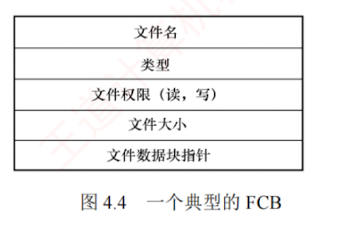
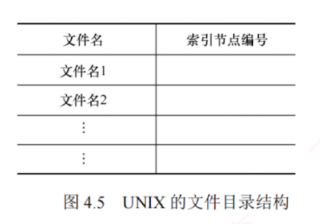

---

### 4.2.2 文件控制块和索引节点

为便于**文件管理**，引入了**文件控制块**（File Control Block, **FCB**）这一**重要数据结构**。

#### 1. 文件控制块

**文件控制块**（FCB）是用于存放**控制文件所需各种信息**的数据结构，以实现**按名存取**。  
**每个文件对应一个 FCB**，所有 **FCB 的集合**构成**文件目录**（也称**目录文件**）。  
每当**创建新文件**，系统即为其建立一个 **FCB**，用以记录其**属性信息**。  
图 4.4 展示了一个**典型的 FCB 结构**。

FCB 主要包含以下**几类信息**：

- **基本信息**，如**文件名**、**物理位置**、**逻辑结构**、**物理结构**等。
    
- **存取控制信息**，包括文件主、核准用户和一般用户的**访问权限**。
    
- **使用信息**，如**文件创建时间**、**最后修改时间**等。
    

---

#### 2. 索引节点

然而，当文件数量庞大时，传统 FCB 目录会**占用大量磁盘空间**。  
在查找过程中，系统需**逐块读入目录项**，并逐一**比对文件名**；  
而仅当**匹配成功**时才需要获取该文件的**物理地址**。  
这意味着，在**检索阶段**，**除文件名外的其他描述信息并无必要调入内存**。  
为此，UNIX 等系统采用**文件名与描述信息分离的设计策略**：  
将**文件的描述信息**独立组织为**索引节点**（inode），简称 **i 节点**；  
而**目录项**则仅由**文件名**及其对应的**索引节点号**（或**索引节点指针**）构成，如图 4.5 所示。

例如，假设一个 FCB 占 64B，盘块大小为 1KB，则每个盘块可容纳 16 个 FCB（**FCB 必须连续存放**）；  
若目录共含 640 个 FCB，则**平均需启动磁盘 20 次**才能完成一次**文件查找**。  
而在 UNIX 系统中，每个**目录项仅占 16B**（14B 文件名+2B 索引节点号），每块可容纳 64 个目录项，从而将平均磁盘启动次数降至原来的 1/4，**显著降低系统开销**。

为兼顾持久存储与高效访问，文件系统将索引节点设计为**两种形态**：

##### 磁盘索引节点

存储于**磁盘**上，作为文件的“**永久档案**”，每个文件有**唯一磁盘索引节点**，主要包含：

- **文件主标识符**，标识文件所属的**用户**或**用户组**。
    
- **文件类型**，指明是**普通文件**、**目录文件**还是**特殊文件**。
    
- **文件存取权限**，规定文件主、核准用户及一般用户的**访问权限**。
    
- **文件物理地址**，通过 **13 个地址项**以直接或间接方式记录**数据所在盘块编号**。
    
- **文件长度**，**以字节为单位**表示文件的实际大小。
    
- **文件链接计数**，统计本文件系统中指向该文件的**目录项**（**硬链接**）数量。
    
- **文件存取时间**，记录文件**最近被访问**、**修改的时间**，以及**索引节点最近被修改的时间**。
    

##### 内存索引节点

当文件被打开时，系统将对应的**磁盘索引节点**载入内存，并附加运行时状态信息，以支持高效的并发访问与快速操作。  
因此，在**磁盘索引节点**的基础上，额外**新增了以下内容**：

- **索引节点号**，用于在**内存中唯一标识**该节点。
    
- **状态**，指示 i 节点**是否被上锁或已修改**，便于**缓存一致性**管理。
    
- **访问计数**，进程每访问一次，计数加 1；访问结束减 1，用于**判断节点是否可释放**。
    
- **逻辑设备号**，标识文件所属文件系统的**逻辑设备号**，在**多文件系统环境**中尤为关键。
    
- **链接指针**，分别指向**空闲链表**与**散列队列**，便于**内核高效调度和回收**。
    
