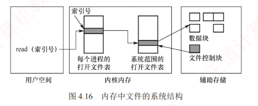

---

### 4.2.7 文件的操作

文件是一种抽象数据类型。为了正确定义文件，需要明确可执行的操作。操作系统提供一系列的系统调用来实现对文件的创建、删除、读/写、打开和关闭等操作。

**1. 文件的基本操作**

最基本的文件操作包括创建文件、删除文件、读文件和写文件等。

**(1) 创建文件**

创建文件涉及元数据分配、存储空间预留与目录注册等多个步骤，具体过程如下：① 合法性与权限校验，检查文件名是否合法、是否与同目录下已有的文件重名，并验证用户对目标目录是否具有写权限。若任一条件不满足，则创建立即终止。② 分配索引节点，从空闲 inode（或 FCB）池中分配一个空闲项，初始化其元数据，包括文件类型、初始大小、访问权限、时间戳以及物理块指针等，并标记为已占用。③ 分配磁盘块，根据文件预估大小，从空闲磁盘块管理结构中分配相应数量的物理块，并将块地址记录在 inode 中。④ 在目录中新建目录项，格式为 `<文件名, 索引节点号>`，使文件可被检索。⑤ 更新文件系统元数据，包括空闲 inode 表、空闲磁盘块结构、目录大小以及修改时间等。⑥ 打开并返回文件描述符（可选），若创建后立即打开（见下节），则系统将在进程的打开文件表中创建表项，分配文件描述符，并初始化读/写指针。

**(2) 删除文件**

删除文件的步骤包括撤销目录可见性、回收元数据、释放存储空间等，具体过程如下：① 路径解析与定位，按路径名逐级查找目录，定位目标文件的目录项，获取其 inode（或 FCB），并验证用户对文件所在目录的写权限。② 检查使用状态与硬链接计数，若文件正被打开，则部分系统将延迟物理删除，待所有引用关闭后再回收资源；若硬链接计数（见 4.2.8 节）大于 1，则仅删除当前目录项并将计数减 1，不回收 inode 与磁盘块；仅当计数为 1 时，才执行完整的删除流程。③ 移除目录中的目录项，使文件在用户视角下“消失”，完成逻辑删除。④ 释放索引节点，当链接计数降至 0 时，将 inode 标记为空闲，并归还至空闲管理结构，其元数据彻底失效。⑤ 释放磁盘块，根据 inode 中的块指针，将所有数据块和索引块归还至空闲磁盘块管理结构。⑥ 释放内存临时资源（可选），包括对应的缓冲区、打开文件表项及内核文件对象等。⑦ 更新文件系统元数据，同步更新目录大小、空闲 inode 表及空闲块结构，确保一致性。

**(3) 读文件**

读文件时，首先根据文件名在目录中查找对应目录项，获取文件的索引节点号，进而定位其在外存中的数据块。随后，依据当前读指针的位置，从指定块中读取数据，并更新读指针。

**(4) 写文件**

写文件时，系统同样先通过文件名查找目录项，获取索引节点号以定位外存数据块。然后，根据当前写指针的位置，将数据写入相应块，并更新写指针。若写入超出当前分配空间，系统将动态分配新磁盘块并更新 inode（或 FCB）中的块指针。

**2. 文件的打开与关闭**

当用户对一个文件执行多次读/写操作时，若每次均需要从检索目录开始，将带来显著的性能开销。为避免重复查找，大多数操作系统规定：用户首次访问某文件时，必须先通过系统调用 open 将其打开。系统维护一个称为打开文件表的数据结构，用于记录当前活跃文件的信息。所谓“打开”，是指系统根据文件路径定位到其目录项后，将关键信息载入内存，在打开文件表中创建一个表项，并将该表项的索引号（文件描述符）返回给用户。此后，用户再次操作该文件时，只需提供文件描述符，系统即可直接从内存获取所需信息，显著降低目录检索开销。

为提升效率与管理灵活性，现代操作系统采用**两级打开文件表**结构：

- **系统打开文件表**：全局共享，存储与进程无关的文件属性，如磁盘位置、文件大小、访问时间等；每项都包含一个打开计数器（Open Count），记录有多少进程打开了该文件。
    
- **进程打开文件表**：每个进程独有，记录进程私有的访问状态，如当前读/写指针、访问权限及文件打开模式。该表中的每一项均指向系统打开文件表的对应项，实现资源共享与独立控制的统一。图 4.16 展示了内存中文件的系统结构。
    

当一个进程成功打开文件时，系统首先确保其在系统打开文件表中存在对应项（若不存在，则创建），随后在该进程的打开文件表中新增一项，指向该系统表项。此后，其他进程若打开同一文件，只需要在其各自的进程表中添加新项并指向同一系统表项，无须重复加载文件元数据，既保证了各进程访问上下文的隔离，又实现了底层资源的高效共享。

综上，文件打开的完整过程如下：系统首先根据用户提供的文件路径逐级遍历目录，将所需的目录文件从磁盘加载至内存，定位目标文件的目录项；随后从中提取其索引节点编号，并以此为关键字在系统打开文件表中查找对应项。若未找到，则从磁盘读取该索引节点至内核缓冲区，在系统表中创建新项，并将打开计数初始化为 1；若已存在，则仅将该项的打开计数加 1。接着，在发起请求的进程所属的进程打开文件表中分配一个新表项，用于记录其指向系统表项的索引；最终，将该表项的索引号作为文件描述符返回给用户进程，供后续读/写等操作使用。

当文件不再使用时，用户调用 close 关闭它。系统随即从该进程的打开文件表中删除对应项，并将系统打开文件表中相应项的打开计数器减 1。一旦计数器减至 0，表明该文件已无任何进程引用，系统便可安全地删除其在系统表中的项，并释放所占用的相关资源。

文件名并非打开文件表的组成部分。因为一旦系统通过文件名完成对磁盘上 FCB 的定位，后续操作便不再需要该文件名。用于访问打开文件表的索引号，也称文件描述符（Linux）或文件句柄（Windows）。因此，只要文件处于打开状态，所有文件操作均通过该索引号完成。

> [!NOTE] 注意
> 
> 一旦成功执行 open() 系统调用，后续所有文件操作［包括 read()、write()、lseek()、close() 等］均不再使用文件名，而是通过文件描述符进行，这一机制是文件管理的核心考点。

每个被打开的文件在系统中均关联以下关键信息：

- **文件指针**。系统为每个进程维护一个独立的当前读/写位置指针。由于该指针针对不同进程而言是私有的，必须与磁盘上的共享文件属性分离，保存在进程的打开文件表中。
    
- **文件打开计数**。记录当前打开该文件的进程数量。因多个进程可能同时访问同一文件，系统只有在最后一个进程调用 close() 后，才会真正释放其在系统打开文件表中的项。
    
- **文件磁盘位置**。大多数文件操作涉及对磁盘数据的修改。为避免每次操作都重新解析路径并读取元数据，系统将文件在磁盘上的位置信息缓存在内存中，供快速访问。
    
- **访问权限**。每个进程在打开文件时需要指定访问模式（如只读、读/写、追加、创建等）。该权限信息保存在进程的打开文件表中，操作系统据此判断是否允许后续的 I/O 请求。