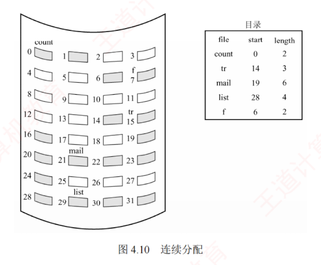
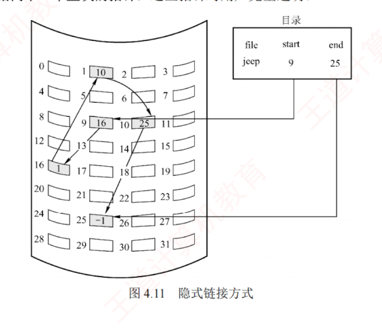
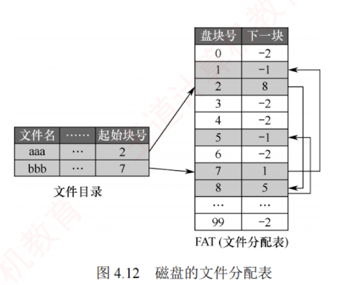
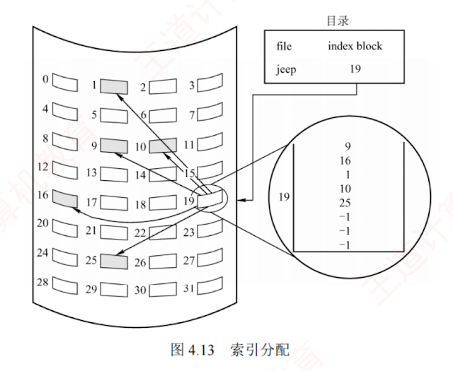
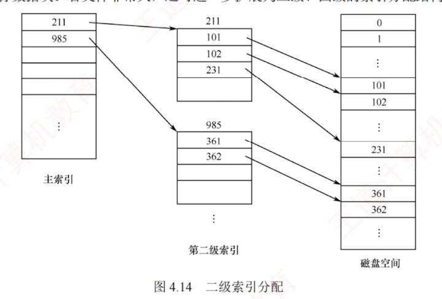
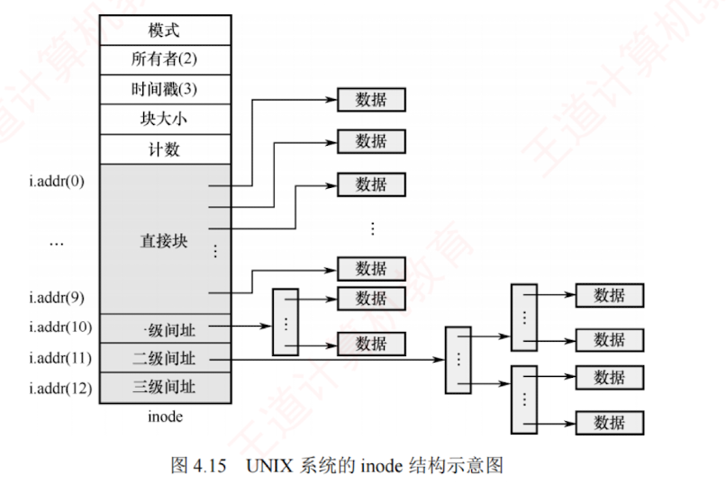

---

### 4.2.6 文件的物理结构

前文指出，文件本质上是一种**抽象数据类型**，其研究涵盖逻辑结构、物理结构及相关操作。  
文件的物理结构关注的是文件数据如何在磁盘上分布与组织。  
这一问题可从两个互补的视角加以理解：  
1. **文件分配方式**，解决如何为文件分配已使用的磁盘块，属于对**非空闲块**的管理；
2. **文件存储空间管理**，解决如何跟踪和分配空闲磁盘块，属于对**空闲块**的管理（见 4.3 节）。

文件分配方式直接决定文件的物理结构，常用策略有三种：  
**连续分配**、**链接分配**和**索引分配**。  
需要特别注意将其与文件的**逻辑结构**区分开来。  
可类比数据结构中“线性表”（逻辑结构）与“顺序表/链表”（物理实现）的关系：逻辑结构描述“是什么”，物理结构则说明“如何存”。

此外，如同内存被划分为固定大小的页，磁盘也被划分为**若干磁盘块**，其大小通常与内存页面一致。  
所有磁盘 I/O 操作均以**块**为单位，在内存与磁盘之间进行数据交换。

#### 1. 连续分配

连续分配方法要求每个文件在磁盘上占有**一组连续的块**（见图 4.10）。  
由于磁盘地址本身具有**线性顺序**，这种布局使得进程访问文件时所需的**寻道次数和寻道时间最小**。

采用**连续分配**时，逻辑文件中的记录依次存放在**相邻的物理块**中。  
文件的**目录项**需要记录该文件**起始块的块号**及其**所占用的总块数**。  
若文件长度为 $n$ 块，且从块 $b$ 开始存放，则该文件占据的块为 $b, b+1, b+2, \dots, b+n-1$；  
要访问第 $i$ 块，可直接计算并访问块 $b+i-1$。

**连续分配的优点**：  
1. 支持**顺序访问**和**直接访问**。
2. 顺序访问**高效**且**速度快**，因为文件所占的块通常位于一条或少数几条相邻磁道上，磁头移动距离最小。  
**缺点**：
3. 必须为文件分配**连续的存储空间**，与内存连续分配类似，易产生大量**外部碎片**。
4. 需要预先知道文件长度，难以支持文件的动态增长——若强行扩展，可能覆盖物理上相邻的其他文件。
5. 为维持文件的逻辑顺序，在删除或插入记录时，往往需要对后续记录进行物理移动，开销较大。

#### 2. 链接分配

链接分配是一种采用**离散方式**分配磁盘块的策略。其**主要优点**包括：  
1. 消除了外部碎片，显著提高磁盘空间的利用率。
2. 支持动态分配盘块，无须事先预知文件大小。
3. 文件的插入、删除和修改操作十分便捷。  
   根据指针存储方式的不同，链接分配可分为隐式链接和显式链接。

##### （1） 隐式链接

隐式链接方式如图 4.11 所示。  
目录项中包含指向**文件第一块**和**最后一块**的指针（**盘块号**）。每个文件对应一个由磁盘块构成的链表，这些块可分散存储于磁盘的任意位置。除最后一块外，每个盘块均存有指向下一个盘块的指针，这些指针对用户完全透明。

隐式链接的缺点：① 仅支持顺序访问，若要访问文件的第 $i$ 块，必须从首块开始，依次跟随指针遍历至第 $i$ 块，随机访问效率极低。② 可靠性较差，一旦链中任一指针损坏，整个链将断开，导致后续数据无法访问。③ 每个盘块需要存储指向下一块的指针，占用一定的存储空间。

为缓解上述问题，可引入**簇**（cluster）的概念：将若干连续的盘块组合成一个簇（基本分配单位），文件的分配与链接均以簇为单位进行。如此，指针数量大幅减少，不仅降低存储开销，也显著缩短链式查找时间，从而提升整体 I/O 性能。但这一优化的代价是可能产生内部碎片——当文件大小不是簇大小的整数倍时，最后一个簇的剩余空间无法被其他文件利用。

---

##### （2） 显式链接

显式链接将用于链接文件各物理块的指针集中存放在内存中的一张全局表中，该表在整个文件系统中仅设一张，称为**文件分配表**（File Allocation Table, FAT）。FAT 的每个表项对应一个磁盘块，并存放指向下一个盘块的指针。因此，文件目录项只需记录该文件的起始块号，后续所有块号均可通过依次查询 FAT 获得。例如，某磁盘共有 100 个盘块，其中存放了两个文件：文件 “aaa” 占用三个块，链接顺序为 $2 \to 8 \to 5$；文件 “bbb” 占用两个块，链接顺序为 $7 \to 1$。其余盘块均为空闲块。该磁盘的文件分配表（FAT）如图 4.12 所示。

不难看出，FAT 的表项与所有磁盘块一一对应。通常，可用特殊值 -1 标记文件的最后一块，用 -2 表示该盘块空闲（也可指定为 -3、-4 等）。因此，FAT 不仅记录了文件的链式结构，还标识了空闲盘块，系统可直接利用 FAT 管理磁盘的空闲空间。当某进程请求分配一个磁盘块时，系统只需在 FAT 中查找值为 -2 的表项，并将对应的磁盘块分配给该进程即可。

**显式链接的优点**：① 支持顺序访问，也支持直接访问，要访问第 $i$ 块，无须依次遍历前 $i-1$ 块；② FAT 在系统启动时即被载入内存，后续检索操作均在内存中完成，不仅显著提升查找速度，也大幅减少磁盘 I/O 次数。**缺点**：FAT 需要常驻内存，磁盘容量越大，内存开销越显著。

#### 3. 索引分配

##### （1） 单级索引分配方式

事实上，在打开某个文件时，只需将该文件所占用的盘块编号调入内存即可，无须加载整个 FAT。为此，可将每个文件的所有盘块号集中存放于一处；当访问该文件时，只需将其对应的盘块号集合一次性载入内存，这正是索引分配的思想。具体而言，系统为每个文件分配一个专用的**索引块**（或称索引表），并将分配给该文件的所有盘块号记录其中，如图 4.13 所示。

例如，若盘块大小为 4KB，每个盘块号占 4B，则一个索引块可容纳 $4KB/4B = 1024$ 个盘块号。采用单级索引时，可支持的最大文件为 $1024 \times 4KB = 4MB$。

**索引分配的优点**：① 支持高效的直接访问，要访问文件的第 $i$ 块，只需读取索引块中第 $i$ 项，即可直接获得对应的盘块号；② 不会产生外部碎片，因为文件的盘块可离散分配。**缺点**：引入了额外的存储开销，每个文件必须配备一个索引块。当文件较小时，如仅占用几个盘块，仍需要为其分配一个完整的索引块，导致索引块的利用率极低；当文件较大时，若所需盘块号超出单个索引块容量，虽可借助链式指针将多个索引块链接起来，但这种方法效率低下。

##### （2） 多级索引分配方式

显然，当文件过大而索引块较多时，可为这些索引块再建立一级索引，称为主索引。主索引表中依次存放各二级索引块的盘块号，从而形成二级索引分配方式。其设计思想与内存管理中的多级页表高度相似（见图 4.14）。访问数据时，系统首先通过主索引定位对应的二级索引块，再通过该二级索引块找到目标数据块。若文件非常大，还可进一步扩展为三级、四级的索引分配结构。

例如，假设盘块大小为 4KB，每个盘块号占 4B，则一个索引块可容纳 1024 个盘块号。采用两级索引时，可支持的最大文件为 $1024 \times 1024 \times 4KB = 4GB$。

**多级索引的优点**：显著提升大型文件的可扩展性与查找效率。**缺点**：当访问一个盘块时，所需的磁盘 I/O 次数随索引级数增加而增多。若文件系统仅采用多级索引作为组织方式，则即使对于大量小文件，访问单个盘块仍需要多次磁盘 I/O，导致整体 I/O 性能难以达到理想水平。

---

##### （3） 混合索引分配方式

为兼顾小、中、大乃至特大型文件的访问效率，需要根据文件大小动态选用最合适的分配策略，在空间开销与访问性能之间取得最佳平衡，因此通常采用混合索引分配方式。对于小文件，为提升大量小文件的访问速度，可将其全部盘块地址直接存放在 inode（或 FCB）中，系统直接从中获取所有盘块地址，无须额外读取索引结构，即直接寻址。对于中型文件，采用单级索引分配，inode 中存放一个索引块的地址，系统需要先读取该索引块，再从中获取文件的盘块地址，即一次间址。对于大型或特大型文件，则分别采用两级和三级索引分配。UNIX 系统正是采用这种混合策略。在其索引节点中，共设有 13 个地址项，即 `i.addr(0)` ~ `i.addr(12)`，如图 4.15 所示。

1. **直接地址**。为了提升对小文件的检索速度，索引节点中设置了 10 个直接地址项，记为 `i.addr(0)` ~ `i.addr(9)`，每个项直接存放一个文件数据块的盘块号。假设每个盘块大小为 4KB，当文件不大于 40KB 时，则可直接从索引节点中读取该文件的全部盘块号。
    
2. **一次间接地址**。对于中、大型文件，仅靠直接地址显然无法满足需求。为此，索引节点中的地址项 `i.addr(10)` 被设计为一次间接地址，用于实现一级索引分配。一次间接地址指向一个专门的一次间址块（索引块），其中存放的是文件数据块的盘块号。一个索引块可容纳 1024 个盘块号，通过一次间接地址最多可寻址 $1K \times 4KB = 4MB$ 的数据。因此，同时使用直接地址和一次间址时，最大可表示的文件长度为 $4MB + 40KB$。
    

3. **多次间接地址**。当文件长度超过 $4MB + 40KB$ 时，还需要利用地址项 `i.addr(11)` 作为二次间接地址，以实现两级索引分配。二次间接地址指向文件的主索引块，该主索引块中的每一项又指向一个一次间址块，而每个一次间址块再指向 1024 个数据块。通过二次间接地址最多可寻址 $1K \times 1K \times 4KB = 4GB$ 的数据。因此，同时使用直接地址、一次间址和二次间址时，最大可表示的文件长度为 $4GB + 4MB + 40KB$。同理，同时采用直接地址、一次间址、二次间址和三次间址时，最大可表示的文件长度为 $4TB + 4GB + 4MB + 40KB$。