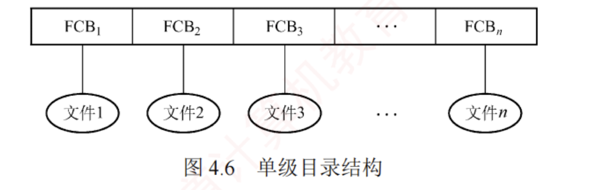
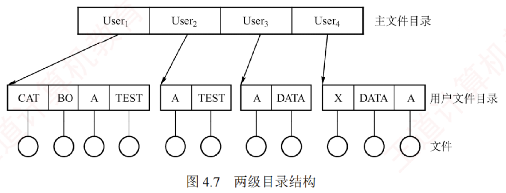
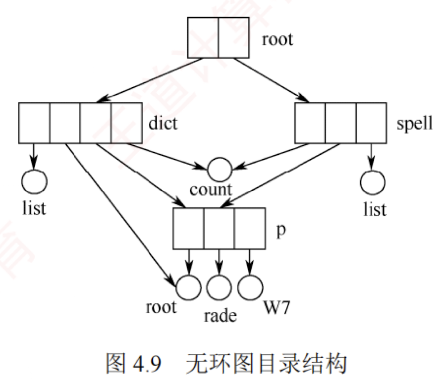

---

### 4.2.3 目录结构

#### *单级目录结构

整个**文件系统**仅维护**一张全局目录表**，**每个文件对应一个目录项**，如图 4.6 所示。

**创建新文件**时，系统首先**遍历整张目录表**，确保**无同名文件**存在；  
确认无冲突后，方可**新增一个 FCB**，并填入该文件的属性信息。  
**访问文件**时，系统根据**文件名**查找对应的 FCB，经合法性检查后执行相应操作。  
**删除文件**时，则先**定位其 FCB**，**回收其所占存储空间**，**再清除该 FCB**。

尽管**单级目录结构**实现了**按名存取**，但其存在**查找效率低**、**不允许文件重名**、**难以支持文件共享**等缺点，且完全**无法满足多用户**环境的需求，因此仅适用于**早期单用户**的简单文件系统。

#### *两级目录结构

为克服单级目录存在的缺陷，系统可采用**两级方案**，将文件目录划分为**主文件目录**（Master File Directory, MFD）和**用户文件目录**（User File Directory, UFD），如图 4.7 所示。

MFD 中的每个目录项记录**一个用户名**及其对应的 **UFD 存储位置**；  
每个 UFD 则包含该用户所有文件的 FCB。  
当用户访问其文件时，系统仅需在其**专属 UFD** 中进行查找。  
这一机制不仅有效解决了**不同用户间文件重名**的问题，还通过隔离用户命名空间**增强了安全性**。

**两级目录结构**提升了检索效率，并支持**基于目录的访问控制**。  
然而，由于每个用户仅有一个扁平的 UFD，无法对文件进行分类管理，因此在组织复杂文件集合时显得**灵活性不足**。

#### 树形目录结构

将两级目录结构加以推广，便形成了**树形目录结构**，如图 4.8 所示。

**树形目录结构**显著提升了**目录检索效率**与**文件系统**的整体性能。  
在该结构中，用户通过**文件路径名**来**标识文件**。  
**路径名是一个字符串**，由从**根目录**出发到**目标文件**路径上所有目录名和文件名，用**分隔符** “/” 连接而成。  
##### 绝对路径

若路径从**根目录**开始，则称为**绝对路径**；  
系统中每个文件都具有**唯一的绝对路径**。  
例如，在 Linux 系统中，“/dev/hda” 就是一个典型的绝对路径。 

##### 相对路径

然而，当**目录层次较深**时，每次**从根目录逐级查找**会**耗费大量时间**。  
为此，系统为每个进程设置一个**当前目录**（也称**工作目录**），进程对文件的访问通常以**当前目录为基准**。  
此时，用户可使用**相对路径**进行定位：它由从**当前目录**出发至**目标文件**路径上的目录名与文件名，用 “/” 连接构成。  
例如，若当前目录为 “/bin”，则 “./ls” 即为相对路径，其中符号 “.” 表示当前工作目录。

通常，每个用户都拥有专属的“**当前目录**”，**登录后系统自动将其切换至该默认目录**。  
操作系统提供专门的**系统调用**，允许用户随时**更改当前目录**。  
例如，Linux 系统的 /etc/passwd 文件记录了各用户登录时的默认当前目录，而 **`cd` 命令通过调用该接口动态更新当前目录**。

##### 优缺点

**树形目录结构**支持灵活的**文件分类**，层次清晰，便于管理与保护。  
不同性质或归属的文件可分布于**目录树的不同分支或子树**中，并能针对各节点设置**独立的存取权限**，实现**精细化控制**。 

然而，该结构也存在**局限**：查找一个文件需按路径名**逐级访问中间目录节点**，导致**磁盘 I/O 次数增加**，可能影响查询速度。  
尽管如此，凭借其良好的**组织性**、**扩展性**以及**对多用户环境的支持**，目前绝大多数现代操作系统（如 UNIX、Linux 和 Windows）**都采用了树形目录结构**。

#### *4. 无环图目录结构

树形目录结构便于实现文件分类，但难以支持文件共享。为此，在其基础上引入指向同一节点的有向边，使整个目录结构演变为一个有向无环图，如图 4.9 所示。该结构允许目录共享子目录或文件，同一个文件或子目录可出现在两个或多个目录中，从而实现跨目录的共享。

然而，共享也带来了删除操作的复杂性：当某用户请求删除一个共享节点时，若系统直接将其物理删除，其他共享用户后续访问将因节点缺失而失败。为此，系统为每个共享节点维护一个共享计数器——新增共享链时计数器加 1，收到删除请求时减 1。仅当计数器归零，才真正删除该节点，否则仅断开请求用户的共享链，保留节点供他人继续使用。无环图目录结构虽有效支持灵活的文件共享，但也因此增加了管理开销，需额外维护引用计数等共享状态。
