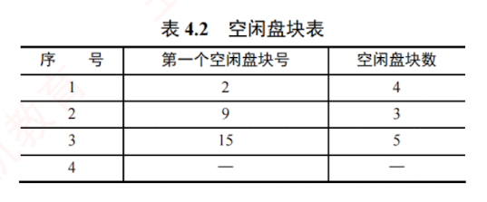

---
### 4.3.2 文件存储空间管理

如 4.2.6 节所述，文件的**物理结构**包含两个方面：**文件的分配方式**与**文件存储空间管理**。  
后者专门负责记录磁盘中的哪些块是**空闲**的，并提供对这些块进行**分配与回收**的机制。  
由于系统以固定大小的**物理块**为单位进行数据交换，存储空间管理的核心任务是**高效组织和管理空闲块**。  
为此，系统需要维护描述**空闲块状态**的数据结构，而这正是本节要介绍的几种管理方法所要解决的问题。

#### 1. 空闲表法

空闲表法属于**连续分配**方式，其思想源于内存的**动态分区分配**：为每个文件分配一块物理上连续的磁盘区域。  
系统为外存中的所有空闲区维护一张**空闲表**，每个空闲区对应一个表项，包含序号、起始盘块号和空闲盘块数等信息，并按起始盘块号递增顺序排列，如表 4.2 所示。

**盘块的分配：**

空闲盘区的分配策略与内存动态分区分配一致，通常采用**首次适应**（First Fit）、**最佳适应**（Best Fit）等算法。  
当系统为新创建的文件分配空间时，会顺序扫描空闲表，查找第一个大小满足需求的空闲区；  
一旦找到，便将其分配给用户，并立即更新空闲表。

**盘块的回收：**

回收用户释放的空间时，也借鉴**内存回收机制**：需要判断回收区是否与空闲表中相邻的前区或后区在物理上连续。  
若相邻，则将它们合并为一个更大的空闲区，以减少碎片。

**空闲表法的优点：** 具有较高的分配效率，能够显著降低磁盘 I/O 次数。  
尤其对于小型文件（如占用 1~5 个盘块），连续分配不仅实现简单，还能充分发挥磁盘顺序读/写的性能优势。

#### 2. 空闲链表法

空闲链表法将所有空闲盘区组织成一条链表，根据链表节点的不同，可分为以下两类：

(1) 空闲盘块链

空闲盘块链以单个盘块为单位，将所有空闲盘块链接成一条链，每个盘块包含一个指向下一个空闲盘块的指针。**分配时：** 从链首依次摘下所需数量的盘块分配给用户。**回收时：** 将释放的盘块逐个插入链尾。

**空闲盘块链的优点：** 单个盘块的分配与回收操作极为简单。**缺点：** 为一个文件分配多个盘块需要多次访问链表，效率较低；且由于管理粒度细，空闲盘块链通常较长，管理开销大。

(2) 空闲盘区链

空闲盘区链以空闲盘区（一组连续的盘块）为单位构建链表。每个盘区包含两项信息：本盘区的盘块数和指向下一个空闲盘区的指针。**分配时：** 采用与内存动态分区分配类似的策略（如首次适应算法），查找满足需求的空闲盘区进行分配。**回收时：** 需要判断回收区是否与链表中相邻的空闲盘区在物理上连续，若相邻则合并，从而有效减少外部碎片。

**空闲盘区链的优缺点与空闲盘块链恰好相反，优点：** 分配与回收的效率较高，且空闲盘区链的长度较短。**缺点：** 分配与回收的过程较为复杂，需要处理盘区的分割与合并操作。

---

**3. 位示图法**

> 考点追踪 ▶ 位示图的应用及相关计算（2010、2014、2015、2023）

位示图法利用二进制的一位来表示磁盘中一个盘块的使用状态：磁盘上的每个盘块均对应位示图中的一个比特位。当该位为 “0” 时，表示对应盘块空闲；为 “1” 时，表示已被分配。因此，一个由 $m \times n$ 位组成的位示图，恰好可描述 $m \times n$ 个盘块的使用情况，如图 4.21 所示。

**盘块的分配：**

1. 顺序扫描位示图，查找一个（或一组）值为 “0” 的位。
    
2. 将找到的一个（或一组）比特位转换为对应的盘块号。假设该位位于位示图中的第 $i$ 行、第 $j$ 列（行、列编号从 1 开始），每行包含 $n$ 位，则对应盘块号 $b$ 按下式计算：
    
    $$b = n(i - 1) + j$$
    
3. 修改位示图，置 $\text{map}[i, j] = 1$。
    

---

**盘块的回收：**

1. 将回收盘块的盘块号 $b$ 转换为位示图中的行号和列号。计算公式为
    
    $$\begin{aligned}
    
    i &= (b - 1) \text{ DIV } n + 1 \
    
    j &= (b - 1) \text{ MOD } n + 1
    
    \end{aligned}$$
    
2. 修改位示图，置 $\text{map}[i, j] = 0$。
    

> **注意**
> 
> 本书中位示图的行和列均从 1 开始编号。若题目指定从 0 开始，则上述公式需要相应调整。

**位示图法的优点：** 查找高效，能快速在位示图中找到一个或一组相邻的空闲盘块，便于实现连续分配；位示图结构紧凑，占用内存空间极小，可常驻内存，避免频繁访问磁盘。**缺点：** 位示图大小会随着磁盘容量的增加而增大，因此更适用于小型或中等规模的系统。

**4. 成组链接法**

空闲表法和空闲链表法均不适用于大型文件系统，因其管理结构随磁盘容量增大而过度膨胀。为此，UNIX 系统采用成组链接法，它融合了二者的思想，有效控制了管理结构的规模。

**成组链接法的思想：** 将所有空闲盘块划分为若干组（例如每组 100 个盘块）。除最后一组外，每组的第一个盘块用作索引块，用于记录下一组中所有空闲盘块的块号及其数量；这些索引块依次链接，形成一条链。文件系统挂载时，第一组的空闲盘块信息（包括块号列表和数量）被预先加载到内存的一个专用栈结构，称为**空闲盘块号栈**。例如，若系统空闲区为第 201~7999 号盘块，则分组如下：第一组为 201~300 号……次末组为 7801~7900 号，最末组为 7901~7999 号（共 99 个盘块）。最末组的块号由前一组的最后一个盘块（7900 号）记录，而该盘块中存放的第一个盘块号为 “0”，用作整条空闲链的结束标志，如图 4.22 所示。

---

简而言之，成组链接法通过 “分组+索引+链接” 的设计，既避免了长链表的遍历开销，又无须维护完整的空闲表，从而在可扩展性与性能之间取得了良好平衡。

**盘块的分配：**

从空闲盘块号栈顶取出一个盘块号并分配给用户，栈指针相应上移，栈中空闲盘块数减 1。若此时栈指针到达栈底（表示当前组已分配完毕），则需要读取该栈底盘块号所对应的物理盘块内容——其中保存的是下一组的空闲盘块号列表。此时，先将该内容整体读入栈以更新空闲盘块号栈，再将原栈底所指的盘块（其索引作用已完成）分配出去。

例如，在图 4.22 中，系统先依次分配 201~299 号盘块；当需要分配 300 号盘块时，首先将其内容（下一组的块号列表）读入空闲盘块号栈，随后将 300 号盘块本身分配给用户。

**盘块的回收：**

系统将释放的盘块号压入空闲盘块号栈顶部，栈指针相应下移，栈中空闲盘块数加 1。若此时栈已满（如达到 100 项），则需要将当前栈中的全部盘块号写入该新回收的盘块，使其成为新的索引块；随后，将该盘块号设为新的栈底，并将栈中空闲盘块数重置为 1。

描述空闲空间的数据结构（如空闲盘块号栈）以及文件系统的关键信息，通常存储在磁盘的固定位置。在 UNIX 系统中，这一区域称为超级块。文件系统挂载时会将其读入内存，并在运行过程中持续维护内存副本与磁盘副本的一致性，从而确保空闲空间管理的正确性与可靠性。