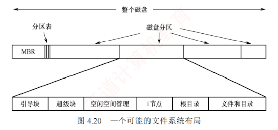

---
### 4.3.1 文件系统布局

**1. 文件系统在磁盘中的结构**

文件系统存放在磁盘上。磁盘通常被划分为一个或多个分区，每个分区中有一个独立的文件系统。文件系统一般包含以下关键信息：引导操作系统的机制、磁盘总块数、空闲块的数量与位置、目录结构，以及所有具体文件的数据。图 4.20 展示了一种可能的文件系统布局。

其主要组成部分简述如下：

1. **主引导记录（Master Boot Record, MBR）**，位于磁盘的 0 号扇区，负责引导计算机。MBR 后紧随一个分区表，用于记录各分区的起始与结束地址，并标记其中一个为活动分区。系统加电后，BIOS 将 MBR 读入内存并执行；MBR 首先识别活动分区，随后读取该分区的第一个扇区，即引导块。
    
2. **引导块（boot block）**，MBR 将控制权移交至引导块中的程序，由其负责加载并启动该分区中的操作系统。注意，每个分区均以引导块开头，即使当前未安装可启动的操作系统，也保留此区域，以便未来部署系统。在 Windows 中，该区域称为分区引导扇区。
    

除引导块外，磁盘分区的后续布局因文件系统类型而异。  
UNIX/Linux 系统中的文件系统通常还包含以下组件（见图 4.20）：

3. **超级块（super block）**，存储文件系统的所有关键信息。当系统启动或首次挂载该文件系统时，超级块会被读入内存。超级块中的典型内容包括：分区的总块数、块大小、空闲块数量及其指针、空闲 i 节点（inode）数量及指针等。
    
4. **空闲块信息**，记录未分配的磁盘块，通常以位示图或空闲链表实现。紧随其后的是一组 i 节点，每个文件对应一个 i 节点，其中完整描述了文件的各种属性。之后是根目录，作为整个目录树的起点。磁盘的其余空间则用于存放所有其他文件和目录的实际数据。
    

---

**2. 文件系统在内存中的结构**

为高效管理文件系统并提升性能，系统在内存中维护一组数据结构。这些信息在文件系统挂载时加载，在运行期间动态更新，并在卸载时释放。典型的内存结构包括：

1. **内存中的挂载表（mount table）**，记录每个已挂载文件系统分区的有关信息，如设备标识、挂载点、文件系统类型及挂载选项等。
    
2. **内存中的目录项的缓存**，缓存最近访问过的目录内容，以减少对磁盘的重复读取，加快路径解析速度。
    
3. **系统级打开文件表**，为每个当前打开的文件维护一个 FCB 的副本，包含文件状态、访问权限、读/写指针、打开计数等全局信息。
    
4. **进程级打开文件表**，每个进程拥有独立的打开文件表，包含该进程所使用的文件描述符及指向系统级打开文件表中对应表项的指针，从而实现进程与全局资源的关联。
    

