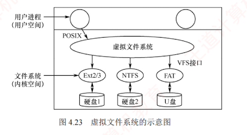
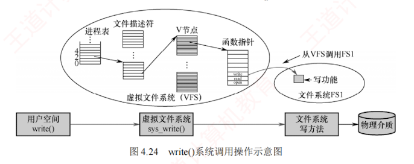

---

### 4.3.3 虚拟文件系统

现代操作系统通常需要支持多种文件系统，如 ext4、NTFS、FAT 等。这些文件系统在磁盘组织方式、元数据格式和操作方法上各不相同。若应用程序为每种文件系统分别编写代码，则不仅开发困难，系统的可维护性也会显著降低。为此，操作系统引入了虚拟文件系统 (VFS)，它位于用户程序与具体文件系统之间，向上提供统一的文件操作接口，如图 4.23 所示。有了 VFS，用户程序就无须关心底层使用的是哪种文件系统。无论文件存储在何种设备上、采用何种格式，程序只需调用标准系统调用 [如 `open()`、`write()` 等] 即可完成操作。VFS 则负责将这些通用请求转发给相应的文件系统进行处理，进而让用户无须察觉底层文件系统的差异。

VFS 采用面向对象的设计思想，抽象出一个通用的文件系统模型，并将其中的公共特性封装为四种对象。每个对象都包含数据成员和一组操作函数指针，这些函数由具体的文件系统提供。只要新的文件系统实现了 VFS 定义的接口，就能被系统识别、挂载并使用。这四种对象如下。

1. **超级块对象**
    
    超级块对象表示一个已挂载的文件系统。它对应磁盘上的超级块，记录该文件系统的全局信息，如块大小、总块数、空闲块数量以及文件系统类型等。当文件系统挂载时，VFS 将其超级块读入内存，创建对应的超级块对象，并设置好相关的操作函数，如分配 inode、同步元数据等。
    
2. **V 节点对象**
    
    V 节点 (vnode) 对象是 VFS 中最重要的抽象对象，用于在内存中表示一个具体的文件或目录。每个 vnode 对象关联底层某个具体文件系统的索引节点 (如 ext4 的 inode)，本质上是对各类文件系统元数据的统一封装：向上为系统调用提供统一的文件属性 (如权限、大小、时间戳等)，向下通过指针指向该文件系统私有的元数据结构。vnode 对象仅在文件首次被访问时动态创建于内存，引用计数归零后自动释放；其内部包含一组标准操作函数指针 (如 `read`、`write` 等)，VFS 通过这些指针将上层请求分发至相应文件系统的具体实现，以屏蔽不同文件系统的差异。
    

> **注意**
> 
> V 节点并不等同于磁盘上的 inode。V 节点是 VFS 为统一管理各类文件而创建的内存对象，它与 inode 通过指针关联，协同完成文件操作：V 节点提供统一接口，inode 提供实际存储信息。

3. **目录项对象**
    
    目录项对象表示路径中的一个组成部分，如 “/home/user/file” 中的 “user”。目录项对象并不直接对应磁盘上的某个固定结构，而是 VFS 在解析路径时动态生成的内存缓存；每个目录项保
    

---

存文件名、指向父目录项和子目录项的指针，以及指向对应 V 节点的指针；多个目录项组合形成逻辑上的目录树；VFS 通过缓存常用目录项，有效加快后续路径查找的速度。

4. **文件对象**
    
    文件对象表示一个进程所打开的文件，可理解为 “文件在进程中的运行实例”，正如进程是程序的运行实例。当进程调用 `open()` 时，内核为其创建一个文件对象；当调用 `close()` 且引用计数归零时，该对象被销毁。文件对象保存当前读/写位置 (文件指针)、访问模式 (读/写或追加) 和引用计数等信息，并包含指向对应 V 节点和目录项的指针；它提供的 `read`、`write`、`seek` 等操作接口最终由 V 节点转发至底层文件系统执行。
    

下面以 `write()` 为例说明 VFS 的工作过程：当进程调用 `write(fd, buf, n)` 时，内核首先进入 VFS 层，执行 `sys_write()` 函数；随后根据文件描述符 `fd` 定位到对应的文件对象，并通过该对象获取其关联的 V 节点；接着，VFS 利用 V 节点中预置的写操作函数指针，调用目标文件系统的具体写方法；该文件系统将数据写入缓冲区，最终通过设备驱动完成磁盘写入。`write()` 系统调用操作示意图如图 4.24 所示。

总结：对用户程序而言，所有文件操作均通过 VFS 提供的统一接口完成，无须关心底层使用的是 ext4、NTFS 还是其他文件系统。VFS 借助前述四类对象，屏蔽不同文件系统的实现细节，使其在系统中呈现出一致的行为。需要强调的是，VFS 本身并不是一种真正的文件系统——它仅存在于内存之中，不占用磁盘空间，随系统启动而建立，随系统关闭而释放。

