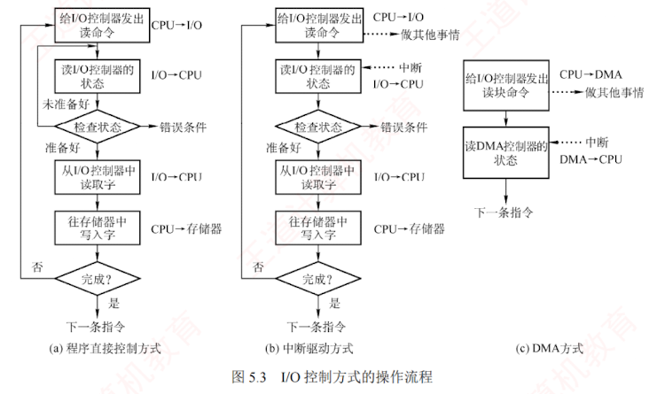
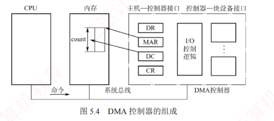

---

### 5.1.2 I/O 控制方式

**I/O 控制**是指**控制设备和主机**之间的**数据传送**。  
在 I/O 控制方式的发展过程中，始终贯穿着这样**一个宗旨**：  
尽量**减少 CPU 对 I/O 控制的干预**，将 CPU 从繁杂的 I/O 控制事务中解脱出来，以便其能更多地去执行运算任务。  
I/O 控制方式共有 **4 种**，下面分别加以介绍。
>不涉及通道

#### 1. 程序直接控制方式

CPU 对 I/O 设备的控制采取**轮询**的 I/O 方式，也称**程序轮询方式**。  
如图 5.3(a) 所示，CPU 向设备控制器**发出一条 I/O 指令**，从 I/O 设备读取一个字（字节），然后**不断地循环测试设备状态**（称为**轮询**），直到确定该字（字节）已在设备控制器的**数据寄存器**中。  
于是 CPU 将数据寄存器中的数据取出，送入内存的指定单元，这样便完成了一个字（字节）的 I/O 操作。

这种方式**简单且易于实现**，但缺点也很明显。  
CPU 的绝大部分时间都处于**等待 I/O 设备状态的循环测试**中，CPU 和 I/O 设备只能**串行工作**，由于 CPU 和 I/O 设备的速度差异很大，导致 CPU 的利用率相当低。  
而 CPU 之所以要**不断地测试 I/O 设备的状态**，就是因为在 CPU 中**未采用中断机制**，使 I/O 设备**无法向 CPU 报告**它已完成了一个字（字节）的输入操作。

#### 2. 中断驱动方式

**中断驱动**方式的思想是允许 **I/O 设备主动打断 CPU 的运行并请求服务**，从而“解放”CPU，使得 CPU 向设备控制器发出一条 I/O 指令后可以继续做其他有用的工作。  
如图 5.3(b) 所示，我们从**设备控制器**和 **CPU** 两个角度分别来看中断驱动方式的工作过程。

##### 从设备控制器的角度来看：  
设备控制器从 CPU 接收一个**读命令**，然后从设备**读数据**。  
一旦数据读入设备控制器的**数据寄存器**，便通过控制线向 CPU 发出**中断**信号，表示数据已准备好，然后等待 CPU 请求该数据。  
**设备控制器**收到 CPU 发出的**取数**请求后，将数据放到**数据总线**上，传到 **CPU 的寄存器**中。  
至此，本次 I/O 操作完成，设备控制器又可开始**下一次 I/O 操作**。

##### 从 CPU 的角度来看：  
当前运行进程发出**读命令**，该进程将被**阻塞**，然后**保存该进程的上下文**，转去**执行其他程序**。  
在**每个指令周期的末尾**，CPU **检查中断信号**。  
当有来自设备控制器的中断时，CPU 保存当前运行进程的上下文，转去**执行中断处理程序**以处理该中断请求。  
**中断处理程序**从设备控制器的**数据寄存器**中**读取一个字**（或字节），并将其写入**内核的缓冲区**。  
处理完成后，系统**解除原 I/O 请求进程的阻塞状态**，并恢复相应进程的上下文以继续执行。
>设备控制器的数据寄存器 $\to$ CPU 内部寄存器（中转） $\to$ 内核缓冲区；  
>等一批数据全部收集完后，再从内核缓冲区复制到用户缓冲区。
>因为设备控制器无法直接越过总线把数据直接写进主存（在非 DMA 方式的中断驱动 I/O 下）。
>**为什么不直接写入用户缓冲区**？
>I/O 往往是逐字节/逐字到达的（如键盘输入、串口通信），操作系统在内核缓冲区集齐完整的数据块（或一行、一个报文）后，再一次性拷贝到用户进程的缓冲区，或者直接唤醒等待的进程来读取。设备与进程速度匹配即**解耦**。

相比于**程序轮询 I/O** 方式，在**中断驱动 I/O** 方式中，设备控制器通过中断**主动**向 CPU 报告 I/O 操作已完成，**不再需要轮询**，在设备准备数据期间，**CPU 和设备并行工作**，CPU 的利用率得到明显提升。  

但是，**中断驱动**方式仍有**两个明显的问题**：  
1. 设备与内存之间的**数据交换**都必须**经过 CPU 中的寄存器**；
2. CPU 是**以字（字节）为单位**进行干预的，若将这种方式用于**块设备**的 I/O 操作，则显然是极其低效的。  
   因此，中断驱动 I/O 方式的速度仍然受限。
[[中断驱动的局限性]]

#### 3. DMA 方式

**DMA**（**直接存储器存取**）方式的**核心思想**是在 I/O 设备与内存之间建立**直接数据通路**，彻底“解放”CPU。其特点如下：

1. 基本传送单位是**数据块**，而**不再是字**（字节）。
    
2. 数据直接在**设备与内存**之间传输，而**不再经过 CPU**。
    
3. 仅在**数据块传送开始**和**结束**时需要 CPU 干预。
    

图 5.4 展示了 **DMA 控制器的组成**。  

为实现**设备与内存**之间直接交换成块的数据，DMA 控制器需包含以下**四类寄存器**：

1. **命令/状态寄存器（CR）**。暂存 CPU 发来的 **I/O 命令**或**设备状态**。
    
2. **内存地址寄存器（MAR）**。存放**数据在内存中的起始地址**。**输入**时（设备 $\to$ 内存），表示数据要写入**内存的目标地址**；**输出**时（内存 $\to$ 设备），表示数据从**内存读取的源地址**。
    
3. **数据寄存器（DR）**。暂存**单次传输的数据单元**（如一个字）。
    
4. **数据计数器（DC）**。记录本次**需传送的字**（字节）**总数**。
    

如图 5.3(c) 所示，DMA 方式的**工作过程**如下：  

CPU 收到设备的 **DMA 请求**后，向 DMA 控制器发送**启动命令**，并**设置 MAR 和 DC 的初值**，随后**启动 DMA 控制器**。  
接着，CPU 将 **I/O 控制权交予 DMA 控制器**，转而**执行其他任务**。  
DMA 控制器**接管总线**后，以**突发方式**将整块数据在设备与内存之间直接传输，无须 CPU 干预。  
传输结束后，DMA 控制器向 CPU 发送**中断信号**，通知操作完成。  
因此，CPU 仅在**数据传送的开始和结束阶段介入**。

DMA 方式的**优点**：  
数据以“块”为单位传输，相比中断方式，**CPU 干预频率进一步降低**；  
数据也不再经过 CPU 寄存器，CPU 与设备的**并行程度进一步提升**。

