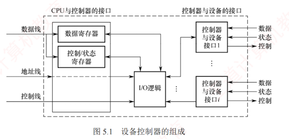
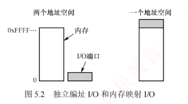

---

### 5.1.1 I/O 设备

I/O 设备管理是操作系统中最复杂且多样化的部分，其核心是通过**软硬件**协作，屏蔽不同设备的物理差异，使应用程序能以**统一方式**使用各类设备。  
一个 I/O 设备通常由**两部分**组成：  
**设备本身**和**设备控制器**。  
设备本身是执行具体**输入或输出**操作的物理装置（如磁盘的盘片与磁头）；  
**设备控制器**则是连接到系统总线上的**专用电路**（如接口芯片），负责将操作系统发出的**抽象命令**（如“读取第 $x$ 个扇区”）转换为设备可识别的**电信号**，并协调主机与设备间的**数据传输**。  
通过这种设计，操作系统无须了解各类设备的具体细节，即可统一管理它们。

#### 1. 设备的分类

I/O 设备是指能够向计算机输入数据或接收其输出数据的外部设备。  
I/O 设备类型多样，可从不同角度进行分类。

##### (1) 按信息交换单位分类

1. **块设备**。以固定大小的**数据块**为单位进行信息交换，如**磁盘**等。  
   其基本特征是**传输速率较高**、支持**随机访问**（可寻址），允许对任意数据块进行读/写操作。
    
2. **字符设备**。以**字符**（或字节）为单位进行信息交换，如交互式终端、打印机等。  
   其基本特征是**传输速率较低**、**不可寻址**，通常采用**中断**方式实现异步通信。
    
##### (2) 按传输速率分类
    
3. **低速设备**。传输速率仅为每秒几字节至数百字节，如键盘、鼠标等。
    
4. **中速设备**。传输速率为每秒数千字节至数十千字节，如激光打印机等。
    
5. **高速设备**。传输速率可达每秒数百千字节至数百兆字节（甚至更高），如磁盘等。
    
##### (3) 按使用特性分类
    
6. **人机交互设备**。用于用户与计算机之间的信息交互，如键盘、显示器、打印机等。
    
7. **存储设备**。用于持久化存储数据，如磁盘、磁带、光盘等。
    
8. **网络通信设备**。用于计算机间通信，如网卡、调制解调器等。
    
##### (4) 按共享属性分类
    
9. **独占设备**。任一时刻仅允许一个进程使用。  
   一旦分配给某进程，即由该进程独占，直至使用完毕后释放。  
   **典型的独占设备多为低速设备**，如打印机。
    
10. **共享设备**。允许**多个进程**在逻辑上**并发访问**。  
    尽管物理访问仍需调度协调，系统可将其分配给多个进程**分时**交替使用。  
    **磁盘是典型的共享设备**。
    
11. **虚拟设备**。通过 SPOOLing 技术，将**独占设备**改造为**多个逻辑设备**，使多个进程能并发使用。其实质是利用高速共享设备（如磁盘）作为缓冲区，实现独占设备的逻辑共享。
    

#### 2. I/O 接口

I/O 接口（也称**设备控制器**）是 CPU 与设备之间的“桥梁”，用于实现计算机与设备之间的数据交换。  
它接收 CPU 发出的命令，控制设备工作，使 CPU 得以从烦琐的设备控制事务中解脱出来。  
设备控制器主要由如下三部分组成，如图 5.1 所示。

1. **设备控制器与 CPU 的接口**。  
   用于实现 CPU 与设备控制器之间的通信。  
   该接口包括三类信号线：**数据线**、**地址线**和**控制线**。   
   **数据线**用于传输读/写数据、控制和状态信息；  
   **地址线**用于指定 I/O 接口中的寄存器编号；  
   **控制线**用于传送读/写等控制信号。
    
2. **设备控制器与设备的接口**。  
   一个设备控制器可连接一个或多个设备，因此内部包含**一个或多个设备接口**。  
   每个接口均可传输**数据、控制和状态三类信号**。
    
3. **I/O 逻辑**。用于实现对设备的控制。  
   它通过控制线与 CPU 交互，对接收的 I/O 命令进行译码，并依据目标地址识别相应设备。  
   CPU 启动设备时，向控制器发送启动命令及目标地址，由 I/O 逻辑完成解析并控制指定的设备。
    

设备控制器的**主要功能**有：  
1. 接收并识别命令，例如磁盘控制器可响应 CPU 发出的读、写、寻道等命令；
2. 完成数据交换，包括 CPU 与控制器之间以及控制器与设备之间的数据传输；
3. 标识并报告设备状态，供 CPU 查询与处理；
4. 地址识别；
5. 数据缓冲；
6. 差错控制。

以磁盘控制器为例：  
当它接收到一条读命令（如“读取第 11408 个扇区”）后，会自动将线性扇区号转换为对应的柱面号、盘面号和扇区号，并控制磁头定位、等待旋转延迟、读取数据，最终将数据可靠地传送到内存。操作系统只需发出命令，而无须关心底层硬件的具体实现细节。

---

#### 3. I/O 接口的类型

从不同角度看，I/O 接口可分为以下类型。

1. 按**数据传送方式**（设备与接口一侧），可分为**并行接口**（一个字节或一个字的所有位同时传送）和**串行接口**（一位一位地有序传送），接口需完成相应的并/串或串/并格式转换。
    
2. 按**主机访问设备的控制方式**，可分为**程序查询接口**、**中断接口**和 **DMA 接口**等。
    
3. 按**功能灵活性**，可分为**可编程接口**（通过编程改变接口功能）和**不可编程接口**。
    
4. 按**设备类型的不同**，可分为**字符设备接口**、**块设备接口**和**网络设备接口**。
    

#### 4. I/O 端口

I/O 端口是指设备控制器中可被 CPU 访问的寄存器，主要包括以下三类：

- **数据寄存器**：缓存从设备送来的输入数据，或暂存 CPU 发出的输出数据。
    
- **状态寄存器**：保存设备的状态或执行结果，供 CPU 读取。
    
- **控制寄存器**：由 CPU 写入，用于启动操作或设置设备的工作模式。
    

为使 CPU 能够访问 I/O 端口，必须对各端口进行编址，每个端口对应一个唯一的端口地址。常见的编址方式主要有独立编址和统一编址两种，如图 5.2 所示。

##### (1) 独立编址（I/O 映射方式）

独立编址为 I/O 端口建立一个独立于主存的地址空间。I/O 端口地址与内存地址在逻辑上完全分离，地址值可以相同，但由于属于不同地址空间，不会发生冲突。CPU 通过专用的 I/O 指令（如 x86 中的 `IN` 和 `OUT`）访问 I/O 端口，指令中的地址字段指定端口号。

优点：I/O 端口数量远少于内存单元，所需地址线较少，译码电路简单，寻址速度快；使用专用 I/O 指令，程序中的 I/O 操作清晰可辨，便于阅读与调试。

缺点：I/O 指令功能有限，通常仅支持简单的数据传输，程序设计灵活性较差；CPU 需同时提供存储器读/写和 I/O 读/写两组控制信号，增加了控制逻辑的复杂性。

##### (2) 统一编址（内存映射方式）

统一编址将部分主存地址空间分配给 I/O 端口，使 I/O 端口与内存单元共享同一地址空间。通过地址范围即可区分访问目标（如高地址段映射到 I/O 设备），因此无须专用 I/O 指令，CPU 使用普通的访存指令（如加载和存储指令）即可访问 I/O 端口。

优点：无须专用 I/O 指令，使得编程更加灵活；I/O 端口可获得较大的编址空间；I/O 访问的保护机制可由虚拟存储管理系统统一实现，无须额外硬件支持。

缺点：I/O 端口占用主存地址空间，减少了系统可用内存容量；由于需根据完整地址判断是否为 I/O 区域，译码电路相对复杂，通常会降低译码速度。

