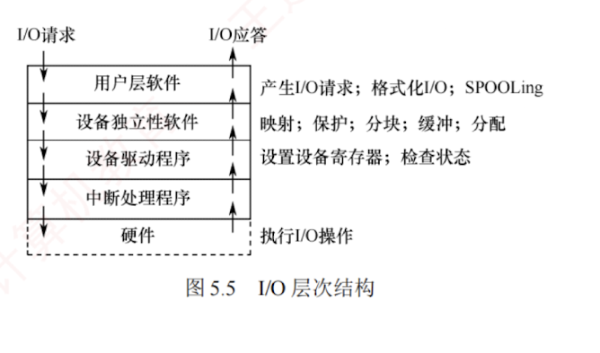
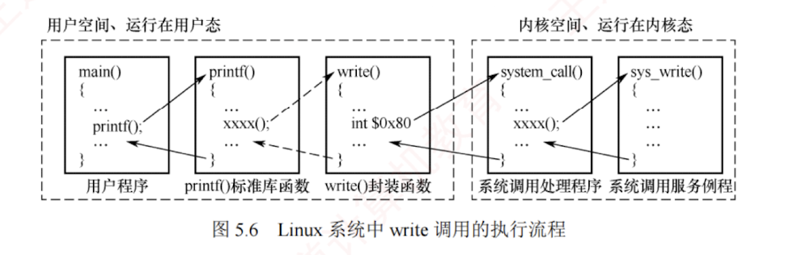

---

### 5.1.3 I/O 软件层次结构

I/O 软件涉及面很广，向下与**硬件**密切相关，向上又与**虚拟存储器系统**、**文件系统**及**用户**直接交互，各类 I/O 操作均需通过 I/O 软件实现。

为使复杂的 I/O 软件具备清晰的结构、良好的可移植性和适应性，现代操作系统普遍采用**层次化**的 I/O 软件设计。  
系统将**设备管理模块**划分为若干层次，每层利用其下层提供的服务，完成输入/输出功能中的特定子任务，并屏蔽其实现细节，**向上层提供统一接口**。  
只要层间接口保持不变，任一层的修改都不会影响其他层次，仅最低层涉及硬件的具体特性。  

一种较为合理的四层划分如图 5.5 所示。  

整个 I/O 软件可视为具有 4 个层次的系统结构，各**层次及其功能**如下：
#### 1. 用户层软件

**实现与用户的交互接口**。  
用户可直接调用用户层提供的 I/O **库函数**（如与 I/O 操作相关的标准库函数）对设备进行操作。  
通常，大部分 I/O 软件位于**操作系统内核**，但仍有一**小部分**驻留在**用户层**，例如与用户程序链接的**库函数**。  
用户层 I/O 软件必须通过**系统调用**获取操作系统服务。

#### 2. 设备独立性软件

**设备独立性**（也称**设备无关性**）是指应用程序在使用 I/O 设备时，无须依赖具体的物理设备。  
为实现这一特性，系统引入了**逻辑设备**与**物理设备**的概念：  
**应用程序**使用**逻辑设备名**请求某类设备；  
系统在运行时，必须将**逻辑设备名映射为实际的物理设备名**。

使用逻辑设备名的**优势**在于：  
1. 提高设备分配的**灵活性**；
2. 易于实现 I/O 重定向，**I/O 重定向是指用于 I/O 操作的设备可以更换**（重定向），而不必修改应用程序。

为实现设备独立性，需在**设备驱动程序**之上设置一层**设备独立性软件**。  
该层的**主要功能**包括以下两个方面：  
1. 执行所有设备的**公共操作**，包括**设备的分配与回收**、**逻辑设备名到物理设备名的映射**、**设备保护**（禁止用户直接访问硬件）、**缓冲管理**、**差错控制**，以及提**供统一大小的逻辑块**，以屏蔽不同设备在信息交换单位和传输速率上的差异；
2. 向用户层（或文件系统）**提供统一的接口**。  
   通过这一层抽象，无论底层设备类型如何，应用程序均可使用**统一的系统调用**（如 read/write）进行访问，显著增强了系统的可移植性与可维护性。

#### 3. 设备驱动程序

**设备驱动程序与硬件直接相关**，每类设备都需要配置一个专用的驱动程序。  
它作为 **I/O 子系统与设备控制器之间的通信桥梁**，**向上层提供统一的操作接口**，屏蔽不同设备控制器的差异。

设备驱动程序的**主要任务**是：  
接收**上层软件**（如设备独立性层）发出的**抽象 I/O 请求**（例如 read 或 write 命令），将其转换为设备控制器能够识别的**具体指令**，启动设备执行相应操作，并将设备控制器返回的状态信息或数据传递回上层。  
其工作流程通常包括如下操作：

1. **将抽象请求转换为具体操作**。**上层请求通常是逻辑性的**（如“读取逻辑块 5”），而设备控制器只能处理**物理操作**。  
   驱动程序根据设备特性，**将逻辑地址转换为物理参数**。  
   例如，磁盘驱动程序会将逻辑扇区号转换为柱面号、盘面号和扇区号。
    
2. **校验请求的合法性**。**驱动程序检查操作是否允许**。  
   例如，禁止从只写设备（如打印机）读取数据，或向以只读方式打开的设备写入。  
   若请求非法，则向上层返回错误。
    
3. **检查设备状态**。在启动 I/O 前，驱动程序读取**设备控制器**的**状态寄存器**，确认设备是否就绪。  
   例如，写操作要求设备处于“接收就绪”状态；  
   否则，进程需要等待。
    
4. **传递参数**。设备就绪后，驱动程序向控制器的相应寄存器写入命令、数据缓冲区地址、传输长度等参数。  
   对于磁盘等复杂设备，所需传递的参数更多。
    
5. **启动设备并处理后续**。参数设置完成后，驱动程序向**命令寄存器**发送启动信号，设备开始工作。  
   在多道程序系统中，当前进程随即被阻塞，CPU 转去执行其他就绪进程，实现与 I/O 设备的并行；  
   设备完成操作并发出中断后，由**中断处理程序**将其唤醒。
    

此外，设备驱动程序还负责**设备的初始化**、**状态维护**、**错误处理**以及与**中断处理**的配合，通过封装底层硬件细节，使上层软件无须了解设备的具体实现，即可使用统一接口访问各类 I/O 设备。

#### 4. 中断处理程序

当 I/O 操作完成时，设备控制器发出**中断信号**。  
CPU 在执行完当前指令后响应中断，暂停当前进程，转去执行相应的中断处理程序；  
处理完毕后，再恢复原进程执行。  

**整个过程如下**：

1. **检测并响应中断**。设备完成**一个数据单位**（如字符或数据块）传输后，其控制器发出**中断请求**。  
   CPU 在指令周期末检测到中断信号时，即暂停当前进程，准备转入**中断处理**。
    
2. **保护被中断进程的 CPU 现场**。  
   **硬件**自动将**程序计数器**（PC）和**程序状态字**（PSW）压入**中断栈**；  
   随后，操作系统软件将其他 CPU 寄存器内容也保存至该栈。
    
3. **转入相应设备的中断处理程序**。CPU 识别中断源，并跳转至对应设备的中断处理程序。
    
4. **处理中断**。程序读取设备控制器的**状态寄存器**，判断操作是否正常完成：  
   若成功，则将设备数据寄存器中的内容传送到**内存缓冲区**；  
   若异常，则进行**错误处理**。
    
5. **恢复现场并返回**。  
   中断处理完成后，系统从中断栈恢复所有寄存器内容，CPU 从被中断指令的下一条继续执行原进程。
    

为确保上述流程可靠运行，操作系统还需对中断处理程序本身进行管理，主要包括**三个环节**。

1. **注册中断**。**驱动程序初始化时**，需要向内核**注册中断号**及其**处理函数入口地址**，以建立硬件中断信号与服务代码之间的映射，确保中断发生时内核能准确调用相应处理例程。
    
2. **处理中断**。中断处理程序的典型流程：  
   ① 确认中断是否由本设备产生；  
   ② 清除控制器中的中断标志，防止重复触发；  
   ③ 执行必要的硬件操作，如读/写数据。  
   由于运行在中断上下文中，处理程序必须快速、非阻塞，不得调用可能引起进程睡眠或调度的函数。
    
3. **注销中断**。当驱动程序被卸载或设备停用时，需要注销其中断处理程序以释放资源。  
   若该中断请求线为独占，则注销后内核立即禁用该线；  
   若该中断请求线为共享，则仅移除本设备的处理例程，该中断线需要等到所有关联设备均注销后，才会被最终禁用。
    

#### 5. I/O 操作举例

类似于文件系统的层次结构，I/O 子系统的层次结构也是需要掌握的重要内容，但不应死记硬背。 

为帮助读者理解，下面通过用户发起的一次 **write 请求**来说明各层的功能：  
1. 当用户要向某设备**写入数据**时，通过操作系统提供的 **write 命令接口**发起请求，该请求首先进入用户层软件。
2. 操作系统向上层提供的是**统一的通用接口**，即大多数设备都支持的标准命令，用户发出的 write 请求首先由**设备独立性层**解析，然后传递给下一层。
3. 不同类型设备对 write 命令的**处理方式不同**（如磁盘与打印机的行为差异显著），因此需由设备驱动层**将通用的 write 命令转换为设备特定的指令**。
4. 驱动程序将指令发送给设备控制器，启动实际的**写操作**；  
   操作完成后，控制器向 CPU 发出**中断信号**，由**中断处理程序**响应。
5. 中断处理程序确认写操作完成，**清除中断标志**，唤醒等待该操作的进程，并将结果逐层返回至用户程序，完成整个写操作。

上面从理论上说明了 I/O 请求在各层次间的传递过程。  
下面结合 Linux 系统中一次 write 系统调用的实际执行流程（见图 5.6），具体分析各层如何协作以及 CPU 状态如何切换。

该流程始于用户空间对**库函数的调用**。  
用户程序调用 `printf()` 后，经标准库内部封装，最终触发 **`write()` 系统调用**的封装函数。该函数生成的机器指令序列中包含一条陷阱指令（如 IA-32 架构下的 `int $0x80`）。  
在执行该指令之前，若干**传送指令**会将**系统调用号**及 **I/O 参数**（如文件描述符、缓冲区地址、字节数）写入指定寄存器（如 `eax`）。  
CPU **执行陷阱指令**后，产生一个受控的**软中断**，硬件自动完成从用户态到内核态的模式切换，并将控制权移交给操作系统内核。

进入内核后，CPU 跳转至系统调用的统一入口程序 `system_call()`。  
该程序根据寄存器 `eax` 中的**系统调用号**，通过跳转表将请求分派给对应的系统调用服务例程 `sys_write()`。  
`sys_write()` 首先执行与设备无关的**公共操作**，如参数合法性检查、内核缓冲区分配与管理等。  
随后，它根据参数（如文件描述符）定位**目标设备**，并调用对应的**设备驱动程序**。

设备驱动程序作为直接与设备控制器交互的模块，负责**将抽象的 I/O 请求转换为设备可识别的具体命令**。  
它**初始化 I/O 接口**、设置**传输参数**，并**启动设备**进行**数据传输**。  
随后，通常将当前进程置为**阻塞态**，并主动调用调度程序让出 CPU，以便其他就绪进程运行。

传输完成后，设备控制器向 CPU 发出中断请求。  
CPU 响应中断，暂停当前执行流，转入预设的**中断服务程序**。  
该程序读取设备状态，确认写操作是否成功，**清除中断标志**，并唤醒等待 I/O 的进程。  
中断处理完毕后，内核沿**调用栈**逐级返回。  
最终，在 `system_call()` 末尾通过执行 `iret` 等特权指令，CPU 切换回用户态，并在用户空间中陷阱指令的下一条指令处恢复执行。

一次完整的 I/O 请求依次穿越了用户层软件、系统调用接口、设备独立性软件、设备驱动程序和中断处理程序，其中，**陷阱指令**是从用户态进入内核态的唯一合法入口，**中断**是设备通知操作完成、触发进程状态转换的核心机制。  
二者共同实现了用户态与内核态之间的安全切换。

---

