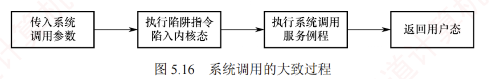
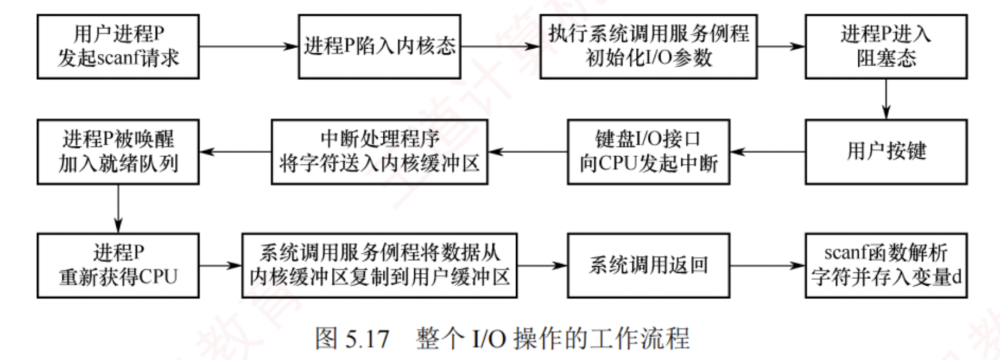
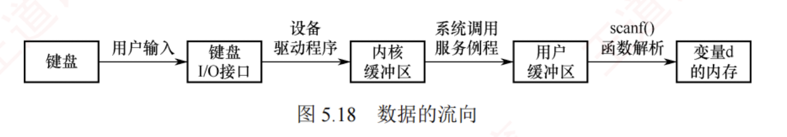

---

### 5.2.6 I/O 操作举例

由于统考对 I/O 的考查日益深入，本节以 C 语言中的库函数 `scanf()` 为例，从执行 `scanf("%c", &d)` 开始，到键盘输入的字符最终存入变量 `d`，介绍 **I/O 操作的具体执行过程**。

在讨论之前，先补充两个概念：  
**内核缓冲区**（位于内核空间）和与之对应的**用户缓冲区**（位于用户空间）。  
这两个地址空间**相互隔离**：  
**内核空间**存放**操作系统代码和数据**，供所有进程共享；  
而**用户程序**运行在**用户空间**。  
由于**系统调用在内核态执行**，因此必须先将 **I/O 设备的数据复制到内核缓冲区**，在系统调用返回前，再**将数据从内核缓冲区复制到用户缓冲区**。

当程序调用 `scanf("%c", &d)` 时，试图通过键盘输入为变量 `d` 赋值。  
`scanf()` 会关联一个由 C 标准库在用户空间管理的**缓冲区** `buf`。  
`scanf()` 函数的执行分为两个阶段。

**第一阶段的工作是在 C 标准库中完成的：**

1. **检查**与 `scanf()` 函数关联的**用户缓冲区** `buf`。  
   若其中已有数据，则**直接读取**；  
   若**缓冲区为空**，则触发**系统调用** `read`，从**内核缓冲区中读取数据**。
    
2. 执行 `read` **系统调用**。  
   在执行 `trap` 指令前，需要传入**三个参数**：
    
    - `fd`：**文件描述符**，**标识输入设备**（此处为**标准输入**）。
        
    - `buf`：**用户空间的缓冲区**，用于**接收从内核复制的数据**。
        
    - `count`：**期望读取的最大字节数**。
        

**第二阶段的工作是系统调用，在内核中完成。**   
`read` 系统调用通过一段包含**陷阱指令**的代码，使 CPU 从用户态陷入内核态，执行相应的**系统调用服务例程**。  
**系统调用的大致过程**如图 5.16 所示。

进入**内核态**后，**系统调用服务例程**访问**内核缓冲区**，并转至真正执行 I/O 操作的**设备驱动层**。  
在**中断驱动方式**下，**系统调用服务例程的执行过程**大致如下。

1. 设置相应的 I/O 参数后，发起 I/O 的进程 P 进入**阻塞态**，CPU 调度其他进程运行。
    
2. 用户通过键盘**输入字符**，该字符被送入键盘 I/O 接口的**数据端口**。
    
3. 键盘 I/O 接口向 CPU 发出**中断请求**。
    
4. CPU 响应中断，执行**键盘中断处理程序**，**读取字符**并将其从 I/O 端口送入**内核缓冲区**。
    
5. **进程 P 被唤醒**，并加入**就绪队列**，等待调度。
    
6. 进程 P 再次获得 CPU 后，**系统调用服务例程**将字符从**内核缓冲区复制到用户缓冲区**。
    
7. 进程 P 从系统调用返回，随后 `scanf()` 对缓冲区中的字符进行解析，最终将其存入变量 `d`。
    
[[为什么不是先中断再输入，而是先输入再中断]]

值得注意的是，在此过程中，用户输入的字符首先从**键盘 I/O 接口的数据端口**送入**内核缓冲区**，再从**内核缓冲区送入用户缓冲区**。  
**前者由设备驱动程序完成**（因其需直接操作 I/O 端口），**后者由设备无关的 I/O 软件层完成**（因其不依赖具体硬件）。  
**数据的流向**如图 5.18 所示。

