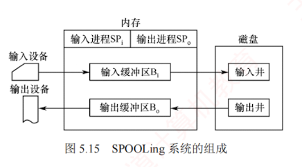

---

### 5.2.4 SPOOLing 技术（假脱机技术）

为缓和 CPU 的高速性与 I/O 设备低速性之间的矛盾，操作系统引入了 SPOOLing，即**假脱机技术**。其思想源于早期的**脱机 I/O 方式**：依赖专用外围控制机，在主机不参与的情况下完成 I/O 操作。输入时，外围机将低速输入设备（如纸带机）上的数据**预先读入高速磁盘**；  
输出时，CPU。**先将结果高速写入磁盘**，再由外**围机将数据送至低速输出设备**（如打印机）。  
**由于整个 I/O 过程脱离主机控制，因此称为脱机**。  
随着多道程序设计技术的发展，操作系统不再需要物理外围机，而是通过专门的输入进程与输出进程，在主机直接控制下**模拟外围机的功能**：  
**输入进程**负责将**低速输入设备**的数据提前读入**磁盘**上的**输入井**；  
**输出进程**则将用户作业的**输出结果**暂存于**磁盘**的**输出井**，再逐步送往实际输出设备。  
由此，I/O 操作与 CPU 计算得以并行执行。

这种以磁盘为缓冲、用软件模拟脱机 I/O 的机制，正是 SPOOLing 技术的本质。  
“脱机”承袭自早期脱机 I/O 的思想，“假”则体现在以**多道程序**和**磁盘空间**替代外围机，进而**将一台物理独占设备虚拟为多台逻辑设备**，实现设备共享。  

SPOOLing 系统的组成如图 5.15 所示。

#### (1) 输入井和输出井

在**磁盘**上开辟的两个**专用存储区域**。  
输入井模拟脱机输入时的磁盘，用于暂存**输入设备**的数据。  
输出井模拟脱机输出时的磁盘，用于暂存**用户程序的输出数据**。  
每个进程的输入（或输出）数据以**文件**形式保存（称为**井文件**），所有文件按**顺序链接**成**输入队列**或**输出队列**。

#### (2) 输入缓冲区和输出缓冲区

在**内存**中开辟的两个**缓冲区**。  
输入缓冲区暂存由**输入设备**送来的数据，随后传送 到**输入井**。  
输出缓冲区暂存从输出井读出的数据，随后传送到输出设备。

#### (3) 输入进程和输出进程

**输入进程**模拟脱机输入的外围控制机，**负责将输入设备的数据经输入缓冲区传送到输入井**。
当 CPU 需要输入数据时，直接从**输入井**读取。  

**输出进程**模拟脱机输出的外围控制机，**负责将用户程序的输出数据写入输出井**，并在输出设备空闲时，经输出缓冲区将数据传送到输出设备。

#### (4) 井管理程序

控制作业与磁盘井之间的信息交换。

**打印机是典型的独占设备**。  
通过 SPOOLing 技术，可将其改造为可供**多个用户共享**的**虚拟设备**。  

当多个用户进程发出打印请求时，SPOOLing 系统接受其请求，但并不真正立即将物理打印机分配给它们，而是由输出进程为每个进程完成以下两项操作：

1. 在磁盘输出井中为其分配一个**空闲磁盘块**，并将待打印数据写入其中。
    
2. 申请一张**用户请求打印表**，记录用户的打印要求，并将该表挂到**假脱机打印队列**上。
    

完成上述操作后，用户进程即认为打印任务已完成，可继续执行后续代码。  
实际上，真实打印尚未开始，但该过程对用户完全**透明**。  
真正的打印由后台的**假脱机打印进程**负责。  
当打印机**空闲**时，该进程检查**假脱机打印队列**；  
若队列非空，则取出队首的**请求表**，根据其中信息将对应的**输出数据**从**输出井**读入**内存缓冲区**，再送至物理打印机进行输出。  
一个任务完成后，继续处理下一个；  
若队列为空，则该进程进入等待状态，直至有新的打印请求将其唤醒。  
由于用户进程仅需将数据写入磁盘即可返回，而物理打印由后台进程按顺序依次执行，多个用户便可**并发**地提交打印请求。  
系统为每个请求在输出井中分配独立的存储区域，使各进程均以为自己独占了一台打印机。  
由此，一台物理打印机被虚拟为多台逻辑设备，实现了高效且透明的共享。

#### SPOOLing 系统的特点：  
1. 提高了 I/O 速度，将对低速 I/O 设备的操作转化为对磁盘输出井中数据的存取，如同脱机输入/输出一样，有效缓和了 CPU 与低速 I/O 设备之间速度不匹配的矛盾；
2. 将独占设备改造为共享设备，在假脱机打印机系统中，实际上并**未将物理设备分配给任何进程**；
3. 实现了**虚拟设备**功能，每个进程都认为自己独占了一台设备。

SPOOLing 技术是一种**以空间换时间**的技术。  
它通过开辟磁盘空间作为输入井和输出井，牺牲了存储空间，但显著节省了时间。  
磁盘是一种高速设备，其与内存交换数据的速度远高于打印机等低速设备。  
若无 SPOOLing 技术，CPU 向打印机输出数据时，必须等待缓慢的打印操作完成，才能继续后续工作，造成 CPU 时间的浪费。  
而在 SPOOLing 技术下，CPU 可将待打印数据快速写入磁盘输出井（该过程由输出进程控制），随即继续执行其他任务。  
若打印机正被占用，SPOOLing 系统会将该打印请求挂到等待队列上，待打印机空闲时再按序输出。  
由于向磁盘写入数据的速度远快于直接驱动打印机，整体 I/O 效率得以提升，CPU 与 I/O 设备实现了**并行**工作。
