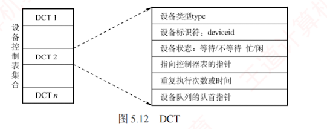
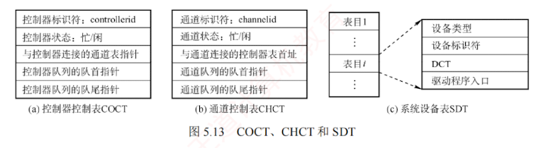
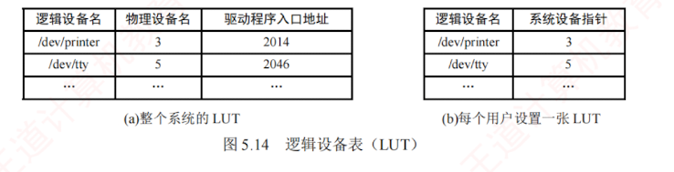

---

### 5.2.3 设备分配与回收

#### 1. 设备分配概述

**设备分配**是指根据用户的 I/O 请求分配所需设备的过程。  
分配的**总体原则**是：在充分发挥设备使用效率（使设备尽可能忙碌）的同时，**避免因分配策略不当引发进程死锁**。

#### 2. 设备分配的数据结构

在系统中，可能存在多个通道，一个通道可连接多个控制器，**每个控制器又可连接多个物理设备**。设备分配的数据结构要能体现这种**从属关系**，各数据结构的介绍如下。

1. **设备控制表（DCT）**：系统为**每个物理设备**配置**一张 DCT**，用于记录该设备的**各项属性**，如图 5.12 所示。DCT 中的**主要字段**包括：
    

- **设备类型**：表示**设备类型**，如打印机、扫描仪、键盘等。
    
- **设备标识符**：即**物理设备名**，该**标识符在系统内是唯一**的。
    
- **设备状态**：表示当前**设备的状态**（忙/闲）。
    
- **指向控制器表的指针**：每个设备由一个控制器控制，该指**针指向对应的控制器表**。
    
- **重复执行次数或时间**：系统指定 **I/O 操作**的**可重试次数**，超过此值则判定为 I/O 失败。
    
- **设备队列的队首指针**：指向因**请求该设备而阻塞的进程队列**（由 PCB 构成）的队首。
    

> **注意**
> 
> 当某进程释放设备且无其他进程等待时，系统会将 DCT 中的**设备状态置为空闲**，完成设备回收。

2. **控制器控制表（COCT）**：每个设备控制器对应一张 **COCT**，用于记录**控制器的状态**及所辖设备信息，如图 5.13(a) 所示。通过 COCT 中的“与控制器连接的通道表指针”，可以找到相应通道的信息。操作系统根据 COCT 对控制器进行操作和管理。
    
3. **通道控制表（CHCT）**：每个通道对应一张 CHCT，用于管理该通道及其下属控制器，如图 5.13(b) 所示。通过 CHCT 中的“与通道连接的控制器表首址”，可以找到该通道管理的所有控制器的信息。操作系统根据 CHCT 对通道进行操作和管理。

4. **系统设备表（SDT）**：**整个系统只维护一张 SDT**，作为所有物理设备的**全局索引**，如图 5.13(c) 所示。每个表目对应一个设备，通常包含**设备类型**、**标识符**等信息。

在多道程序系统中，由于进程数通常多于设备数，必须采用**合理的分配策略**。  
主要考虑的因素包括：**设备的固有属性**、**分配算法**、**分配的安全性**以及**设备的独立性**。

#### 3. 设备分配时应考虑的因素

**(1) 设备的固有属性**

设备的固有属性可分为三类，需采用不同的分配策略。

1. **独占设备**：分配给某进程后，便由其独占使用，直至进程主动释放或终止。
    
2. **共享设备**：可同时供多个进程使用，需通过调**度机制协调访问顺序**（如磁盘）。
    
3. **虚拟设备**：通过对**独占设备**进行**虚拟化**（如 SPOOLing 技术），使其在**逻辑上表现为可共享设备**，允许多个进程**并发**地提交 I/O 请求。
    

**(2) 设备分配算法**

常用的**设备分配算法**主要有两种。

1. **FCFS 算法**：按进程请求设备的先后顺序，排成**一个等待队列**，优先分配给**队首进程**。
    
2. **最高优先级优先算法**：高优先级进程排在队列前方，优先级相同时按 **FCFS** 原则排队。
    

**(3) 设备分配中的安全性**

指在分配过程中应**避免死锁的发生**，主要通过以下**两种方式**实现。

1. **安全分配方式**：每当进程发出 I/O 请求后，便**立即进入阻塞态**，直至 **I/O 操作完成才被唤醒**。在此期间，进程不再请求任何其他资源，从而有效**避免死锁**。  
   其优点是**安全性高**，缺点是 **CPU 与 I/O 设备串行工作**，系统效率较低。
    
2. **不安全分配方式**：进程在发出 I/O 请求后仍继续运行，需要时可**发出第二个、第三个 I/O 请求**等。  
   仅当所请求的设备已被其他进程占用时，才进入阻塞态。  
   其优点是**单个进程可同时使用多个设备**，使进程推进迅速；  
   缺点是**可能因循环等待而造成死锁**。
    

#### 4. 设备分配的步骤

下面以**独占设备**为例，介绍设备分配的过程。

1. **分配设备**：首先根据 I/O 请求中的**物理设备名**，查找 **SDT**，从中找出该设备的 **DCT**，再根据 **DCT 中的设备状态字段**判断其状态。  
   若**忙**，则将**进程 PCB** 挂入**设备等待队列**；  
   若**空闲**，则将**设备分配给该进程**。
    
2. **分配控制器**：设备分配后，根据 **DCT** 找到对应的 **COCT**，查询**控制器的状态**。  
   若**忙**，则将进程 PCB 挂入**控制器等待队列**；  
   若**空闲**，则将**控制器分配给该进程**。
    
3. **分配通道**：控制器分配后，根据 **COCT** 找到对应的 **CHCT**，查询**通道**的状态。  
   若**忙**，则将**进程 PCB** 挂入**通道等待队列**；  
   若**空闲**，则将**通道分配给该进程**。  
   只有当**设备、控制器和通道均成功分配**后，此次**设备分配才算完成**，随后可**启动设备**进行数据传送。
    

上述过程基于**物理设备名**发出 I/O 请求。  
若指定设备已被其他进程占用，则分配失败，说明该方案**缺乏设备独立性**。  
为**实现设备独立性**，进程应使用**逻辑设备名**。  
此时，系统从 SDT 中依次查找**该类设备的 DCT**：  
若**某设备空闲**，则进行后续分配；  
>若某设备忙，继续检索 SDT 中同类物理设备的下一个 DCT;

仅**当所有同类设备都忙**时，才将**进程挂入该类设备的公共等待队列**。  
只要存在一个可用设备，系统便会继续进行后续分配流程。

#### 5. 逻辑设备名到物理设备名的映射

为实现设备独立性，进程应使用**逻辑设备名**请求某类设备。由于系统只能识别物理设备名，需在系统中配置一张**逻辑设备表（Logical Unit Table, LUT）**，用于**建立逻辑设备名到物理设备名的映射**。  
LUT 的每个表项包含三项内容：**逻辑设备名、物理设备名和驱动程序入口地址**。  
当进程使用**某个逻辑设备名**请求设备时，系统为其**分配一台空闲的物理设备**，并**在 LUT 中建立相应表目**。  
此后，该进程的所有 I/O 请求均通过该表项找到对应的**物理设备**及其**驱动程序**。

系统中可采用两种方式设置逻辑设备表。

1. **整个系统仅设置一张 LUT**。如图 5.14(a) 所示。所有进程的设备分配情况都记录在同一张 LUT 中，这就要求所有用户不能使用相同的逻辑设备名，适用于**单用户系统**。
    
2. **为每个用户设置一张 LUT**。如图 5.14(b) 所示。系统仍维护全局的系统设备表（SDT）。不同用户可以使用相同的逻辑设备名，互不干扰，适用于**多用户系统**。
    

[[设备分配的各类数据结构]]
