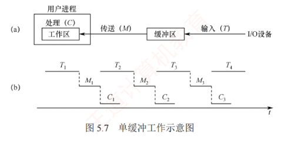
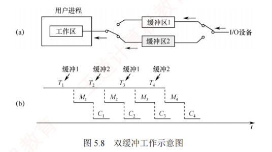
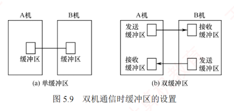
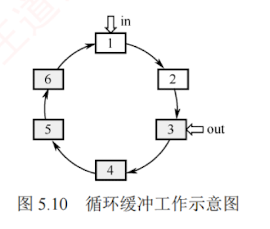
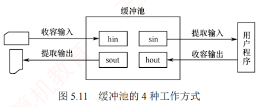
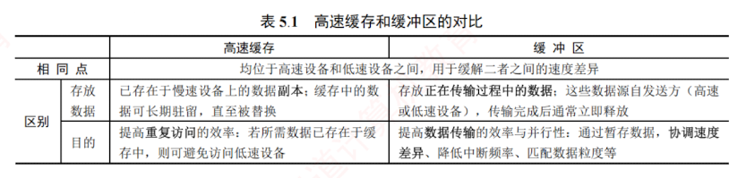

 ---

## 5.2.2 高速缓存与缓冲区
### 1. 磁盘高速缓存（Disk Cache）

操作系统采用**磁盘高速缓存**技术以提高磁盘 I/O 性能，访问高速缓存中的数据比直接读/写磁盘更高效。  
磁盘高速缓存不同于通常意义下的位于 CPU 与主存之间的硬件高速缓存，而是指利用**内存中的存储空间**暂存**从磁盘读取的盘块数据**。  
这些数据在逻辑上是**磁盘内容的副本**，**物理上则驻留在内存**中。

磁盘高速缓存在内存中有**两种组织形式**：  
一种是在**内存**中开辟固定大小的**专用缓存区**；
另一种是将**系统空闲内存**作为**动态缓冲池**，供**请求分页系统**和**磁盘 I/O 子系统**共享使用。

### 2. 缓冲区（Buffer）

在**设备管理子系统**中，引入**缓冲区**的主要目的如下：

1. 缓和 CPU 与 I/O 设备间**速度不匹配**的矛盾。
    
2. 减少对 CPU 的**中断频率**，放宽对中断响应时间的限制。
    
3. 解决**基本数据单元大小**（**数据粒度**）不匹配的问题。
    
4. 提高 CPU 与 I/O 设备之间的**并行性**。
    

**缓冲区的实现方法**包括：

1. 采用**硬件缓冲器**，但由于**成本较高**，除一些关键部位外一般不采用。
    
2. 利用**内存**作为**缓冲区**，本节要介绍的正是**由内存组成的缓冲区**。
    

#### 缓冲技术

根据系统设置的缓冲区数量，**缓冲技术**可分为**以下几种**：
##### 单缓冲

当用户进程发出 **I/O 请求**时，操作系统在**内存**中为其分配一个**缓冲区**，其大小通常为**一个数据块**。如图 5.7 所示，在**块设备输入过程**中，假设设备将一块数据送入缓冲区的时间为 $T$，操作系统将缓冲区数据传送到用户工作区的时间为 $M$，CPU 处理该块数据的时间为 $C$。  
对于**块设备**，必须等**整块数据装入缓冲区**后，才能将其传送到**工作区**。

在**单缓冲**中，设备向缓冲区**写入数据的时间** $T$ 可与 **CPU 处理前一块数据的时间** $C$ **并行**。

当 $T > C$ 时，设备向缓冲区填充数据的速度**慢于** CPU 处理数据的速度。  
此时，CPU 在完成当前数据块的处理后，必须**等待设备将下一块数据完整写入缓冲区**；  

只有**缓冲区装满**后，操作系统才能将该数据块**从缓冲区传送到用户工作区**。  
处理每块数据所需的时间为 $T + M$。

当 $T < C$ 时，设备填充缓冲区的速度快于 CPU 的处理速度。此时，缓冲区一旦装满，设备便**无法继续写入新数据**，必须**等待 CPU 完成对当前工作区数据的处理**；  
此后，操作系统才能**将缓冲区中的数据移至工作区**，从而释放缓冲区空间。  
处理每块数据所需的时间为 $C + M$。

综上，单缓冲处理每块数据所需的时间为 $\max(T, C) + M$。

由于**单缓冲区是共享资源**，设备与 CPU 对其访问必须**互斥**。  
若 CPU 尚未取走缓冲区中的数据，即使设备已准备好新数据，也无法写入缓冲区，此时**设备需等待 CPU 释放缓冲区**。

##### 双缓冲

为了**加快输入/输出速度**，提高设备利用率，引入了**双缓冲机制**（也称**缓冲对换**）。  
如图 5.8 所示，当设备输入数据时，先将数据送入缓冲区 1；  
装满后，转向缓冲区 2 写入。  
此时，操作系统可从**已满的缓冲区** 1 中取出数据送入用户工作区，并由 CPU 进行处理。  
当缓冲区 1 的数据处理完后，若缓冲区 2 已装满，则操作系统**切换到从缓冲区 2** 中取出数据送入用户工作区，而设备又可以开始向缓冲区 1 写入新数据。  
可见，**双缓冲显著提高了设备与 CPU 的并行程度**。

仍假设设备输入数据到**缓冲区**、数据传送到**工作区**和**处理的时间**分别为 $T$、$M$ 和 $C$。  
在**双缓冲**中，设备向一个缓冲区写入数据的时间 $T$ 可与操作系统传送及处理的时间 $C + M$ 并行。

当 $T > C + M$ 时，**设备输入所需时间大于数据传送与处理的总时间**。  
此时，**设备可连续工作**。  
假设在某一时刻，缓冲区 1 为空，缓冲区 2 已满：  
操作系统开始将缓冲区 2 的数据传送到工作区（耗时 $M$），CPU 随即处理该数据（耗时 $C$），同时设备向缓冲区 1 写入新数据。  
由于 $T > C + M$，当缓冲区 2 的数据处理完毕时，缓冲区 1 尚未装满，**系统必须等待其装满**后，才能将下一块数据从缓冲区 1 传送到工作区。  
处理每块数据所需的时间为 $T$。

当 $T < C + M$ 时，**设备输入较快**，**CPU 无须等待设备**。  
类似地，当缓冲区 1 为空、缓冲区 2 已满时：  
操作系统传送并处理缓冲区 2 的数据（共耗时 $C + M$），同时设备向缓冲区 1 写入数据。  
由于 $T < C + M$，**缓冲区 1 很快装满**，但系**统仍需等待缓冲区 2** 的数据完全处理完毕，才能切换至缓冲区 1 并传送其内容。  
处理每块数据所需的时间为 $C + M$。

综上，**双缓冲**处理每块数据的时间为 $\max(T, C + M)$。

在**双机通信**场景中，若要实现**全双工通信**（双方同时收发数据），每台机器需分别设置**发送缓冲区**和**接收缓冲区**。  
如图 5.9(b) 所示，A 机的发送缓冲区对应 B 机的接收缓冲区，反之亦然。  
若仅在每台机器中配置**单一缓冲区** [见图 5.9(a)]，则**无法同时进行发送与接收操作**。

##### 循环缓冲

在**双缓冲机制**中，当**输入与输出速度基本匹配**时，能够取得**较好的效果**；  
但若两者速率相差较大，则**双缓冲**难以充分发挥作用。  
为此，可引入**多缓冲机制**，并将多个缓冲区组织成**循环缓冲**的形式，如图 5.10 所示（灰色表示已装满数据的缓冲区，白色表示空缓冲区）。

**循环缓冲**由若干个大小相等的**缓冲区**构成，每个缓冲区包含一个**链接指针**，指向**下一个缓冲区**；  
**最后一个缓冲区**的指针则指向**第一个缓冲区**，从而形成一个**循环队列**结构。

系统需维护**两个指针**：`in` 和 `out`。其中，`in` 指向下一个待写入的**空缓冲区**，`out` 指向下一个待读取的**满缓冲区**。  
输入进程和计算进程在运行过程中分别推进 `in` 和 `out` 指针，沿链接方向循环移动。  
采用**循环缓冲**技术，可以实现**输入进程与计算进程的并行执行**。  
由于两者的**处理速度可能不一致**，在运行过程中可能出现以下**两种同步情形**。

1. **`in` 追赶上 `out`（称为系统受计算限制）**。表明**输入进程的写入速度快于计算进程的处理速度**，导致所有**缓冲区均被填满**，无空缓冲区可供继续写入。  
   此时，**输入进程必须阻塞**，直至计算进程从某个缓冲区中取走数据，释放出一个**空缓冲区**，并唤醒输入进程。
    
2. **`out` 追赶上 `in`（称为系统受 I/O 限制）**。表明**计算进程的处理速度快于输入进程的供给速度**，导致所有**缓冲区均为位空**，无数据可供继续处理。  
   此时，**计算进程必须阻塞**，直至输入进程向某个缓冲区写入数据，使其变为**满缓冲区**，并唤醒计算进程。
    

##### 缓冲池

相对于**单个缓冲区**（仅是一块**内存区域**），**缓冲池是一种包含管理数据结构和操作函数的软件机制**，用于统一管理多个缓冲区，并支持**多进程**共享使用。

**缓冲池**由系统统一管理的供**多个进程共享**的**一组缓冲区**构成。  
根据使用状态，这些缓冲区被组织为**以下队列**：  
1. **空缓冲区队列**，由**空缓冲区链接**而成；
2. **输入队列**，由装满**输入数据**的缓冲区**链接**而成；
3. **输出队列**，由装满**输出数据**的缓冲区**链接**而成。

在操作过程中，缓冲区可**动态**扮演以下**四种角色**（见图 5.11）：  
1. 收容输入缓冲区（hin），用于暂存输入数据；
2. 提取输入缓冲区（sin），用于读取输入数据；
3. 收容输出缓冲区（hout），用于暂存输出数据；
4. 提取输出缓冲区（sout），用于读取输出数据。

缓冲池中的**缓冲区**按以下 **4 种方式**工作。

1. **收容输入**。**输入进程需要输入数据**时，从空缓冲区队列队首摘取**一个空缓冲区**，作为**收容输入缓冲区**，将输入数据写入其中，装满后将其挂到**输入队列队尾**。
    
2. **提取输入**。**计算进程需要输入数据**时，从**输入队列**队首摘取**一个缓冲区**，作为**提取输入缓冲区**，从中读取数据，读取完毕后将其挂到**空缓冲区队列队尾**。
    
3. **收容输出**。**计算进程需要输出数据**时，从空缓冲区队列队首摘取**一个空缓冲区**，作为**收容输出缓冲区**，将输出数据写入其中，装满后将其挂到**输出队列队尾**。
    
4. **提取输出**。**输出进程需要输出数据**时，从**输出队列**队首摘取**一个缓冲区**，作为**提取输出缓冲区**，从中读取数据，读取完毕后将其挂到**空缓冲区队列队尾**。
    

对于**循环缓冲**和**缓冲池**，本节仅介绍其工作机制，**不涉及时间性能的定量分析**。  
而对于**单缓冲**和**双缓冲**，只要依据前述模型进行分析，即可求解任意场景下处理每块数据所需的时间。

[[四种缓冲区技术的对比]]

#### 3. 高速缓存与缓冲区的对比

在 **I/O 系统**中，**高速缓存**（Cache）是一种**利用高速存储介质保存慢速设备数据副本的机制**，其访问速度远高于直接访问慢速设备。  
高速缓存与缓冲区的**对比**如表 5.1 所示。

[[缓冲区和磁盘高速缓存的对比]]

[[缓冲与缓存概念的对比]]
