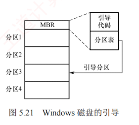

---

### 5.3.2 磁盘的管理

#### 1. 磁盘初始化

一个新的磁盘只是一个涂有磁性材料的**空白盘**。  
在磁盘能够存储数据之前，必须将其划分为**扇区**，以便磁盘控制器进行读/写操作，这一过程称为**低级格式化**（也称**物理格式化**）。  
每个扇区通常由**头部**、**数据区域**和**尾部**组成。  
头部和尾部包含了一些磁盘控制器的使用信息，其中利用磁道号、磁头号和扇区号来标志一个扇区，利用 CRC 字段对扇区进行校验。

大多数磁盘在出厂时作为制造过程的一部分已完成低级格式化，这使制造商能够测试磁盘，并建立**逻辑块地址到物理扇区的初始映射**。  
对于许多磁盘，控制器在低级格式化时还可**指定扇区中数据区域的大小**，通常为 256 字节、512 字节或 4KB 等。

#### 2. 分区

在使用磁盘存储文件之前，还需完成两个步骤。  
第一步是**分区**，将磁盘划分为若干**逻辑区域**（如常见的 C 盘、D 盘），每个分区的起始位置和大小记录在**主引导记录**（**MBR**）的**分区表**中。  
第二步是对分区进行**逻辑格式化**（也称**高级格式化**），即在分区上建立**文件系统**，包括**初始化根目录**、创建用于**管理空闲与已分配空间的数据结构**，并将初始目录置为空。

由于扇区单位过小，为提高 I/O 效率，操作系统将**多个连续扇区组合成一簇**（在文件系统中也称**块**）。为简化管理，通常将一簇分配给单个文件，因此**文件占用空间为簇的整数倍**；  
**即使文件大小小于一簇（甚至为 0 字节），仍需占用一整簇空间**。

#### 3. 引导块

计算机启动时需要运行一个**初始化程序**（称为**自举程序**），用于**初始化** CPU、寄存器、设备控制器和内存等，随后**加载并启动操作系统**。  
为此，自举程序需定位磁盘上的操作系统内核，将其载入内存，并跳转至其入口地址，从而开始操作系统的执行。

**自举程序**通常存放于 **ROM** 中。  
为避免因修改自举代码而需更换 ROM 硬件的问题，一般仅在 ROM 中保留一个**小型自举装入程序**，而将功能完整的**引导程序**存放在**磁盘**的**引导块**中。  
该引导块位于**磁盘的固定位置**。  
**含有引导块的磁盘称为启动磁盘或系统磁盘**。

ROM 中的代码指示**磁盘控制器**将引导块**读入内存**并执行，后者可从指定位置**加载操作系统内核**并启动之。  
下面以 Windows 为例说明**引导过程**：  
Windows 允许将磁盘划分为多个分区，其中**活动分区**（**引导分区**）包含操作系统核心文件。  
系统将初始引导代码存储在磁盘第 0 号扇区，称为**主引导记录**（**MBR**）。  
启动时，ROM 中的代码首先读取 MBR；  
除**引导代码**外，MBR 还包含**分区表**和**一个标志位**，用于指明应从哪个分区引导，如图 5.21 所示。随后，系统读取该分区的**首扇区**（称为**引导扇区**），继续完成后续引导步骤，包括加载系统服务与驱动程序。

#### 4. 坏块

磁盘因含有机械部件且容错能力较弱，容易出现一个或多个扇区损坏，部分坏块甚至在出厂时就已存在。  
根据磁盘类型和控制器能力，坏块的处理方式有所不同。

对于简单磁盘，如采用 IDE 控制器的磁盘，坏块通常由操作系统在**逻辑格式化**时检测。  
例如 MS-DOS 的 Format 命令会识别坏扇区，并在 **FAT 表**中标记为不可用，从而避免程序使用。

对于现代的复杂磁盘，控制器内部维护一份坏块列表。该列表在出厂低级格式化时初始化，并在使用过程中动态更新。低级格式化会预留部分备用扇区，这些扇区对操作系统透明。当发现坏块时，控制器自动将其映射到备用扇区，实现逻辑替换，此机制称为扇区备用。

坏块处理的核心思想是：通过软件标记或硬件重映射，确保系统不会使用坏块。
