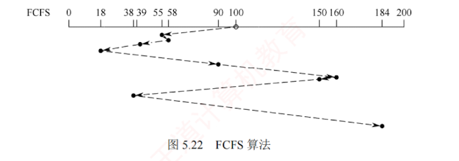
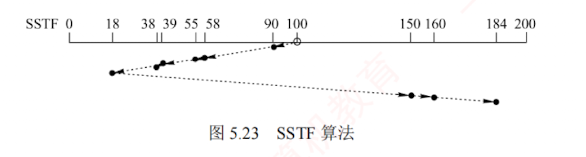
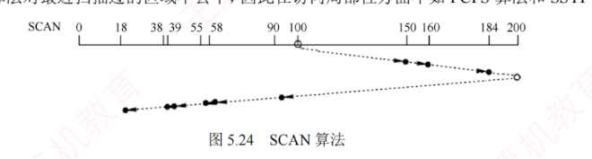
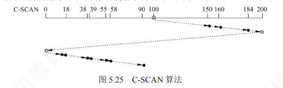
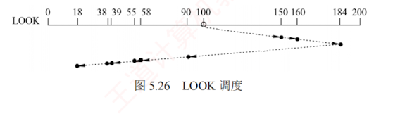
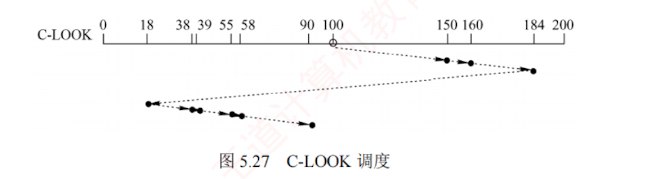
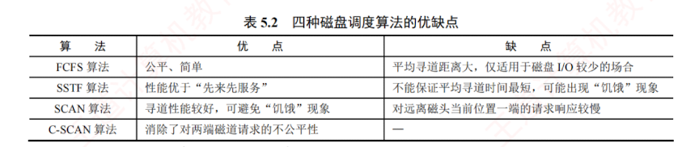
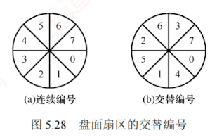
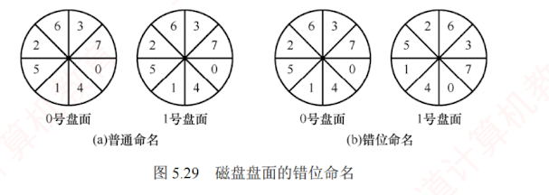

---
### 5.3.3 磁盘调度算法

#### 1. 磁盘的存取时间

一次磁盘读/写操作的时间由**寻道时间**、**旋转延迟时间**和**数据传输时间**三部分组成。

1. **寻道时间** $T_s$。活动头磁盘在读/写数据前，磁头移动到目标磁道所需的时间。  
   该时间包括磁头臂的启动时间 $s$ 和跨越 $n$ 条磁道的移动时间，即
    
    $$T_s = mn + s$$
    
    式中，$m$ 为跨越每条磁道所需的时间，约为 0.2ms；磁头臂的启动时间约为 2ms。
    
2. **旋转延迟时间** $T_r$。  
   目标扇区旋转至磁头下方所需的**平均等待时间**（因位置随机，平均为半圈旋转时间）。  
   设磁盘转速为 $r$，则
    
    $$T_r = 1 / (2r)$$
    

	典型的磁盘转速为 5400 转/分，相当于旋转一圈需 11.1ms，对应 $T_r \approx 5.56\text{ms}$。

3. 数据传输时间 $T_t$。读取或写入 $b$ 字节数据所需的时间。若每条磁道存储 $N$ 字节，则

$$T_t = b / (rN)$$

式中，$r$ 为磁盘每秒转数。总平均存取时间 $T_a$ 可表示为

$$T_a = T_s + 1 / (2r) + b / (rN)$$

在磁盘存取时间中，**寻道时间占主导地位**，且直接接**受磁盘调度算法影响**；  
**而旋转延迟时间和数据传输时间均与磁盘转速成反比**，因此**转速**是磁盘性能的一个非常重要的硬件参数，难以从操作系统层面进行优化。  

因此，**磁盘调度的主要目标是减少磁盘的平均寻道时间**。

#### 2. 磁盘调度算法

目前常用的磁盘调度算法有以下几种。

##### (1) 先来先服务（First Come First Served, FCFS）算法

FCFS 算法按进程请求访问磁盘的先后顺序进行调度，是最简单的调度算法（见图 5.22）。  
**优点是公平性好**。当请求较少且访问的扇区在物理位置上较为聚集时，性能尚可；  
但当大量进程竞争磁盘时，磁头频繁长距离移动，导致效率低下。  
因此，实际系统通常采用更高效的调度算法。

例如，假设磁盘请求队列为 55, 58, 39, 18, 90, 160, 150, 38, 184，磁头初始位于磁道 100。采用 FCFS 算法时，磁头的移动过程如图 5.22 所示。总移动距离为 $(45 + 3 + 19 + 21 + 72 + 70 + 10 + 112 + 146) = 498$ 个磁道，平均寻道长度 $= 498 / 9 = 55.3$。

##### (2) 最短寻道时间优先（Shortest Seek Time First, SSTF）算法

SSTF 算法每次选择距离当前磁头位置最近的请求进行调度，以使单次寻道时间最短。  
尽管该策略不能保证平均寻道时间最小，但通常能提供优于 FCFS 算法的性能。  
该算法可能引发“**饥饿**”现象，如图 5.23 所示，若磁头位于 18 号磁道，且附近持续出现新请求，则磁头将长期在 18 号磁道附近来回移动，导致较远磁道（如 184 号）长时间得不到服务。

例如，设磁盘请求队列为 55, 58, 39, 18, 90, 160, 150, 38, 184，磁头初始位于磁道 100。采用 SSTF 算法时，磁头的移动过程如图 5.23 所示。总移动距离为 $10 + 32 + 3 + 16 + 1 + 20 + 132 + 10 + 24 = 248$ 个磁道，平均寻道长度 $= 248 / 9 = 27.5$。

##### (3) 扫描（SCAN）算法

SSTF 算法因磁头在局部区域来回移动而引发饥饿。  
为避免该问题，SCAN 算法规定：磁头仅在到达最外侧磁道后才转向内侧移动，到达最内侧磁道后才转向外侧移动。  
它在 SSTF 的基础上引入了磁头移动方向的约束，如图 5.24 所示。  
其行为类似于电梯运行，故也称**电梯调度算法**。  
但 SCAN 算法对最近扫描过的区域不公平，因此在访问局部性方面不如 FCFS 算法和 SSTF 算法。

例如，设磁盘请求队列为 55, 58, 39, 18, 90, 160, 150, 38, 184，磁头初始位于磁道 100。采用 SCAN 算法时，还需知道磁头移动方向。若磁头沿磁道号增大的方向移动，则访问顺序为 100, 150, 160, 184, 200, 90, 58, 55, 39, 38, 18，磁头的移动过程如图 5.24 所示。总移动距离为 $(50 + 10 + 24 + 16 + 110 + 32 + 3 + 16 + 1 + 20) = 282$ 个磁道，平均寻道长度 $= 282 / 9 = 31.33$。

##### (4) 循环扫描（Circular SCAN, C-SCAN）算法

C-SCAN 算法在 SCAN 算法的基础上规定：磁头仅沿单一方向移动并提供服务，返回时快速移至起始端且不处理任何请求。  
由于 SCAN 算法倾向于优先服务靠近最内侧或最外侧磁道的请求，导致中间区域的响应延迟较大。C-SCAN 算法通过将回归过程转化为非服务性的快速跳转，并**以循环方式均匀地处理所有请求**，从而有效缓解了这种不公平性，如图 5.25 所示。

例如，假设磁盘请求队列为 55, 58, 39, 18, 90, 160, 150, 38, 184，磁头初始位于磁道 100。采用 C-SCAN 算法时，若磁头沿磁道号增大的方向移动，则访问顺序为 100, 150, 160, 184, 200, 0, 18, 38, 39, 55, 58, 90，磁头的移动过程如图 5.25 所示。总移动距离为 $50 + 10 + 24 + 16 + 200 + 18 + 20 + 1 + 16 + 3 + 32 = 390$ 个磁道，平均寻道长度 $= 390 / 9 = 43.33$。

采用 SCAN 算法和 C-SCAN 算法时，磁头总是严格地从磁盘一端移动到另一端。  
实际上，可进一步改进：**磁头只需移动到当前方向上最远的请求位置即可返回**，无须抵达物理端点。  
这种改进后的 SCAN 算法和 C-SCAN 算法分别称为 LOOK 调度（见图 5.26）和 C-LOOK 调度（见图 5.27），因其在朝某一方移动前会“查看”（look）该方向是否存在待处理请求。

若无特别说明，实际系统中所称的 SCAN 算法和 C-SCAN 算法通常指 LOOK 调度和 C-LOOK 调度。

以上四种磁盘调度算法的**优缺点**如表 5.2 所示。

##### (5) NStepSCAN 算法和 FSCAN 算法

SSTF 算法、SCAN 算法和 C-SCAN 算法在特定情况下可能出现**磁臂黏着现象**：  
当一个或多个进程频繁发出对某个磁道的 I/O 请求时，磁头会长期滞留于该区域，导致其他进程难以获得服务。

为了缓解这一问题，NStepSCAN 算法将磁盘请求队列划分为若干长度为 $N$ 的子队列。  
调度器按 **FCFS 原则**依次处理各子队列，而在处理每个子队列内部时，则采用 SCAN 算法进行扫描。  
在处理某个子队列的过程中，若有新请求到达，则系统将其放入尚未处理的其他子队列中，不插入当前正在服务的子队列。  
这一机制有效**避免了磁头因局部热点请求而长期滞留的现象**，进而**避免了磁臂黏着**。  
算法性能随 $N$ 值变化：  
当 $N$ 较大时，NStepSCAN 算法的行为趋近于 SCAN 算法；  
当 $N=1$ 时，每个子队列仅含一个请求，算法退化为 FCFS 算法。

FSCAN 算法是 NStepSCAN 算法的简化形式，其做法是将请求队列固定划分为两个子队列：  
1. 当前服务队列，包含调度开始时已存在的所有请求，按 SCAN 算法处理；
2. 新请求队列，在当前扫描过程中新到达的请求全部暂存于此，推迟至下一轮扫描时处理。  
   通过“**冻结当前、延后新请求**”的策略，FSCAN 算法不仅保留了 SCAN 算法的特性，还避免了磁臂黏着，且实现简单、开销低。

#### 3. 减少延迟时间的方法

除减少寻道时间外，**减少旋转延迟时间**也是提高磁盘 I/O 效率的重要途径。

**磁盘是连续旋转设备**。  
当磁头读取一个扇区后，系统需要一定时间处理数据，才能开始读取下一个扇区。  
若逻辑上相邻的块在物理上也相邻，则在处理当前扇区的过程中，下一个目标扇区可能已随盘面旋转而掠过磁头；  
待处理完成时，该扇区已不可访问，只能等待近一整圈才能再次到达，从而造成显著延迟。  
为此，可对单个盘面的扇区采用**交替编号** [假设盘面有 8 个扇区，见图 5.28(b)]，使逻辑相邻的块在物理布局上保持适当间隔，确保在处理完一个扇区后，下一个目标扇区能及时旋转至磁头下方，从而有效减少因错过扇区而导致的长延迟。

此外，由于磁盘的所有盘面同步旋转，同一柱面内的块通常按盘面顺序连续存放，即依次为：盘面 0 扇区 0、盘面 0 扇区 1 ...... 盘面 0 扇区 7、盘面 1 扇区 0 ...... 盘面 1 扇区 7、盘面 2 扇区 0 ...... 。若要读取不同盘面上的连续块，例如在读完盘面 0 扇区 7 后，系统仍需一段处理时间；而在此期间，盘面持续旋转，导致下一个目标块（如盘面 1 扇区 0）可能已在磁头经过时被错过，无法立即读取，只能等待其下一次旋转至磁头下方。  
为此，可对不同盘面实施**错位命名** [假设有 2 个盘面，且已采用交替编号，见图 5.29(b)]，使得在处理完盘面 0 扇区 7 后，盘面 1 扇区 0 恰好或即将到达磁头位置，从而在首次经过时即可读取，显著减少旋转延迟。

在磁盘的存取时间中，**寻道时间**和**旋转延迟时间**属于“**找**”的时间，这类开销可通过**合理的算法**或**布局优化**来降低，而**传输时间**主要由磁盘本身的特性决定，难以通过软件手段减少。

#### 4. 提高磁盘 I/O 速度的方法

文件的访问速度是衡量文件系统性能最重要的因素，可从以下三个方面来优化：  
1. 改进文件目录结构和检索目录的方法，以减少对目录的查找时间；
2. 选取好的文件存储结构，以提高文件的访问速度；
3. 提高磁盘 I/O 速度，以实现文件数据在磁盘与内存之间的快速传送。
4. ① 和 ② 已在第 4 章中介绍，这里主要介绍如何提高磁盘 I/O 的速度。

5. **采用磁盘高速缓存**。5.2.2 节介绍了磁盘高速缓存的概念。
    
6. **调整磁盘请求顺序**。即上文介绍的各种磁盘调度算法。
    
7. **提前读**。在读取当前磁盘块的同时，将逻辑上紧随其后的下一个（或多个）磁盘块一并预读到内存缓冲区，以应对后续可能的连续访问。
    
8. **延迟写**。当修改一个缓冲区中的数据时，并不立即写回磁盘，而仅设置**延迟写标志**；  
   当该**缓冲区被替换**时，才真正将数据**写入磁盘**，从而合并多次写操作，减少 I/O 次数。
    
9. **优化物理块的分布**。除上文介绍的扇区编号优化外，对于采用**链接或索引**方式组织的文件，应尽量将其所属的块安排在**同一磁道或相邻磁道**上，以**减少寻道时间**。  
   此外，将若干连续扇区组成**簇**，以簇为单位对文件进行分配，也能有效降低磁头的平均移动距离。
    
10. **虚拟盘**。指用内存空间仿真磁盘，也称 RAM 盘。  
    由于内存访问速度远高于磁盘，因此常用于存放临时文件或对 I/O 延迟敏感的数据。虚拟盘与磁盘高速缓存的区别：  
    虚拟盘的内容完全由用户程序控制，而磁盘高速缓存的内容则由操作系统透明管理。
    
11. **采用磁盘阵列 RAID**。某些 RAID 级别可支持交叉存取，能大幅提高磁盘 I/O 速度。
    
