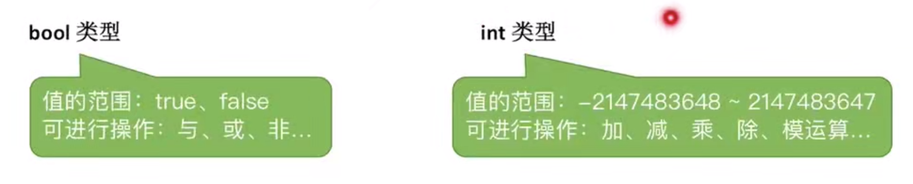
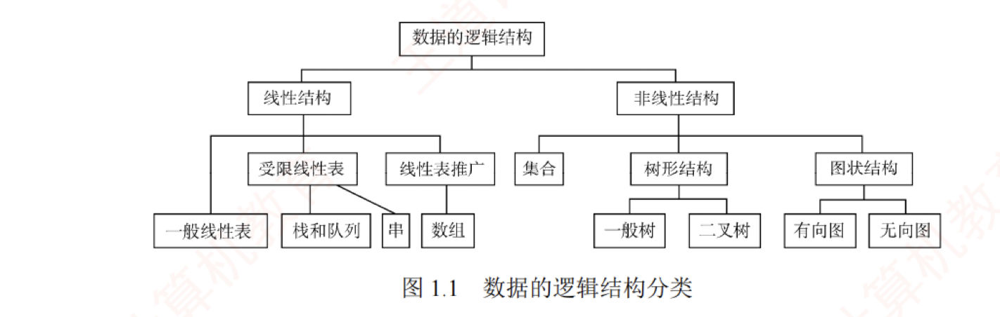

---

### 基本概念和术语

1. 数据
   >数据是信息的载体，是描述客观事物属性的数、字符，以及所有能输入到计算机中并被计算机程序识别和处理的符号的**集合**。数据是计算机程序加工的原料。
   
2. 数据元素
   >数据元素是数据的**基本单位**，通常作一个整体进行考虑和处理。一个数据元素可由若干数据项组成，**而数据项是构成数据元素的不可分割的最小单位**。例如，一条学生记录就是一个数据元素，它由学号、姓名、性别等数据项组成。
   
3. 数据对象
   >数据对象是具有**相同性质**的数据元素的集合，是数据的一个子集。例如，整数数据对象可表示为集合$N=\{0,\pm 1,\pm 2,……\}$
   
4. 数据类型
   >数据类型是一个值的集合以及定义在该集合上的一组操作的总称。

	**图中包含了值的集合以及集合上的操作**
   

	- 原子类型：其值不可再分的数据类型。

	- 结构类型：其值可进一步分解为若干成分（分量）的数据类型。

	- 抽象数据类型（ADT）：一个数学模型以及定义在该模型上的一组操作。它通常是对数据的某种抽象，规定了数据的取值范围、结构形式以及可执行的操作集合。

### 数据结构三要素

1. 数据的逻辑结构
   >逻辑结构是指数据元素之间的逻辑关系，即从逻辑角度对数据的描述方式。它与数据在计算机中的存储方式无关，是独立于具体系统的。数据的逻辑结构可分为**线性结构和非线性结构**。例如，线性表是典型的线性结构；集合、树和图则是典型的非线性结构.
   
   **图示为数据的逻辑结构分类**
   
>	集合中的数据元素只有同属于一个集合这一种关系
>	线形结构中的数据元素之间仅存在一对一的关系
>	树形结构中的数据元素之间存在一对多的关系
>	图状结构或者说是网状结构的数据元素之间存在多对多的关系

2. 数据的存储结构
   >存储结构是指数据结构在计算机中的表示形式，也称**物理结构**，包括数据元素的表示及其相互关系的表示。它是逻辑结构在计算机中的具体实现，依赖于所采用的编程语言。常见的存储结构有**顺序存储、链式存储、索引存储和散列存储。**
   
   - 顺序存储：将逻辑上相邻的数据元素存储在物理位置也相邻的存储单元中，元素间的关系由存储单元的邻接关系体现。优点是可以实现随机存取，每个元素占用最少的存储空间；缺点是要求使用连续的存储空间，可能导致较多的外部碎片。

   - 链式存储：不要求逻辑上相邻的元素在物理位置上也相邻，而是通过指针指示元素的存储地址来表示其逻辑关系。优点是不会出现碎片现象，能充分利用所有存储单元：缺点是每个元素因存储指针而额外占用存储空间，且只能顺序存取。

   - 索引存储：在存储元素信息的同时，额外建立索引表。索引表中的每一项称为索引项， 通常包含关键字和地址。优点是检索速度快；缺点是需要额外的存储空间用于索引表， 且增加或删除数据时需更新索引表，带来额外的时间开销。

   - 散列存储：根据元素的关键字直接计算出其存储地址，也称哈希（Hash）存储。优点是检索、插入和删除操作都非常快速；缺点是如果散列函数设计不当，可能会产生冲突（也称哈希冲突），解决冲突会增加时间和空间成本。

2. 数据的运算
   >数据的运算包括**定义与实现**两个方面：定义针对逻辑结构，说明运算的功能；实现则基于存储结构，描述具体的操作步骤。