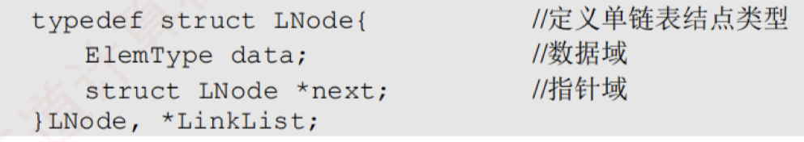
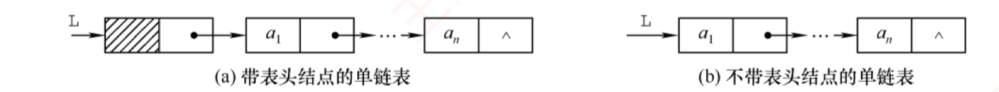
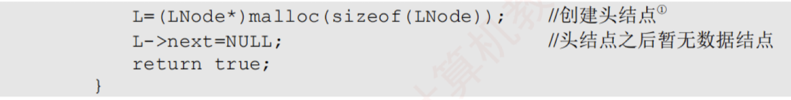
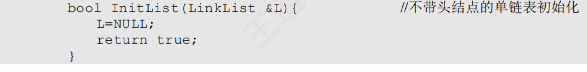
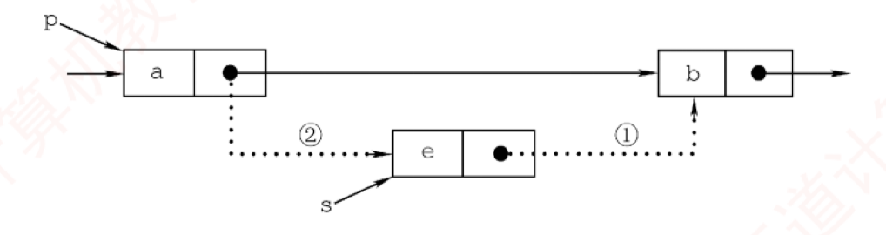

---

### 为什么线性表使用链式存储？

#### 理解

顺序表支持随机存取任意元素，但插入和删除操作都需要移动大量元素，效率低。
链式存储的线性表不要求地址连续的存储单元；通过指针建立元素之间的逻辑关系，因此插入和删除操作无需移动元素，只需修改相关指针，效率较高，但是这样做导致失去了顺序表的随机存取能力，所以只能从头开始顺序访问

#### 总结

|     | 顺序表              | 链表                           |
| --- | ---------------- | ---------------------------- |
| 优点  | 可随机存取，存储密度高      | 不要求大片连续空间，改变容量方便             |
| 缺点  | 要求大片连续空间，改变容量不方便 | 不可随机存取，要耗费一定空间存储指针因此导致存储密度不高 |

### 单链表的定义

#### 定义

线性表的链式存储也称单链表。它通过一组**任意的存储单元**（不要求地址连续）来存储线性表中的元素数据。为了建立数据元素之间的线性关系，每个链表结点除了存放元素自身的信息外，还需要额外设置一个指向其后继结点的指针。
>下图为单链表的结点结构

#### 单链表的结构体定义


>typedef用于将数据类型重命名
>
>这里的typedef就是将struct LNode重命名成了LNode或者*LinkList

>LNode表示的是这个结点，*LinkList 表示的则是指向这个结点的指针


#### 头指针

##### 头指针的定义

通常使用头指针L（或head等）来标识一个单链表，该指针指向链表的起始位置。当头指针为NULL时，**表示链表为空**。此外，为了简化操作，在单链表的第一个数据结点之前常附加一个特殊的结点，称头结点。头结点的数据域一般**不存放有效数据**（但可用于记录表长等信息）。**在带头结点的单链表中**，头指针L指向头结点，而头结点的 next 指向第一个数据结点。在**不带头结点的单链表中**，头指针L直接指向第一个数据结点。无论哪种形式，表尾结点的指针域为 NULL（图中用“^”表示）。



##### 头指针和头结点的关系

>头指针始终指向链表的第一个结点  
>头结点仅存在于带头结点的链表中，它是链表的第一个结点，其数据域通常不存放实际数据


##### 头结点的优点

1. **操作统一性**：第一个数据结点的位置存储在头结点的指针域中，因此在链表首部进行插入和删除操作时，与其他位置的操作逻辑一致，无须特别处理。
2. **空表与非空表处理统一**：无论链表是否为空，头指针始终是一个非空指针，因为它始终指向头结点，而如果一个链表是空表，则它的头结点的next为NULL，从而避免了对空表的单独判断。


### 单链表上的基本操作

#### 单链表的初始化

##### 带头结点


需要先创建一个头结点，然后令头指针L指向该头结点，头结点的next指针初始化为NULL。

##### 不带头结点


只需将头指针L初始化为NULL


#### 求表长操作

##### 操作说明

求表长操作是指统计单链表中数据结点的个数，不包括头结点，从第一个数据结点开始依次遍历，因此需要设置一个计数变量，每访问一个结点，值加一，直到遇到NULL，说明到达了表尾。

##### 代码定义


##### 时间复杂度分析

时间复杂度为$O(n)$，因为需要遍历n个结点


#### 单链表的插入

##### 操作说明

将值为 e 的新结点插入到第 i 个位置（成为新的第 i 个数据结点）。先检查 i 的合法性，然后找到第 i-1 个结点（前驱），再在其后插入新结点。假设找到的第 i-1 个结点为_p，然后令新结点_s 的 next 指向_p 的后继，再令_p 的 next 指向*s，如图所示。



##### 代码定义

```text
bool ListInsert(LinkList &L,int i,ElemType e){
    LNode *p=L;              //p 指向当前扫描结点
    int j=0;                 //j 记录当前位序，头结点为第 0 个结点
    while(p!=NULL&&j<i-1){   //循环找到第 i-1 个结点
        p=p->next;
        j++;
    }
    if(p==NULL)              //i 值不合法
        return  false;
    LNode *s=(LNode*)malloc(sizeof(LNode));
    s->data=e;
    s->next=p->next;         //图 2.5 中操作步骤①
    p->next=s;               //图 2.5 中操作步骤②
    return  true;
}
```

##### 理解

步骤①和②的顺序不可颠倒。若先执行 p->next=s，则原后继地址丢失，导致 s->next=p->next 实际变为 s->next=s，形成自环。该操作的时间复杂度为 O(n)，主要开销在于查找前驱结点。若已知某结点指针，则在其后插入新结点的时间复杂度为 O(1)。注意，当插入位置 i=1 时，不带头结点的单链表需要更新头指针 L 指向新首结点，而带头结点的则无需特殊处理。

##### 扩展

对某个结点进行前插操作：

> 前插操作是指在某结点前插入一个新结点，与后插操作相反。任何前插操作均可转化为后插操作：只需从头结点开始顺序查找其前驱，时间复杂度为 O(n)。若对给定结点进行前插，则还可采用另一种技巧（适用于数据可复制的情况）：将新结点_s 插入目标结点_p 之后，再交换_p 与_s 的数据域。这种技巧逻辑上等效于前插，且时间复杂度为 O(1)。主要代码片段如下：

```text
s->next=p->next;            //修改指针域，不能颠倒
p->next=s;
temp=p->data;               //交换数据域部分
p->data=s->data;
s->data=temp;
```


#### 单链表的删除

##### 操作说明

删除单链表的第i个数据结点。先检查i的合法性，再找到第i-1个数据结点，然后删除其后继结点，并释放内存。假设找到的第 $i-1$ 个结点为_p，其后继为被删结点_q，先将_p 的 next 指向_q 的后继结点，然后释放*q 的存储空间，如图所示。


##### 代码定义

```text
bool ListDelete(LinkList &L,int i,ElemType &e){
    LNode *p=L;                    //指针 p 指向当前扫描到的结点
    int j=0;                       //记录当前结点的位序，头结点是第 0 个结点
    while(p->next!=NULL&&j<i-1){   //循环找到第 i-1 个结点
        p=p->next;
        j++;
    }
    if(p->next==NULL||j>i-1)       //i 值不合法
        return  false;
    LNode *q=p->next;             //令 q 指向被删除结点
    e=q->data;                     //用 e 返回元素的值
    p->next=q->next;               //将*q 结点从链中 “断开”
    free(q);                       //释放结点的存储空间①
    return  true;
}
```

##### 时间复杂度分析


类似于插入操作，该操作的主要耗时也在查找操作上，时间复杂度为 $O(n)$。

当链表不带头结点时，需判断被删结点是否为首结点，若是，则要做特殊处理，将头指针 L 指向新的首结点。当链表带头结点时，删除首结点和删除其他结点的操作是相同的。

##### 如何删除给定结点*p。

常规方法需要从头遍历找到_p 的前驱，时间复杂度为 $O(n)$。若允许修改结点内容，则可采用一种 $O(1)$ 的技巧：将_p 的后继结点的数据复制到*p 中，然后删除其后继结点。该方法的局限性在于不能用于删除尾结点（因其无后继）。主要代码片段如下：

```text
LNode *q=p->next;          //令 q 指向*p 的后继结点
p->data=p->next->data;     //用后继结点的数据域覆盖
p->next=q->next;           //将*q 结点从链中 “断开”
free(q);                   //释放后继结点的存储空间
```