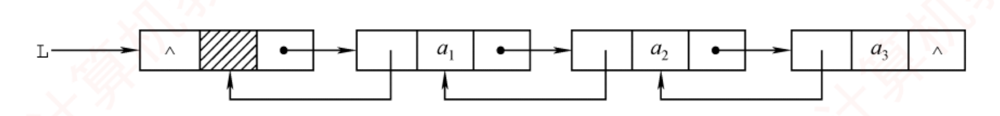

---

## 双链表的定义

### 定义

单链表的每个结点仅包含一个指向其后继的指针，故只能从前往后依次遍历。若需访问某结点的前驱（插入或删除操作时），则要从头开始遍历，时间复杂度为$O(n)$。为了克服这一局限，引入了双链表，双链表中的每个结点包含两个指针prior和next，分别指向直接前驱和直接后继，如图2.9所示。其中，头结点的prior为NULL，尾结点的next也为NULL。



### 双链表结点类型的定义

```text
typedef struct DNode{                    //定义双链表结点类型
    ElemType data;                       //数据域
    struct DNode *prior,*next;           //前驱和后继指针
}DNode, *DLinklist;
```

### 理解

双链表的按值查找操作和按位查找操作与单链表的相同，通常也需要从头结点开始顺序查找。由于增加了指向前驱的指针，双链表在插入操作和删除操作中要同时维护前驱与后继两个方向的链接，因此其实现方式与单链表的有较大差异。关键在于：修改指针时**不能造成断链**。得益于对前驱结点的直接访问，**在已知目标结点的前提下，双链表的插入和删除操作的时间复杂度可降至$O(1)$。**


## 双链表的基本操作


### 双链表的插入操作

#### 操作说明

在双链表的结点_p之后插入新结点_s


#### 代码定义

```text
① s->next=p->next;            //将结点*s 插入到结点*p 之后
② p->next->prior=s;
③ s->prior=p;
④ p->next=s;
```

#### 理解

上述语句的执行顺序并不是任意的：步骤①必须在步骤④之前，否则p->next 被覆盖后，无法访问原后继结点，导致指针丢失，插入失败。其余步骤可在保证逻辑正确的前提下适当调整（例如③可在①前执行）。

#### 补充

若问题改成要求在结点_p 之前插入结点_s，则要如何处理？
代码设计如下：
```
```// 在结点 p 之前插入新结点 s
s->prior = p->prior;      // (1) s 的前驱先接到 p 的前驱
s->next  = p;             // (2) s 的后继接到 p
p->prior->next = s;       // (3) 原前驱的 next 改指向 s
p->prior = s;             // (4) p 的 prior 改指向 s
```


### 双链表的删除操作

#### 操作说明

删除双链表中结点_p的后继结点_q


#### 代码定义

```text
p->next=q->next;              //图2.11 中步骤①
q->next->prior=p;             //图2.11 中步骤②
free(q);                      //释放结点空间
```

#### 补充

若问题改成要求删除结点_q的前驱结点_p，请读者尝试写出对应的操作步骤。

建立双链表时，同样可以采用类似单链表的头插法或尾插法，但要注意：每次插入新结点时，要同时正确设置next 和prior 两个指针，以维持双向链接的完整性。