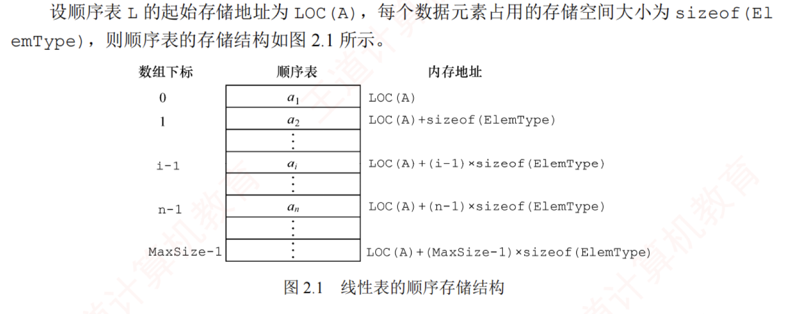

### 顺序表的定义

>线性表的顺序存储也称顺序表

- 顺序表是用一组**地址连续的存储单元**依次存储线性表中的数据元素，使得**逻辑上相邻的元素在物理位置上也相邻**
- 顺序表的特点：表中元素的**逻辑顺序与其物理存储顺序完全一致**
- 顺序表的存储结构如图所示：
  >此外利用sizeof()函数来获取数据元素的大小
  >
  
  >第一个元素在起始base地址，第二个元素则紧挨着第一个，以此类推

- 因为任意数据元素的存储地址与顺序表的起始地址之间的偏移量与其位序呈线形关系，因此可以在**O(1)时间内直接访问表中任意位置的元素**
  >因为在请求访问$a[i]$时，CPU所做的事情就是计算地址，一步就可以算出，然后再取出该地址的值，这两步都是固定次数的运算，与n没有关系
-   这种特性使得线性表的顺序存储结构属于**随机存取**。
  >这里的随机存取指的并不是随机存储数据，而是任意位置等成本，访问任意下标的元素的代价都是一样的，因为能直接把地址算出来
-   通常使用**数组**来实现线性表

### 顺序表的实现

#### 静态分配
- 静态分配的存储结构可描述为：
  ```C++
  #define MaxSize 50  //定义最大长度
  typedef struct {
    ElemType data[MaxSize];  //使用静态数组存放数据元素
    int length; //顺序表的当前长度
  }SqList;      //顺序表的类型定义
  ```
  >因为存储空间是静态的，所以数组的大小和存储空间在编译时已经固定，若空间占满，再插入新的元素会导致溢出
  >  不能刚开始就声明一个很大的内存空间，这样会造成内存资源浪费
  

#### 动态分配
```C++
#define MaxSize 50  //定义最大长度
typedef struct {
  ElemType *data  //指示动态分配数组的指针
  int MaxSize,length; //顺序表的当前长度
}SqList;      //顺序表的类型定义

L.data=new ElemType [InitSize]     //C++的初始动态分配语句
```

