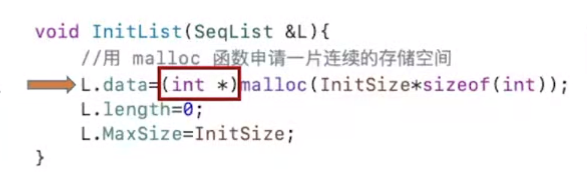
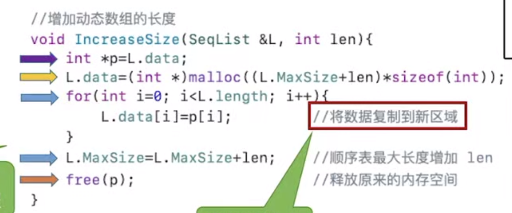
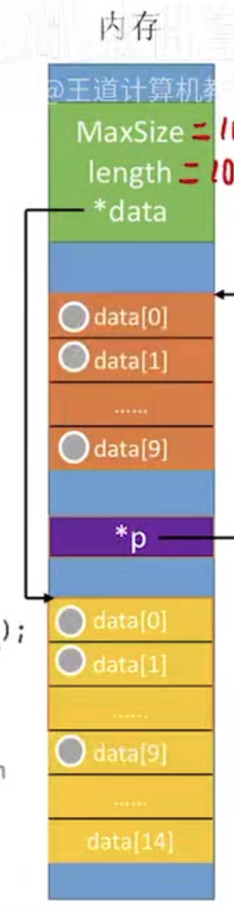

---

## 顺序表的定义

### 顺序表定义

>线性表的顺序存储也称顺序表  
>[[存储与存取的联系#顺序存储]]

- 顺序表是用一组**地址连续的存储单元**依次存储线性表中的数据元素，使得**逻辑上相邻的元素在物理位置上也相邻**
- 顺序表的特点：表中元素的**逻辑顺序与其物理存储顺序完全一致**
- 顺序表的存储结构如图所示：
  >此外利用sizeof()函数来获取数据元素的大小
  >
  
  >第一个元素在起始base地址，第二个元素则紧挨着第一个，以此类推

- 因为任意数据元素的存储地址与顺序表的起始地址之间的偏移量与其位序呈线形关系，因此可以在**O(1)时间内直接访问表中任意位置的元素**
  >因为在请求访问$a[i]$时，CPU所做的事情就是计算地址，一步就可以算出，然后再取出该地址的值，这两步都是固定次数的运算，与n没有关系
-   这种特性使得线性表的顺序存储结构属于**随机存取**。
  >这里的随机存取指的并不是随机存储数据，而是任意位置等成本，访问任意下标的元素的代价都是一样的，因为能直接把地址算出来
-   通常使用**数组**来实现线性表

### 静态分配
- 静态分配的存储结构可描述为：
  ```C++
  #define MaxSize 50  //定义最大长度
  typedef struct {
    ElemType data[MaxSize];  //使用静态数组存放数据元素
    int length; //顺序表的当前长度
  }SqList;      //顺序表的类型定义
  ```
  >因为存储空间是静态的，所以数组的大小和存储空间在编译时已经固定，若空间占满，再插入新的元素会导致溢出
  >  不能刚开始就声明一个很大的内存空间，这样会造成内存资源浪费
  

### 动态分配

##### 操作说明
在动态分配时，存储数组的空间是在程序执行过程中通过动态存储分配语句申请的。  
当空间满时，需要开辟一块更大的存储空间，将原表中的所有元素复制到新空间中，从而实现存储元素的扩充。  
这样就无须在初始化时为线性表一次性划分全部可能用到的空间。


##### 结构体定义

```C++
#define MaxSize 50  //定义最大长度
typedef struct {
  ElemType *data  //指示动态分配数组的指针
  int MaxSize,length; //顺序表的当前长度
}SqList;      //顺序表的类型定义

L.data=new ElemType [InitSize]     //C++的初始动态分配语句
```

##### 代码定义

>
>
>
>分别是初始化和动态增加数组长度
>定义了新指针p，相当于开辟了一个新的空间，最后使用free函数将指针p指向的内存空间销毁
>


### 顺序表的优点

1. **可进行随机访问**，即通过首地址和元素序号可在$O(1)$时间内找到指定的元素
2. **存储密度高**，每个结点仅存储数据元素，无额外指针开销
   
### 顺序表的缺点

1. **插入和删除效率低**，需要移动大量元素
2. **要求分配连续的存储空间**


## 顺序表上基本操作的实现

1. 初始化  [[顺序表#顺序表上基本操作的实现#顺序表的初始化]]
2. 插入  [[顺序表#顺序表上基本操作的实现#顺序表的插入]]
3. 删除  [[顺序表#顺序表上基本操作的实现#顺序表的删除]]
4. 按值查找  [[顺序表#顺序表上基本操作的实现#按值查找(顺序查找)]]


### 顺序表的初始化

- 对于静态分配来说，数组空间已经由编译器自行分配，因此初始化时只需将当前长度置0，即
```
 L.length=0;  
```
>若不对data数组进行初始化，因为内存当中可能会遗留一些脏数据，故data数组可能会被写入这些脏数据
>
>访问数据时使用查找操作最为合适

 - 对于动态分配来说，需要在运行时为顺序表分配初始大小的数组空间，并设置长度和容量
```
 L.length=0; 
 MaxSize=InitSize; 
```

### 顺序表的插入

#### 基本操作
- 在顺序表的第$i(1\le i \le L.length+1)$个位置插入新元素e。若i超出合法范围，或存储空间已满，则插入失败，返回false；否则，将第i个元素及其后的所有元素依次后移一位，腾出一个空位置插入e，表长加1，返回true。
	  

#### 时间复杂度分析

- 最好情况：在表尾插入（$i=n+1$），无须移动元素，时间复杂度为 $O(1)$。

- 最坏情况：在表头插入（$i=1$），需移动全部 $n$ 个元素，时间复杂度为 $O(n)$。

- 平均情况：设在第 $i$ 个位置插入的概率为 $p_i=1/(n+1)$，则平均移动次数为

$$  
\sum_{i=1}^{n+1} p_i(n-i+1)  
=\sum_{i=1}^{n+1}\frac{1}{n+1}(n-i+1)  
=\frac{1}{n+1}\sum_{i=1}^{n+1}(n-i+1)  
=\frac{1}{n+1}\cdot\frac{n(n+1)}{2}  
=\frac{n}{2}  
$$
>$n+1$是因为加上要插上的元素的位置，表中一共有$n+1$个元素

>因此，插入操作的平均时间复杂度为 $O(n)$。


### 顺序表的删除

#### 基本操作
- 删除顺序表L的第$i(1\le i \le L.length+1)$个位置的元素。并通过引用参数e返回其值。若i非法，返回false；否则，保存被删元素，将其后所有元素前移一位，表长减1，返回true。
	  

#### 时间复杂度分析

- 最好情况：删除表尾元素（$i=n$），无须移动元素，时间复杂度为 $O(1)$。

- 最坏情况：删除表头元素（$i=1$），需移动其余 $n-1$ 个元素，时间复杂度为 $O(n)$。

- 平均情况：设删除第 $i$ 个元素的概率为 $p_i=1/n$，则平均移动次数为

$$  
\sum_{i=1}^{n} p_i(n-i)  
=\sum_{i=1}^{n}\frac{1}{n}(n-i)  
=\frac{1}{n}\sum_{i=1}^{n}(n-i)  
=\frac{1}{n}\cdot\frac{n(n-1)}{2}  
=\frac{n-1}{2}  
$$
### 按值查找(顺序查找)
#### 基本操作
- 在顺序表L中查找第一个值等于e的元素，返回其位序；若未找到，则返回0.
	  

#### 时间复杂度分析

- 最好情况：目标元素在表头（$i=1$），比较 1 次，时间复杂度为 $O(1)$。

- 最坏情况：目标元素在表尾或不存在，需要比较 $n$ 次，时间复杂度为 $O(n)$。

- 平均情况：设目标元素在第 $i$ 位的概率为 $p_i=1/n$，则平均比较次数为

$$  
\sum_{i=1}^{n} p_i\cdot i  
=\sum_{i=1}^{n}\frac{1}{n}\cdot i  
=\frac{1}{n}\cdot\frac{n(n+1)}{2}  
=\frac{n+1}{2}  
$$

>因此，按值查找的平均时间复杂度为 $O(n)$。

>顺序表的**按序号查找**非常简单，直接通过数组下标访问即可，时间复杂度为 $O(1)$。

### 插入和删除操作的总结
顺序表的插入和删除操作的时间开销主要耗费在移动元素上，移动元素的个数取决于操作位置。
>插入操作将元素从后往前依次后移一位  
>删除操作将元素从前往后依次前移一位

---
