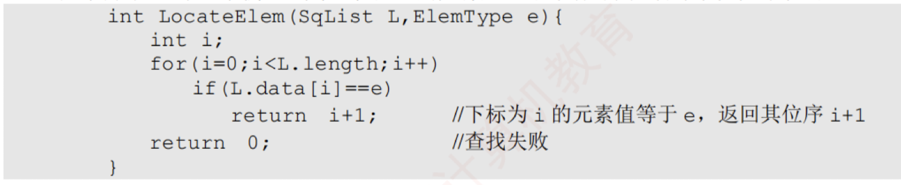

---

### 顺序表的初始化

- 对于静态分配来说，数组空间已经由编译器自行分配，因此初始化时只需将当前长度置0，即
```
 L.length=0;  
```
>若不对data数组进行初始化，因为内存当中可能会遗留一些脏数据，故data数组可能会被写入这些脏数据
>
>访问数据时使用查找操作最为合适

 - 对于动态分配来说，需要在运行时为顺序表分配初始大小的数组空间，并设置长度和容量
```
 L.length=0; 
 MaxSize=InitSize; 
```

### 顺序表的插入

#### 基本操作
- 在顺序表的第$i(1\le i \le L.length+1)$个位置插入新元素e。若i超出合法范围，或存储空间已满，则插入失败，返回false；否则，将第i个元素及其后的所有元素依次后移一位，腾出一个空位置插入e，表长加1，返回true。
	  

#### 时间复杂度分析

- 最好情况：在表尾插入（$i=n+1$），无须移动元素，时间复杂度为 $O(1)$。

- 最坏情况：在表头插入（$i=1$），需移动全部 $n$ 个元素，时间复杂度为 $O(n)$。

- 平均情况：设在第 $i$ 个位置插入的概率为 $p_i=1/(n+1)$，则平均移动次数为

$$  
\sum_{i=1}^{n+1} p_i(n-i+1)  
=\sum_{i=1}^{n+1}\frac{1}{n+1}(n-i+1)  
=\frac{1}{n+1}\sum_{i=1}^{n+1}(n-i+1)  
=\frac{1}{n+1}\cdot\frac{n(n+1)}{2}  
=\frac{n}{2}  
$$
>$n+1$是因为加上要插上的元素的位置，表中一共有$n+1$个元素

>因此，插入操作的平均时间复杂度为 $O(n)$。


### 顺序表的删除

#### 基本操作
- 删除顺序表L的第$i(1\le i \le L.length+1)$个位置的元素。并通过引用参数e返回其值。若i非法，返回false；否则，保存被删元素，将其后所有元素前移一位，表长减1，返回true。
	  

#### 时间复杂度分析

- 最好情况：删除表尾元素（$i=n$），无须移动元素，时间复杂度为 $O(1)$。

- 最坏情况：删除表头元素（$i=1$），需移动其余 $n-1$ 个元素，时间复杂度为 $O(n)$。

- 平均情况：设删除第 $i$ 个元素的概率为 $p_i=1/n$，则平均移动次数为

$$  
\sum_{i=1}^{n} p_i(n-i)  
=\sum_{i=1}^{n}\frac{1}{n}(n-i)  
=\frac{1}{n}\sum_{i=1}^{n}(n-i)  
=\frac{1}{n}\cdot\frac{n(n-1)}{2}  
=\frac{n-1}{2}  
$$
### 按值查找(顺序查找)
#### 基本操作
- 在顺序表L中查找第一个值等于e的元素，返回其位序；若未找到，则返回0.
	  

#### 时间复杂度分析

### 总结
顺序表的插入和删除操作的时间开销主要耗费在移动元素上，移动元素的个数取决于操作位置。
>插入操作将元素从后往前依次后移一位  
>删除操作将元素从前往后依次前移一位

